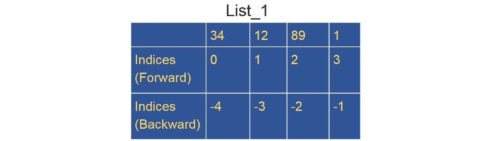
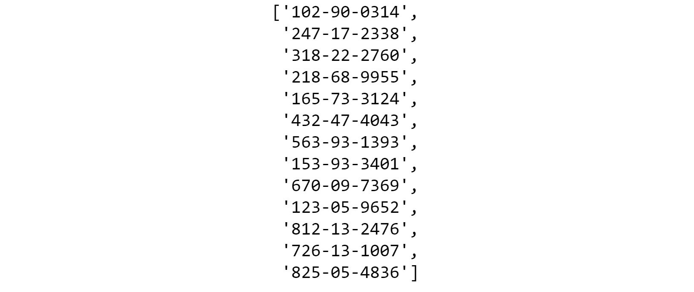
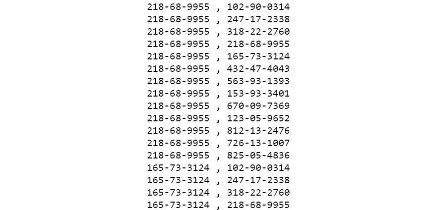
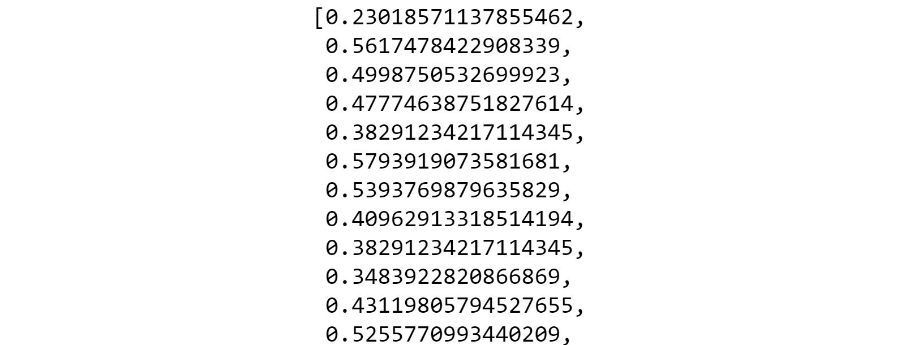
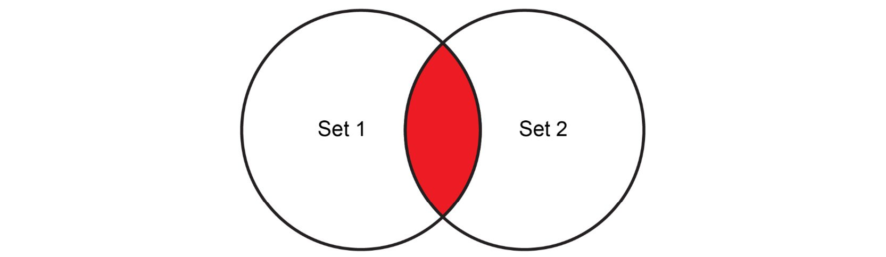
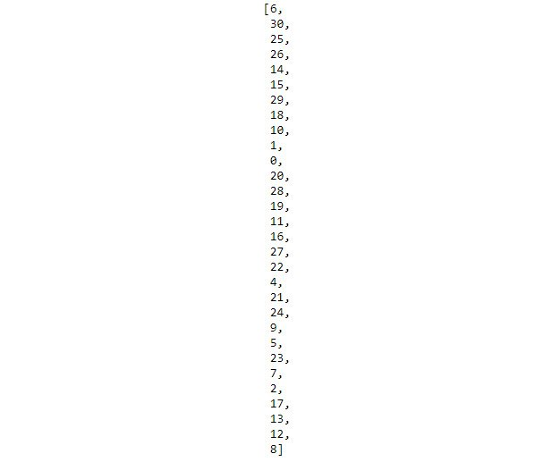
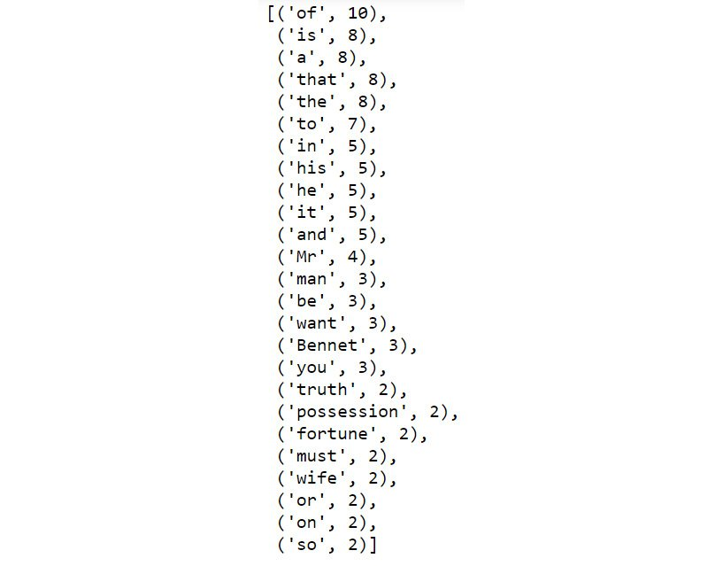

Lab 1: Introduction to Data Wrangling with Python
=================================================


#### Pre-reqs:
- Google Chrome (Recommended)

#### Lab Environment
Notebooks are ready to run. All packages have been installed. There is no requirement for any setup.

All notebooks are present in `~/work/data-wrangling-python/lab01` folder.


Let\'s take a look at a few data structures in Python.

Lists, Sets, Strings, Tuples, and Dictionaries
==============================================


Now that we have touched upon a few advantages of using Python, we will
start by exploring various basic data structures in Python. We will also
learn about a few techniques we can use to handle these data structures.
This is invaluable for a data practitioner.

Lists
-----

The following is an example of a simple list:

```
list_example = [51, 27, 34, 46, 90, 45, -19]
```


The following is also an example of a list:

```
list_example2 = [15, "Yellow car", True, 9.456, [12, "Hello"]]
```


As you can see, a list can contain any number of the allowed data types,
such as `int`, `float`, `string`, and
`boolean`, and a list can also be a mix of different data
types (including nested lists).

In Python, there is a concept of creating a slice of a list. Here is the
syntax:

```
my_list [ inclusive start index : exclusive end index ]
```


Known as **list slicing**, this returns a smaller list from the original
list by extracting only a part of it. To slice a list, we need two
integers. The first integer will denote the start of the slice and the
second integer will denote the end. Notice that slicing does not include
the third index or the end element. A slice is a chunk of the list tuple
or string. The range is from `0` to `1` minus the
total length. The first number given represents the first position to
include in the slice. The second number is used to indicate which place
you want to stop at, but not include. A slice can have an index of
`–1` to indicate the last element.

The indices will be automatically assigned, as follows:





List Functions
==============


In this section, we will discuss a few basic functions for handling
lists.

You can access list elements using the following code:

```
list_example = [51, 27, 34, 46, 90, 45, -19]
list_example[0]
```


The output is as follows:

```
51
```


To find out the length of a list, we simply use the `len`
function. The `len` function in Python returns the length of
the specified list:

```
len(list_example)
```


The output is as follows:

```
7
```


We can append new elements in the list. `append` is a built-in
method in Python for the list data type:

```
list_example.append(11)
list_example
```


The output is as follows:

```
[51, 27, 34, 46, 90, 45, -19, 11]
```


Let\'s go through some exercises to practice these functions.


Exercise 1.01: Accessing the List Members
-----------------------------------------

In this exercise, we will be reading a list of social security numbers
from the `ssn.csv` file and then observing the different ways
of accessing the elements from the list using the forward and backward
indices. We will be using our first Python function, `len`,
which will return the length of the specified list. We will be starting
with the basic building blocks for future exercises. Let\'s go through
the following steps:

**Note:**

The `ssn.csv` file can be found here:
<https://github.com/fenago/data-wrangling-python>.

1.  Open a new Jupyter Notebook and define a list called
    `ssn`. Read from the `ssn.csv` file using the
    `read_csv` command and print the list elements:

    
    ```
    import pandas as pd
    ssn = list(pd.read_csv("../datasets/ssn.csv"))
    print(ssn)
    ```

    **Note:**

    The highlighted path in the code must be changed based on where you
    have saved the `ssn.csv` file on your system.

    The output is as follows:

    
    ```
    ['218-68-9955',
     '165-73-3124',
     '432-47-4043',
     '563-93-1393',
     '153-93-3401',
     '670-09-7369',
     '123-05-9652',
     '812-13-2476',
     '726-13-1007',
     '825-05-4836']
    ```

2.  Access the first element of `ssn` using its forward index:

    
    ```
    ssn[0]
    ```

    The output is as follows:

    
    ```
    '218-68-9955'
    ```

3.  Access the fourth element of `ssn` using its forward
    index:

    
    ```
    ssn[3]
    ```

    The output is as follows:

    
    ```
    '563-93-1393'
    ```

4.  Access the last element of `ssn` using the `len`
    function:

    
    ```
    ssn[len(ssn) - 1]
    ```

    The output is as follows:

    
    ```
    '825-05-4836'
    ```

5.  Access the last element of `ssn` using its backward index:

    
    ```
    ssn[-1] 
    ```

    The output is as follows:

    
    ```
    '825-05-4836'
    ```

6.  Access the first three elements of `ssn` using forward
    indices:

    
    ```
    ssn[1:3]
    ```

    The output is as follows:

    
    ```
    ['165-73-3124', '432-47-4043']
    ```

7.  Access the last two elements of `ssn` by slicing:

    
    ```
    ssn[-2:]
    ```

    The output is as follows:

    
    ```
    ['726-13-1007', '825-05-4836']
    ```

8.  Access the first two elements using backward indices:

    
    ```
    ssn[:-2]
    ```

    The output is as follows:

    
    
    


    When we leave one side of the colon (`:`) blank, we are
    basically telling Python either to go until the end or start from
    the beginning of the list. It will automatically apply the rule of
    list slices that we just learned.

9.  Reverse the elements in the list:

    
    ```
    ssn[-1::-1]
    ```

    The output is as follows:

    
    
    


**Note:**

To access the source code for this specific section, please refer to
<https://github.com/fenago/data-wrangling-python>.


In this exercise, we learned how to access the list members with forward
and backward indices. We\'ll create a list in the next exercise.


Exercise 1.02: Generating and Iterating through a List
------------------------------------------------------

In this exercise, we are going to examine various ways of generating a
list and a nested list using the same file containing the list of social
security numbers (`ssn.csv`) that we used in the previous
exercise.

**Note:**

The `ssn.csv` file can be found here:
<https://github.com/fenago/data-wrangling-python>.

We are going to use the `append` method to add new elements to
the list and a `while` loop to iterate through the list. To do
so, let\'s go through the following steps:

1.  Open a new Jupyter Notebook and import the necessary Python
    libraries. Read from the `ssn.csv` file:

    
    ```
    import pandas as pd
    ssn = list(pd.read_csv("../datasets/ssn.csv"))
    ```

    **Note:**

    The highlighted path in the code must be changed based on where you
    have saved the `ssn.csv` file on your system.

2.  Create a list using the `append` method. The
    `append` method from the Python library will allow you to
    add items to the list:

    
    ```
    ssn_2 = []
    for x in ssn:
        ssn_2.append(x)
    ssn_2
    ```

    The output will be as follows:

    
    
    


    Here, we started by declaring an empty list called
    `ssn_2`, and then we used a `for` loop to append
    values to it after reading from the `ssn.csv` file.

3.  Generate a list using the following command:

    
    ```
    ssn_3 = ["soc: " + x for x in ssn_2]
    ssn_3
    ```

    The output is as follows:

    
    

4.  Use a `while` loop to iterate over the list:

    **Note:**

    Conditionals work the same way as in any other strongly typed
    language, such as C, C++, or Java.

    
    ```
    i = 0
    while i < len(ssn_3):
        print(ssn_3[i])
        i += 1
    ```

    The output is as follows:

    
    ```
    soc: 218-68-9955
    soc: 165-73-3124
    soc: 432-47-4043
    soc: 563-93-1393
    soc: 153-93-3401
    soc: 670-09-7369
    soc: 123-05-9652
    soc: 812-13-2476
    soc: 726-13-1007
    soc: 825-05-4836
    ```

5.  Search all the social security numbers with the number `5`
    in them:

    
    ```
    numbers = [x for x in ssn_3 if "5" in x]
    numbers
    ```

    The output will be as follows:

    
    
    


    Let\'s explore a few more list operations. We are going to use the
    `+` operator to add the contents of two lists and use the
    `extend` keyword to replace the contents of the existing
    list with another list.

6.  Generate a list by adding the two lists. Here, we will just use the
    `+` operator:

    
    ```
    ssn_4 = ["102-90-0314" , "247-17-2338" , "318-22-2760"]
    ssn_5 = ssn_4 + ssn
    ssn_5
    ```

    The output is as follows:

    
    
    


7.  Extend a string using the `extend` keyword:

    
    ```
    ssn_2.extend(ssn_4)
    ssn_2
    ```

    The output is as follows:

    
    
    

    **Note:**

    The `extend` operation changes the original list
    (`ssn_2`) and appends all the elements of
    `ssn_4` to it. So, be careful while using it.

8.  Now, let\'s loop over the first list and create a nested list inside
    that loop that goes over the second list:

    
    ```
    for x in ssn_2:
        for y in ssn_5:
            print(str(x) + ' , ' + str(y))
    ```

    The output (partially shown) is as follows:

    
    


In this exercise, we used the built-in methods of Python to manipulate
lists. In the next exercise, we\'ll check whether the elements or
members in a dataset are present as per our expectations.


Exercise 1.03: Iterating over a List and Checking Membership
------------------------------------------------------------

This exercise will demonstrate how we can iterate over a list and verify
that the values are as expected. This is a manual test that can often be
done while dealing with a reasonably sized dataset for business case
scenarios. Let\'s go through the following steps to check the membership
of values and whether they exist in the `.csv` file:

**Note:**

The `car_models.csv` file can be found at
<https://github.com/fenago/data-wrangling-python>.

1.  Import the necessary Python libraries and read from the
    `car_models.csv` file:

    
    ```
    import pandas as pd
    car_models = list(pd.read_csv("../datasets/car_models.csv"))
    car_models
    ```

    **Note:**

    The highlighted path in the code must be changed based on where you
    have saved the `car_models.csv` file on your system.

    The output is as follows:

    
    ```
    ['Escalade ',
     ‹ X5 M›,
     ‹D150›,
     ‹Camaro›,
     ‹F350›,
     ‹Aurora›,
     ‹S8›,
     ‹E350›,
     ‹Tiburon›,
     ‹F-Series Super Duty ‹]
    ```

2.  Iterate over a list:

    
    ```
    list_1 = [x for x in car_models]
    for i in range(0, len(list_1)):
        print(list_1[i])
    ```

    The output is as follows:

    
    ```
    Escalade
    X5 M
    D150
    Camaro
    F350
    Aurora
    S8
    E350
    Tiburon
    F-Series Super Duty
    ```

    However, this is not very Pythonic. Being Pythonic means to follow
    and conform to a set of best practices and conventions that have
    been created over the years by thousands of capable developers. In
    this case, this means we could use the `in` keyword in the
    `for..in` conditional because Python does not have index
    initialization, bounds checking, or index incrementing, unlike
    traditional languages. Python uses syntactic sugar to make iterating
    through lists easy and readable. In other languages, you might have
    to create a variable (index initialization) as you loop over the
    list check that variable (bounds checking) since it will be
    incremented in the loop (index incrementing).

3.  Write the following code to see the Pythonic way of iterating over a
    list:

    
    ```
    for i in list_1:
        print(i)
    ```

    The output is as follows:

    
    ```
    Escalade
    X5 M
    D150
    Camaro
    F350
    Aurora
    S8
    E350
    Tiburon
    F-Series Super Duty
    ```

    Notice that in the second method, we do not need a counter anymore
    to access the list index; instead, Python\'s `in` operator
    gives us the element at the `i`[th]{.superscript} position
    directly.

4.  Check whether the strings `D150` and `Mustang`
    are in the list using the `in` operator:

    
    ```
    "D150" in list_1
    ```

    The output is `True`.

    
    ```
    "Mustang" in list_1
    ```

    The output is `False`.


In this exercise, we\'ve seen how to iterate over a list and verified
the membership of each element. This is an important skill. Often, when
working with large applications, manually checking a list could be
useful. If at any time you are unsure of a list, you can easily verify
what values are present. Now, we will see how we can perform a sort
operation on a list.


Exercise 1.04: Sorting a List
-----------------------------

In this exercise, we will sort a list of numbers, first by using the
`sort` method and then by using the `reverse`
method. To do so, let\'s go through the following steps:

**Note:**

The `ssn.csv` file can be found here:
<https://github.com/fenago/data-wrangling-python>.

1.  Open a new Jupyter Notebook and import the necessary Python
    libraries:

    
    ```
    import pandas as pd
    ssn = list(pd.read_csv("../datasets/ssn.csv"))
    ```

    **Note:**

    The highlighted path in the code must be changed based on where you
    have saved the `ssn.csv` file on your system.

2.  Use the `sort` method with `reverse=True`:

    
    ```
    list_1 = [*range(0, 21, 1)]
    list_1.sort(reverse=True)
    list_1
    ```

    The output is as follows:

    
    ```
    [20, 19, 18, 17, 16, 15, 14, 13, 12, 11, 10, 9, 8, 7, 
    6, 5, 4, 3, 2, 1, 0]
    ```

3.  Use the `reverse` method directly to achieve this result:

    
    ```
    list_1.reverse()
    list_1
    ```

    The output is as follows:

    
    ```
    [0, 1, 2, 3, 4, 5, 6, 7, 8, 9, 10, 11, 12, 13, 14, 15, 16, 
    17, 18, 19, 20]
    ```

The difference between the `sort` method and the
`reverse` method is that we can use `sort` with
customized sorting, whereas we can only use `reverse` to
reverse a list. Also, both methods work in-place, so be aware of this
while using them. Now, let\'s create a list with random numbers. Random
numbers can be very useful in a variety of situations and preprocessing
data is a common process in machine learning.


Exercise 1.05: Generating a Random List
---------------------------------------

In this exercise, we will be generating a `list` with random
numbers using the `random` library in Python and performing
mathematical operations on them. To do so, let\'s go through the
following steps:

1.  Import the `random` library:
    
    ```
    import random
    ```

2.  Use the `randint` method to generate some random integers
    and add them to a list:
    
    ```
    list_1 = [random.randint(0, 30) for x in range (0, 100)]
    ```

3.  Let\'s print the list. Note that there will be duplicate values in
    `list_1`:

    
    ```
    list_1
    ```

    The sample output (partially shown) is as follows:

    
    
    


    **Note:**

    The output will vary with every run since we are generating
    random numbers.

4.  Let\'s find the square of each element:

    
    ```
    list_2 = [x**2 for x in list_1]
    list_2
    ```

    The output is as follows:

    
    
    


5.  Now let\'s find the log of the `1` elements of
    `list_2`:

    
    ```
    import math 
    list_2 = [math.log(x+1,10) for x in list_2]
    list_2
    ```

    The output (partially shown) is as follows:

    
    
    


**Note:**

The output is susceptible to change since we are generating
random numbers.


In this exercise, we worked on random variables, lists comprehension,
and preprocessing data. Let\'s put what we have learned so far together
and go through an activity to practice how to handle lists.


Activity 1.01: Handling Lists
-----------------------------

In this activity, you will generate a list of random numbers and then
generate another list from the first one, which only contains numbers
that are divisible by three. Repeat the experiment 10 times; you\'ll see
that the output varies each time, given that a different set of random
numbers will be generated each time. Then, you will calculate the
average difference between the lengths of the two lists.

These are the steps for completing this activity:

1.  Create a `list` of `100` random numbers.

2.  Create a new `list` from this random `list`,
    with numbers that are divisible by `3`.

3.  Calculate the length of these two lists and store the difference in
    a new variable.

4.  Using a loop, perform steps 1, 2, and 3, and find the difference
    variable 10 times.

5.  Find the arithmetic mean of these `10` difference values.

    The output (will vary with each run) should look similar to this:

    
    ```
    66.3
    ```


Sets
----

A set, mathematically speaking, is just a collection of well-defined
distinct objects. Python gives us a straightforward way to deal with
them using its set data type.


Introduction to Sets
--------------------

With the last list that we generated in the previous section; we are
going to revisit the problem of getting rid of duplicates from it. We
can achieve that with the following line of code:

```
list_12 = list(set(list_1))
```


If we print this, we will see that it only contains unique numbers. We
used the **set** data type to turn the first list into a set, thus
getting rid of all duplicate elements, and then used the **list**
function to turn it into a list from a set once more:

```
list_12
```


The output will be as follows:


In the next section, we will discuss the union and intersection of sets.


Union and Intersection of Sets
------------------------------

In mathematical terms, a list of unique objects is a set. There are many
ways of combining sets in the same mathematical term. One such way is
the use of a union.

This is what a union between two sets looks like:


This simply means taking everything from both sets but only taking the
common elements once.

We can implement this concept by using the following code:

```
set1 = {"Apple", "Orange", "Banana"}
set2 = {"Pear", "Peach", "Mango", "Banana"}
```


To find the union of the two sets, the following code should be used:

```
set1 | set2
```


The output would be as follows:

```
{'Apple', 'Banana', 'Mango', 'Orange', 'Peach', 'Pear'}
```


Notice that the common element, `Banana`, appears only once in
the resulting set. The common elements of two sets can be identified by
obtaining the intersection of the two sets, as follows:





We get the intersection of two sets in Python as follows:

```
set1 & set2
```


This will give us a set with only one element. The output is as follows:

```
{'Banana'}
```


**Note:**

You can also calculate the difference between sets (also known as
complements). To find out more, refer to this link:
https://docs.python.org/3/tutorial/datastructures.html\#sets.

In this section, we went through sets and how we can do basic set
functionality. Sets are used throughout database programming and design,
and they are very useful for data wrangling.


Creating Null Sets
------------------

In mathematical terms, a set that has nothing inside it is called a null
set or an empty set.

You can create a null set by creating a set containing no elements. You
can do this by using the following code:

```
null_set_1 = set({})
null_set_1
```


The output is as follows:

```
set()
```


However, to create a dictionary with null values, use the following
command:

```
null_set_2 = {}
null_set_2
```


The output is as follows:

```
{}
```


We are going to learn about this in detail in the next section.


Dictionary
----------

A dictionary is like a list, which means it is a collection of several
elements. However, with the dictionary, it is a collection of key-value
pairs, where the key can be anything that can fit into memory.
Generally, we use numbers or strings as keys.

To create a dictionary, use the following code:

```
dict_1 = {"key1": "value1", "key2": "value2"}
dict_1
```


The output is as follows:

```
{'key1': 'value1', 'key2': 'value2'}
```


This is also a valid dictionary:

```
dict_2 = {"key1": 1, "key2": ["list_element1", 34], \
          "key3": "value3","key4": {"subkey1": "v1"}, \
          "key5": 4.5}
dict_2
```


**Note:**

The code snippet shown here uses a backslash ( `\` ) to split
the logic across multiple lines. When the code is executed, Python will
ignore the backslash, and treat the code on the next line as a direct
continuation of the current line.

The output is as follows:

```
{'key1': 1,
 'key2': ['list_element1', 34],
 'key3': 'value3',
 'key4': {'subkey1': 'v1'},
 'key5': 4.5}
```


The keys must be unique in a dictionary.


Exercise 1.06: Accessing and Setting Values in a Dictionary
-----------------------------------------------------------

In this exercise, we are going to access the elements and set values in
a dictionary. When working with dictionaries, it\'s important to be able
to iterate through each key-value pair, which will allow you to process
the data as needed. To do so, let\'s go through the following steps:

1.  To access a value in the dictionary, you must provide the key. Keep
    in mind there is no given order for any pair in the dictionary:
    
    ```
    stocks = \
    {"Solar Capital Ltd.":"$920.44M", \
     "Zoe's Kitchen, Inc.":"$262.32M",\
     "Toyota Motor Corp Ltd Ord":"$156.02B",\
     "Nuveen Virginia Quality Municipal Income Fund":"$238.33M",\
     "Kinross Gold Corporation":"$5.1B",\
     "Vulcan Materials Company":"$17.1B",\
     "Hi-Crush Partners LP":"$955.69M",\
     "Lennox International, Inc.":"$8.05B",\
     "WMIH Corp.":"$247.66M",\
     "Comerica Incorporated":"n/a"}
    ```

2.  Print a particular element from the `stocks` list:

    
    ```
    stocks["WMIH Corp."]
    ```

    This will return the value associated with it, as follows:

    
    ```
    '$247.66M'
    ```

3.  Set a value using the same method we use to access a value:
    
    ```
    stocks["WMIH Corp."] = "$300M"
    ```

4.  Define a blank dictionary and then use the key notation to assign
    values to it:

    
    ```
    dict_3 = {} # Not a null set. It is a dict
    dict_3["key1"] = "Value1"
    dict_3
    ```

    **Note:**

    The `#` symbol in the code snippet above denotes a code
    comment. Comments are added into code to help explain specific bits
    of logic.

    The output is as follows:

    
    ```
    {'key1': 'Value1'}
    ```


As we can see, the manipulation techniques of a dictionary are pretty
simple. Now, just like a list, iterating through a dictionary is very
important in order to process the data.


Exercise 1.07: Iterating over a Dictionary
------------------------------------------

In this exercise, we are going to iterate over a dictionary and print
the values and keys. To do so, let\'s go through the following steps:

1.  Open a new Jupyter Notebook and define a dictionary with the key
    provided along with it. Keep in mind there is no given order for any
    pair in the dictionary:
    
    ```
    stocks = \
    {"Solar Capital Ltd.":"$920.44M",\
     "Zoe's Kitchen, Inc.":"$262.32M",\
     "Toyota Motor Corp Ltd Ord":"$156.02B",\
     "Nuveen Virginia Quality Municipal Income Fund":"$238.33M",\
     "Kinross Gold Corporation":"$5.1B",\
     "Vulcan Materials Company":"$17.1B",\
     "Hi-Crush Partners LP":"$955.69M",\
     "Lennox International, Inc.":"$8.05B",\
     "WMIH Corp.":"$247.66M",\
     "Comerica Incorporated":"n/a"}
    ```

2.  Remove the `$` character from the `stocks`
    dictionary:

    
    ```
    for key,val in stocks.items():
        stocks[key] = val.replace('$', '')
    stocks
    ```

    The output should be as follows:

    
    ```
    {'Solar Capital Ltd.': '920.44M',
     "Zoe's Kitchen, Inc.": '262.32M',
     'Toyota Motor Corp Ltd Ord': '156.02B',
     'Nuveen Virginia Quality Municipal Income Fund': '238.33M',
     'Kinross Gold Corporation': '5.1B',
     'Vulcan Materials Company': '17.1B',
     'Hi-Crush Partners LP': '955.69M',
     'Lennox International, Inc.': '8.05B',
     'WMIH Corp.': '300M',
     'Comerica Incorporated': 'n/a'}
    ```

3.  Iterate over the `stocks` dictionary again and split the
    value into a list with price (`val`) and multiplier
    (`mult`) as separate elements where a single value is
    assigned to each key:

    
    ```
    for key,val in stocks.items():
        mult = val[-1]
        stocks[key] = [val[:-1],mult]
    stocks
    ```

    The output is as follows:

    
    ```
    {'Solar Capital Ltd.': ['920.44', 'M'],
     «Zoe›s Kitchen, Inc.»: [‹262.32›, ‹M›],
     ‹Toyota Motor Corp Ltd Ord›: [‹156.02›, ‹B›],
     ‹Nuveen Virginia Quality Municipal Income Fund›: [‹238.33›, ‹M›],
     ‹Kinross Gold Corporation›: [‹5.1›, ‹B›],
     ‹Vulcan Materials Company›: [‹17.1›, ‹B›],
     ‹Hi-Crush Partners LP›: [‹955.69›, ‹M›],
     ‹Lennox International, Inc.›: [‹8.05›, ‹B›],
     ‹WMIH Corp.›: [‹300›, ‹M›],
     ‹Comerica Incorporated›: [‹n/›, ‹a›]}
    ```

Notice the difference between how we did the iteration on the list and
how we are doing it here. A dictionary always contains a key-value pair,
and we always need to access the value of any element in a dictionary
with its key. In a dictionary, all the keys are unique.

**Note:**

To access the source code for this specific section, please refer to
<https://github.com/fenago/data-wrangling-python>.


In the next exercise, we will revisit the problem that we encountered
with the list earlier in this lab to create a list with unique
values. We will look at another workaround to fix this problem.


Exercise 1.08: Revisiting the Unique Valued List Problem
--------------------------------------------------------

In this exercise, we will use the unique nature of a dictionary, and we
will drop the duplicate values from a list. First, we will create a
random list with duplicate values. Then, we\'ll use the
`fromkeys` and `keys` methods of a dictionary to
create a unique valued list. To do so, let\'s go through the following
steps:

1.  First, generate a random list with duplicate values:
    
    ```
    import random
    list_1 = [random.randint(0, 30) for x in range (0, 100)]
    ```

2.  Create a unique valued list from `list_1`:

    
    ```
    list(dict.fromkeys(list_1).keys())
    ```

    The sample output is as follows:

    
    
    


**Note:**

The output is susceptible to change since we are generating
random numbers.

Here, we have used two useful methods of the `dict` data type
in Python, `fromkeys` and `keys`.
`fromkeys` is a built-in function in which a new dictionary is
created from the given sequence of elements with values given by the
user, while the `keys` method gives us the keys of a
dictionary.

**Note:**

To access the source code for this specific section, please refer to
<https://github.com/fenago/data-wrangling-python>.


Exercise 1.09: Deleting a Value from Dict
-----------------------------------------

In this exercise, we are going to delete a value from `dict`
using the `del` method. Perform the following steps:

1.  Create `list_1` with five elements:

    
    ```
    dict_1 = {"key1": 1, "key2": ["list_element1", 34], \
              "key3": "value3","key4": {"subkey1": "v1"}, \
              "key5": 4.5}
    dict_1
    ```

    The output is as follows:

    
    ```
    {'key1': 1,
     'key2': ['list_element1', 34],
     'key3': 'value3',
     'key4': {'subkey1': 'v1'},
     'key5': 4.5}
    ```

2.  We will use the `del` function and specify the element we
    want to delete:

    
    ```
    del dict_1["key2"]
    dict_1
    ```

    The output is as follows:

    
    ```
    {'key1': 1, 'key3': 'value3', 'key4': {'subkey1': 'v1'}, 'key5': 4.5}
    ```

3.  Let\'s delete `key3` and `key4`:
    
    ```
    del dict_1["key3"]
    del dict_1["key4"]
    ```

4.  Now, let\'s print the dictionary to see its content:

    
    ```
    dict_1
    ```

    The output should be as follows:

    
    ```
    {'key1': 1, 'key5': 4.5}
    ```


In this exercise, we learned how to delete elements from a dictionary.
This is a very useful functionality of dictionaries, and you will find
that it\'s used heavily when writing Python applications.

**Note:**

The `del` operator can be used to delete a specific index from
a list as well.

In our final exercise on `dict`, we will go over a less
commonly used list comprehension called **dictionary comprehension**. We
will also examine two other ways to create a `dict`, which can
be very useful for processing dictionaries in one line. There could be
cases where this could be used as a range of key-value pairs of name and
age or credit card number and credit card owner. A dictionary
comprehension works exactly the same way as list comprehension, but we
need to specify both the key and the value.


Exercise 1.10: Dictionary Comprehension
---------------------------------------

In this exercise, we will generate a dictionary using the following
steps:

1.  Generate a `dict` that has `0` to `9`
    as the keys and the square of the key as the values:

    
    ```
    list_1 = [x for x in range(0, 10)]
    dict_1 = {x : x**2 for x in list_1}
    dict_1
    ```

    The output is as follows:

    
    ```
    {0: 0, 1: 1, 2: 4, 3: 9, 4: 16, 5: 25, 6: 36, 7: 49, 8: 64, 9: 81}
    ```

    Can you generate a `dict` using `dict`
    comprehension without using a list? Let\'s try this now.

2.  Generate a `dictionary` using the `dict`
    function:

    
    ```
    dict_2 = dict([('Tom', 100), ('Dick', 200), ('Harry', 300)])
    dict_2
    ```

    The output is as follows:

    
    ```
    {'Tom': 100, 'Dick': 200, 'Harry': 300}
    ```

3.  You can also a `dictionary` using the `dict`
    function, as follows:

    
    ```
    dict_3 = dict(Tom=100, Dick=200, Harry=300)
    dict_3
    ```

    The output is as follows:

    
    ```
    {'Tom': 100, 'Dick': 200, 'Harry': 300}
    ```


Dictionaries are very flexible and can be used for a variety of tasks.
The compact nature of comprehension makes them very popular. The
strange-looking pair of values that just looked at
(`'Harry', 300`) is called a tuple. This is another important
fundamental data type in Python. We will learn about tuples in the
next section.


Tuples
------

A tuple is another data type in Python. Tuples in Python are similar to
lists, with one key difference. A tuple is a variant of a Python list
that is immutable. Immutable basically means you can\'t modify it by
adding or removing from the list. It is sequential in nature and similar
to lists.

A tuple consists of values separated by commas, as follows:

```
tuple_1 = 24, 42, 2.3456, "Hello"
```


Notice that, unlike lists, we did not open and close square brackets
here.

When referring to a tuple, the length of the tuple is called its
**cardinality**. This comes from database and set theory and is a common
way to reference its length.


Creating a Tuple with Different Cardinalities
---------------------------------------------

This is how we create an empty tuple:

```
tuple_1 = ()
```


This is how we create a tuple with only one value:

```
tuple_1 = "Hello",
```


Notice the trailing comma here.

We can nest tuples, similar to lists and dicts, as follows:

```
tuple_1 = "hello", "there"
tuple_12 = tuple_1, 45, "Sam"
```


One special thing about tuples is the fact that they are an immutable
data type. So, once they\'re created, we cannot change their values. We
can just access them, as follows:

```
tuple_1 = "Hello", "World!"
tuple_1[1] = "Universe!"
```


The last line of the preceding code will result in a
`TypeError` as a tuple does not allow modification.

This makes the use case for tuples a bit different than lists, although
they look and behave very similarly in a few ways.

We can access the elements of a tuple in the same manner we can for
lists:

```
tuple_1 = ("good", "morning!" , "how", "are" "you?")
tuple_1[0]
```


The output is as follows:

```
'good'
```


Let\'s access another element:

```
tuple_1[4]
```


The output will be:

```
'you?'
```


Unpacking a Tuple
-----------------

The expression \"unpacking a tuple\" simply means getting the values
contained in the tuple in different variables:

```
tuple_1 = "Hello", "World"
hello, world = tuple_1
print(hello)
print(world)
```


The output is as follows:

```
Hello
World
```


Of course, as soon as we do that, we can modify the values contained in
those variables.


Exercise 1.11: Handling Tuples
------------------------------

In this exercise, we will walk through the basic functionalities of
tuples. Let\'s go through the steps one by one:

1.  Create a tuple to demonstrate how tuples are immutable. Unpack it to
    read all the elements, as follows:

    
    ```
    tupleE = "1", "3", "5"
    tupleE
    ```

    The output is as follows:

    
    ```
    ('1', '3', '5')
    ```

2.  Try to override a variable from the `tupleE` tuple:

    
    ```
    tupleE[1] = "5"
    ```

    This step will result in `TypeError` as the tuple does not
    allow modification.

    
    ```
    TypeError                                 Traceback (most recent call last)
    <ipython-input-58-b4cba6d5ed11> in <module>
    ----> 1 tupleE[1] = "5"
    TypeError: 'tuple' object does not support item assignment
    ```

3.  Try to assign a series to the `tupleE` tuple:

    
    ```
    1, 3, 5 = tupleE
    ```

    This step will also result in a `SyntaxError`, stating
    that it can\'t assign to the literal:

    
    ```
    File "<ipython-input-3-a5283cb38d62>", line 1
        1, 3, 5 = tupleE
                         ^
    SyntaxError: can't assign to literal
    ```

4.  Print variables at `0`th and `1`st positions:

    
    ```
    print(tupleE[0])
    print(tupleE[1])
    ```

    The output is as follows:

    
    ```
    1
    3
    ```


We have seen two different types of data so far. One is represented by
numbers, while the other is represented by textual data. Now it\'s time
to look into textual data in a bit more detail.


Strings
-------

In the final section of this lab, we will learn about strings.
Strings in Python are similar to strings in any other programming
language.

This is a string:

```
string1 = 'Hello World!' 
```


A string can also be declared in this manner:

```
string2 = "Hello World 2!"
```


You can use single quotes and double quotes to define a string.

The start and end of a string is defined as:

```
str[ inclusive start position:  exclusive end position ]. 
```


Strings in Python behave similar to lists, apart from one big caveat.
Strings are immutable, whereas lists are mutable data structures.


Exercise 1.12: Accessing Strings
--------------------------------

In this exercise, we are going perform mathematical operations to access
strings. Let\'s go through the following steps:

1.  Create a string called `str_1`:

    
    ```
    str_1 = "Hello World!"
    str_1
    ```

    The output is as follows:

    
    ```
    'Hello World!'
    ```

    You can access the elements of the string by specifying the location
    of the element, like we did for lists.

2.  Access the first member of the string:

    
    ```
    str_1[0]
    ```

    The output is as follows:

    
    ```
    'H'
    ```

3.  Access the fifth member of the string:

    
    ```
    str_1[4]
    ```

    The output is as follows:

    
    ```
    'o'
    ```

4.  Access the last member of the string:

    
    ```
    str_1[len(str_1) - 1]
    ```

    The output is as follows:

    
    ```
    '!'
    ```

5.  Access the last member of the string, in a different way this time:

    
    ```
    str_1[-1]
    ```

    The output is as follows:

    
    ```
    '!'
    ```


Each of the preceding operations will give you the character at the
specific index. The method for accessing the elements of a string is
like accessing a list. Let\'s do a couple of more exercises to
manipulate strings.


Exercise 1.13: String Slices
----------------------------

This exercise will demonstrate how we can slice strings the same way as
we did with lists. Although strings are not lists, the functionality
will work in the same way.

Let\'s go through the following steps:

1.  Create a string, `str_1`:

    
    ```
    str_1 = "Hello World! I am learning data wrangling"
    str_1
    ```

    The output is as follows:

    
    ```
    'Hello World! I am learning data wrangling'
    ```

2.  Specify the slicing values and slice the string:

    
    ```
    str_1[2:10]
    ```

    The output is as follows:

    
    ```
    'llo Worl'
    ```

3.  Slice a string by skipping a slice value:

    
    ```
    str_1[-31:]
    ```

    The output is as follows:

    
    ```
    'd! I am learning data wrangling'
    ```

4.  Use negative numbers to slice the string:

    
    ```
    str_1[-10:-5]
    ```

    The output is as follows:

    
    ```
    ' wran'
    ```

As we can see, it is quite simple to manipulate strings with basic
operations.


String Functions
----------------

To find out the length of a string, we simply use the `len`
function:

```
str_1 = "Hello World! I am learning data wrangling"
len(str_1)
```


The length of the string is `41`. To convert a string\'s case,
we can use the `lower` and `upper` methods:

```
str_1 = "A COMPLETE UPPER CASE STRING"
str_1.lower()
```


The output is as follows:

```
'a complete upper case string'
```


To change the case of the string, use the following code:

```
str_1.upper()
```


The output is as follows:

```
'A COMPLETE UPPER CASE STRING'
```


To search for a string within a string, we can use the `find`
method:

```
str_1 = "A complicated string looks like this"
str_1.find("complicated")
str_1.find("hello")
```


The output is `-1`. Can you figure out whether the
`find` method is case-sensitive or not? Also, what do you
think the `find` method returns when it actually finds
the string?

To replace one string with another, we have the `replace`
method. Since we know that a string is an immutable data structure,
`replace` actually returns a new string instead of replacing
and returning the actual one:

```
str_1 = "A complicated string looks like this"
str_1.replace("complicated", "simple")
```


The output is as follows:

```
'A simple string looks like this'
```


**Note:**

You should look up string methods in the standard documentation of
Python 3 to discover more about these methods. Visit
<https://docs.python.org/3.7/>.

Strings have two useful methods: `split` and `join`.
Here are their definitions:

```
str.split(separator)
```


The `seperator` argument is a delimiter that you define:

```
string.join(seperator)
```


Let\'s take a look at the following exercise to practice the
`split` and `join` functionalities.


Exercise 1.14: Splitting and Joining a String
---------------------------------------------

This exercise will demonstrate how to perform split and join operations
on a string. These two string methods need separate approaches as they
allow you to convert a string into a list and vice versa. Let\'s go
through the following steps to do so:

1.  Create a string and convert it into a list using the
    `split` method:

    
    ```
    str_1 = "Name, Age, Sex, Address"
    list_1 = str_1.split(",")
    list_1
    ```

    The preceding code will give you a list similar to the following:

    
    ```
    ['Name', ' Age', ' Sex', ' Address']
    ```

2.  Combine this list into another string using the `join`
    method:

    
    ```
    s = " | "
    s.join(list_1) 
    ```

    This code will give you a string like this:

    
    ```
    'Name |  Age |  Sex |  Address'
    ```


With these, we are at the end of the second topic of this lab. Now,
we have the motivation to learn about data wrangling and have had a
solid introduction to the fundamentals of data structures using Python.
There is more to this topic, which will be covered in *Chapter 2*,
*Advanced Operation on Built-In Data Structures*.

The next section will ensure that you have understood the various basic
types of data structures and their manipulation techniques. We will do
that by going through an activity that has been designed specifically
for this purpose.


Activity 1.02: Analyzing a Multiline String and Generating the Unique Word Count
--------------------------------------------------------------------------------

In this activity, you will do the following:

-   Get multiline text and save it in a Python variable.

-   Get rid of all new lines in it using string methods.

-   Get all the unique words and their occurrences from the string.

-   Repeat the steps to find all unique words and occurrences, without
    considering case sensitivity.

    **Note:**

    For the sake of simplicity, the original text (which can be found at
    <https://www.gutenberg.org/files/1342/1342-h/1342-h.htm>) has been
    pre-processed  bit.

These are the steps to guide you through solving this activity:

1.  Create a `mutliline_text` variable by copying the text
    from the first lab of *Pride and Prejudice*.

    **Hint**: Remember to add triple quotation marks to enter a
    multiline text. This is the only way to enter a chunk of text in
    Python.

2.  Find the type and length of the `multiline_text` string
    using the `type` and `len` commands.

3.  Remove all new lines and symbols using the `replace`
    method.

4.  Find all of the words in `multiline_text` using the
    `split` method.

5.  Create a list from this list that will contain only the unique
    words.

6.  Count the number of times the unique word has appeared in the list
    using the `key` and `value` in `dict`.

7.  Find the top 25 words from the unique words that you have found
    using the `slice` method.

The output is as follows:





Summary
=======

In this lab, we learned about data wrangling and looked at examples
from various real-life data science situations where data wrangling is
very useful. We moved on to learn about the different built-in data
structures that Python has to offer. We got our hands dirty by exploring
lists, sets, dictionaries, tuples, and strings. These are the
fundamental building blocks of Python data structures, and we need them
all the time when working and manipulating data in Python. We did
several small hands-on exercises to learn more about them. We finished
this lab with carefully designed activities that let us combine a
lot of different tricks from all the different data structures and let
us observe the interplay between all of them. In the next lab, we
will learn about the data structures in Python and utilize them to solve
problems.
