Lab 3: Introduction to NumPy, Pandas, and Matplotlib
====================================================


#### Pre-reqs:
- Google Chrome (Recommended)

#### Lab Environment
Notebooks are ready to run. All packages have been installed. There is no requirement for any setup.

All notebooks are present in `~/work/data-wrangling-python/lab03` folder.


Let\'s go through the first exercise in this lab, where we will
learn how to create a `NumPy` array from a list.

Exercise 3.01: Creating a NumPy Array (from a List)
---------------------------------------------------

In this exercise, we will create a `NumPy` array from a list.
We\'re going to define a list first and use the array function of the
`NumPy` library to convert the list into an array. Next,
we\'ll read from a `.csv` file and store the data in a
`NumPy` array using the `genfromtxt` function of the
`NumPy` library. To do so, let\'s go through the
following steps:

1.  To work with `NumPy`, we must import it. By convention, we
    give it a short name, np, while importing it. This will make
    referencing the objects under the `NumPy` package
    organized:
    
    ```
    import numpy as np
    ```

2.  Create a list with three elements: `1`, `2`, and
    `3`:

    
    ```
    list_1 = [1,2,3]
    list_1
    ```

    The output is as follows:

    
    ```
    [1, 2, 3]
    ```

3.  Use the `array` function to convert it into an array:

    
    ```
    array_1 = np.array(list_1)
    array_1
    ```

    The output is as follows:

    
    ```
    array([1, 2, 3])
    ```

    We just created a `NumPy` array object called
    `array_1` from the regular Python list object,
    `list_1`.

4.  Create an array of floating type elements, that is, `1.2`,
    `3.4`, and `5.6`, using the array function
    directly:

    
    ```
    a = np.array([1.2, 3.4, 5.6])
    a
    ```

    The output is as follows:

    
    ```
    array([1.2, 3.4, 5.6])
    ```

5.  Let\'s check the type of the newly created object, a, using the
    `type` function:

    
    ```
    type(a)
    ```

    The output is as follows:

    
    ```
    numpy.ndarray
    ```

6.  Use the `type` function to check the type of
    `array_1`:

    
    ```
    type(array_1)
    ```

    The output is as follows:

    
    ```
    numpy.ndarray
    ```

    As we can see, both a and `array_1` are `NumPy`
    arrays.

7.  Now, use type on `list_1`:

    
    ```
    type(list_1)
    ```

    The output is as follows:

    
    ```
    list
    ```

    As we can see, `list_1` is essentially a Python list and
    we have used the array function of the `NumPy` library to
    create a `NumPy` array from that list.

8.  Now, let\'s read a `.csv` file as a `NumPy`
    array using the `genfromtxt` function of the
    `NumPy` library:

    
    ```
    data = np.genfromtxt('../datasets/stock.csv', \
                         delimiter=',',names=True,dtype=None, \
                         encoding='ascii')
    data
    ```

    **Note:**

    The path (highlighted) should be specified based on the location of
    the file on your system. The `stock.csv` file can be found
    here: <https://github.com/fenago/data-wrangling-python>.

    The partial output is as follows:

    
    ```
    array([('MMM', 100), ('AOS', 101), ('ABT', 102), ('ABBV', 103),
           ('ACN', 104), ('ATVI', 105), ('AYI', 106), ('ADBE', 107),
           ('AAP', 108), ('AMD', 109), ('AES', 110), ('AET', 111),
           ('AMG', 112), ('AFL', 113), ('A', 114), ('APD', 115),
           ('AKAM', 116), ('ALK', 117), ('ALB', 118), ('ARE', 119),
           ('ALXN', 120), ('ALGN', 121), ('ALLE', 122), ('AGN', 123),
           ('ADS', 124), ('LNT', 125), ('ALL', 126), ('GOOGL', 127),
           ('GOOG', 128), ('MO', 129), ('AMZN', 130), ('AEE', 131),
           ('AAL', 132), ('AEP', 133), ('AXP', 134), ('AIG', 135),
           ('AMT', 136), ('AWK', 137), ('AMP', 138), ('ABC', 139),
           ('AME', 140), ('AMGN', 141), ('APH', 142), ('APC', 143),
           ('ADI', 144), ('ANDV', 145), ('ANSS', 146), ('ANTM', 147),
           ('AON', 148)], dtype=[('Symbol', '<U5'), ('Price', '<i8')])
    ```

9.  Use the `type` function to check the type of
    `data`:

    
    ```
    type(data)
    ```

    The output is as follows:

    
    ```
    numpy.ndarray
    ```

As we can see, the data variable is also a `NumPy` array.


Exercise 3.02: Adding Two NumPy Arrays
--------------------------------------

This simple exercise will demonstrate the addition of two
`NumPy` arrays using the `+` notation, and thereby
show the key difference between a regular Python list/array and a
`NumPy` array. Let\'s perform the following steps:

1.  Import the `NumPy` library:
    
    ```
    import numpy as np
    ```

2.  Declare a Python list called `list_1` and a
    `NumPy` array:
    
    ```
    list_1 = [1,2,3]
    array_1 = np.array(list_1)
    ```

3.  Use the `+` notation to concatenate two `list_1`
    objects and save the results in `list_2`:

    
    ```
    list_2 = list_1 + list_1
    list_2
    ```

    The output is as follows:

    
    ```
    [1, 2, 3, 1, 2, 3]
    ```

4.  Use the same `+` notation to concatenate two
    `array_1` objects and save the result in
    `array_2`:

    
    ```
    array_2 = array_1 + array_1
    array_2
    ```

    The output is as follows:

    
    ```
    [2 ,4, 6]
    ```

5.  Load a `.csv` file and concatenate it with itself:

    
    ```
    data = np.genfromtxt('../datasets/numbers.csv', \
                         delimiter=',', names=True)
    data = data.astype('float64')
    data + data
    ```

    **Note:**

    The path (highlighted) should be specified based on the location of
    the file on your system. The `.csv` file that will be used
    is `numbers.csv`; this can be found at:
    <https://github.com/fenago/data-wrangling-python>.

    The output is as follows:

    
    ```
    array([202., 204., 206., 208., 210., 212., 214., 216., 218., 
           220., 222., 224., 226., 228., 230., 232., 234., 236., 
           238., 240., 242., 244., 246., 248., 250., 252., 254., 
           256., 258., 260., 262., 264., 266., 268., 270., 272., 
           274., 276., 278., 280., 282., 284., 286., 288., 290., 
           292., 294., 296.])
    ```

Did you notice the difference? The first **print** shows a list with
`6` elements, \[`1, 2, 3, 1, 2, 3`\], but the second
**print** shows another `NumPy` array (or vector) with the
elements \[`2, 4, 6`\], which are just the sum of the
individual elements of `array_1`. As we discussed earlier,
`NumPy` arrays are perfectly designed to perform element-wise
operations since there is element-to-element correspondence.


In the following exercise, we will try out some mathematical operations
on `NumPy` arrays.


Exercise 3.03: Mathematical Operations on NumPy Arrays
------------------------------------------------------

In this exercise, we\'ll generate a `NumPy` array with the
values extracted from a `.csv` file. We\'ll be using the
multiplication and division operators on the generated `NumPy`
array. Let\'s go through the following steps:

**Note:**

The `.csv` file that will be used is `numbers.csv`;
this can be found at: <https://github.com/fenago/data-wrangling-python>.

1.  Import the `NumPy` library and create a `NumPy`
    array from the `.csv` file:

    
    ```
    import numpy as np
    data = np.genfromtxt('../datasets/numbers.csv', \
                         delimiter=',', names=True)
    data = data.astype('float64')
    data
    ```

    **Note:**

    Don\'t forget to change the path (highlighted) based on the location
    of the file on your system.

    The output is as follows:

    
    ```
    array([101., 102., 103., 104., 105., 106., 107., 108., 109., 
           110., 111., 112., 113., 114., 115., 116., 117., 118., 
           119., 120., 121., 122., 123., 124., 125., 126., 127., 
           128., 129., 130., 131., 132., 133., 134., 135., 136., 
           137., 138., 139., 140., 141., 142., 143., 144., 145., 
           146., 147., 148.])
    ```

2.  Multiply `45` by every element in the array:

    
    ```
    data * 45
    ```

    The output is as follows:

    
    ```
    array([4545., 4590., 4635., 4680., 4725., 4770., 4815., 4860., 
           4905., 4950., 4995., 5040., 5085., 5130., 5175., 5220., 
           5265., 5310., 5355., 5400., 5445., 5490., 5535., 5580., 
           5625., 5670., 5715., 5760., 5805., 5850., 5895., 5940., 
           5985., 6030., 6075., 6120., 6165., 6210., 6255., 6300., 
           6345., 6390., 6435., 6480., 6525., 6570., 6615., 6660.])
    ```

3.  Divide the array by `67.7`:

    
    ```
    data / 67.7
    ```

    The output is as follows:

    
    ```
    array([1.49187592, 1.50664697, 1.52141802, 1.53618907, 
           1.55096012, 1.56573117, 1.58050222, 1.59527326, 
           1.61004431, 1.62481536, 1.63958641, 1.65435746, 
           1.66912851, 1.68389956, 1.69867061, 1.71344165, 
           1.7282127 , 1.74298375, 1.7577548 , 1.77252585, 
           1.7872969 , 1.80206795, 1.816839  , 1.83161004, 
           1.84638109, 1.86115214, 1.87592319, 1.89069424, 
           1.90546529, 1.92023634, 1.93500739, 1.94977843, 
           1.96454948, 1.97932053, 1.99409158, 2.00886263, 
           2.02363368, 2.03840473, 2.05317578, 2.06794682, 
           2.08271787, 2.09748892, 2.11225997, 2.12703102, 
           2.14180207, 2.15657312, 2.17134417, 2.18611521])
    ```

4.  Raise one array to the second array\'s power using the following
    command:

    
    ```
    list_1 = [1,2,3]
    array_1 = np.array(list_1)
    print("array_1 raised to the power of array_1: ", \
          array_1**array_1)
    ```

    The output is as follows:

    
    ```
    array_1 raised to the power of array_1:  [ 1  4 27]
    ```

Thus, we can observe how NumPy arrays allow element-wise exponentiation.


In the next section, we\'ll discuss how to apply advanced mathematical
operations to NumPy arrays.


Exercise 3.04: Advanced Mathematical Operations on NumPy Arrays
---------------------------------------------------------------

In this exercise, we\'ll practice using all the built-in mathematical
functions of the `NumPy` library. Here, we are going to be
creating a list and converting it into a `NumPy` array. Then,
we will perform some advanced mathematical operations on that array.
Let\'s go through the following steps:

**Note:**

We\'re going to use the `numbers.csv` file in this exercise,
which can be found here: <https://github.com/fenago/data-wrangling-python>.

1.  Import the `pandas` library and read from the
    `numbers.csv` file using `pandas`. Then, convert
    it into a list:

    
    ```
    import pandas as pd
    df = pd.read_csv("../datasets/numbers.csv")
    list_5 = df.values.tolist()
    list_5
    ```

    The output (partially shown) is as follows:

    
    
    


2.  Convert the list into a `NumPy` array by using the
    following command:

    
    ```
    import numpy as np
    array_5 = np.array(list_5)
    array_5
    ```

    The output (partially shown) is as follows:

    
    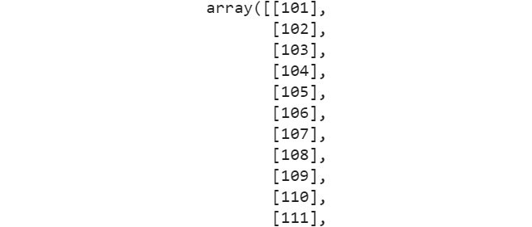
    


3.  Find the sine value of the array by using the following command:

    
    ```
    # sine function
    np.sin(array_5)
    ```

    The output (partially shown) is as follows:

    
    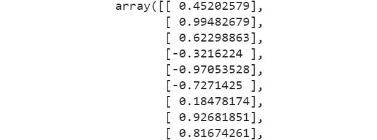
    


4.  Find the logarithmic value of the array by using the following
    command:

    
    ```
    # logarithm
    np.log(array_5)
    ```

    The output (partially shown) is as follows:

    
    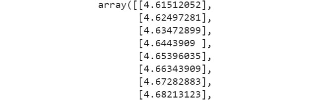
    


5.  Find the exponential value of the array by using the following
    command:

    
    ```
    # Exponential
    np.exp(array_5)
    ```

    The output (partially shown) is as follows:

    
    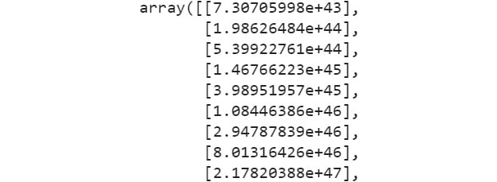
    


As we can see, advanced mathematical operations are fairly easy to
perform on a `NumPy` array using the built-in methods.


Exercise 3.05: Generating Arrays Using arange and linspace Methods
------------------------------------------------------------------

This exercise will demonstrate how we can create a series of numbers
using the `arange` method. To make the list linearly spaced,
we\'re going to use the `linspace` method. To do so, let\'s go
through the following steps:

1.  Import the `NumPy` library and create a series of numbers
    using the `arange` method using the following command:

    
    ```
    import numpy as np
    np.arange(5,16)
    ```

    The output is as follows:

    
    ```
    array([ 5, 6, 7, 8, 9, 10, 11, 12, 13, 14, 15])
    ```

2.  Print numbers using the `arange` function by using the
    following command:

    
    ```
    print("Numbers spaced apart by 2: ",\
          np.arange(0,11,2))
    print("Numbers spaced apart by a floating point number:   ",\
          np.arange(0,11,2.5))
    print("Every 5th number from 30 in reverse order\n",\
          np.arange(30,-1,-5))
    ```

    The output is as follows:

    
    ```
    Numbers spaced apart by 2: [ 0 2 4 6 8 10]
    Numbers spaced apart by a floating point number:  
    [ 0. 2.5 5.0 7.5 10. ]
    Every 5th number from 30 in reverse order
     [30 25 20 15 10  5  0]
    ```

3.  For linearly spaced numbers, we can use the `linspace`
    method, as follows:

    
    ```
    print("11 linearly spaced numbers between 1 and 5: ",\
          np.linspace(1,5,11))
    ```

    The output is as follows:

    
    ```
    11 linearly spaced numbers between 1 and 5: 
    [1. 1.4 1.8 2.2 2.6 3. 3.4 3.8 4.2 4.6 5. ]
    ```

As we can see, the `linspace` method helps us in creating
linearly spaced elements in an array.


So far, we have only created one-dimensional arrays. Now, let\'s create
some multi-dimensional arrays (such as a matrix in linear algebra).


Exercise 3.06: Creating Multi-Dimensional Arrays
------------------------------------------------

In this exercise, just like we created the one-dimensional array from a
simple flat list, we will create a two-dimensional array from a list of
lists.

**Note:**

This exercise will use the `numbers2.csv` file, which can be
found at <https://github.com/fenago/data-wrangling-python>.

Let\'s go through the following steps:

1.  Import the necessary Python libraries, load the
    `numbers2.csv` file, and convert it into a two-dimensional
    `NumPy` array by using the following commands:

    
    ```
    import pandas as pd
    import numpy as np
    df = pd.read_csv("../datasets/numbers2.csv",\
                     header=None)
    list_2D = df.values
    mat1 = np.array(list_2D)
    print("Type/Class of this object:",\
          type(mat1))
    print("Here is the matrix\n----------\n",\
          mat1, "\n----------")
    ```

    **Note:**

    Don\'t forget to change the path (highlighted) based on the location
    of the file on your system.

    The output is as follows:

    
    ```
    Type/Class of this object: <class 'numpy.ndarray'>
    Here is the matrix
    ---------- 
    [[1 2 3] 
    [4 5 6] 
    [7 8 9]] 
    ----------
    ```

2.  Tuples can be converted into multi-dimensional arrays by using the
    following code:

    
    ```
    tuple_2D = np.array([(1.5,2,3), (4,5,6)])
    mat_tuple = np.array(tuple_2D)
    print (mat_tuple)
    ```

    The output is as follows:

    
    ```
    [[1.5 2.  3. ]
     [4.  5.  6. ]]
    ```

Thus, we have created multi-dimensional arrays using Python lists and
tuples.

**Note:**

To access the source code for this specific section, please refer to
<https://github.com/fenago/data-wrangling-python>.


Now, let\'s determine the dimension, shape, size, and data type of the
two-dimensional array.


Exercise 3.07: The Dimension, Shape, Size, and Data Type of Two-dimensional Arrays
----------------------------------------------------------------------------------

This exercise will demonstrate a few methods that will let you check the
dimension, shape, and size of the array.

**Note:**

The `numbers2.csv` file can be found at
<https://github.com/fenago/data-wrangling-python>.

To learn how to find out the dimensions of an array in Python, let\'s go through the following steps:

1.  Import the necessary Python modules and load the
    `numbers2.csv` file:

    
    ```
    import pandas as pd
    import numpy as np
    df = pd.read_csv("../datasets/numbers2.csv",\
                     header=None) 
    list_2D = df.values
    mat1 = np.array(list_2D)
    ```

    **Note:**

    Don\'t forget to change the path (highlighted) based on the location
    of the file on your system.

2.  Print the dimension of the matrix using the `ndim`
    function:

    
    ```
    print("Dimension of this matrix: ", mat1.ndim,sep='')
    ```

    The output is as follows:

    
    ```
    Dimension of this matrix: 2
    ```

3.  Print the size using the `size` function:

    
    ```
    print("Size of this matrix: ", mat1.size,sep='')
    ```

    The output is as follows:

    
    ```
    Size of this matrix: 9
    ```

4.  Print the shape of the matrix using the `shape` function:

    
    ```
    print("Shape of this matrix: ", mat1.shape,sep='')
    ```

    The output is as follows:

    
    ```
    Shape of this matrix: (3, 3)
    ```

5.  Print the dimension type using the `dtype` function:

    
    ```
    print("Data type of this matrix: ", mat1.dtype,sep='')
    ```

    The output is as follows:

    
    ```
    Data type of this matrix: int64
    ```

In this exercise, we looked at the various utility methods available in
order to check the dimensions of an array. We used the `dnim`,
`shape`, `dtype`, and `size` functions to
look at the dimension of the array.


Exercise 3.08: Zeros, Ones, Random, Identity Matrices, and Vectors
------------------------------------------------------------------

In this exercise, we will be creating a vector of zeros and a matrix of
zeros using the `zeros` function of the `NumPy`
library. Then, we\'ll create a matrix of fives using the
`ones` function, followed by generating an identity matrix
using the `eye` function. We will also work with the
`random` function, where we\'ll create a matrix filled with
random values. To do this, let\'s go through the following steps:

1.  Print the vector of zeros by using the following command:

    
    ```
    import numpy as np
    print("Vector of zeros: ",np.zeros(5))
    ```

    The output is as follows:

    
    ```
    Vector of zeros:  [0. 0. 0. 0. 0.]
    ```

2.  Print the matrix of zeros by using the following command:

    
    ```
    print("Matrix of zeros: ",np.zeros((3,4)))
    ```

    The output is as follows:

    
    ```
    Matrix of zeros:  [[0. 0. 0. 0.]
     [0. 0. 0. 0.]
     [0. 0. 0. 0.]]
    ```

3.  Print the matrix of fives by using the following command:

    
    ```
    print("Matrix of 5's: ",5*np.ones((3,3)))
    ```

    The output is as follows:

    
    ```
    Matrix of 5's:  [[5. 5. 5.]
     [5. 5. 5.]
     [5. 5. 5.]]
    ```

4.  Print an identity matrix by using the following command:

    
    ```
    print("Identity matrix of dimension 2:",np.eye(2))
    ```

    The output is as follows:

    
    ```
    Identity matrix of dimension 2: [[1. 0.]
     [0. 1.]]
    ```

5.  Print an identity matrix with a dimension of `4x4` by
    using the following command:

    
    ```
    print("Identity matrix of dimension 4:",np.eye(4))
    ```

    The output is as follows:

    
    ```
    Identity matrix of dimension 4: [[1. 0. 0. 0.]
     [0. 1. 0. 0.]
     [0. 0. 1. 0.]
     [0. 0. 0. 1.]]
    ```

6.  Print a matrix of random shape using the `randint`
    function:

    
    ```
    print("Random matrix of shape(4,3):\n",\
          np.random.randint(low=1,high=10,size=(4,3)))
    ```

    The sample output is as follows:

    
    ```
    Random matrix of shape (4,3):
     [[6 7 6]
     [5 6 7]
     [5 3 6]
     [2 9 4]]
    ```

As we can see from the preceding output, a matrix was generated with a
random shape.

**Note:**

When creating matrices, you need to pass on tuples of integers as
arguments. The output is susceptible to change since we have used random
numbers.

To access the source code for this specific section, please refer to
<https://github.com/fenago/data-wrangling-python>.


Random number generation is a very useful utility and needs to be
mastered for data science/data wrangling tasks. We will look at the
topic of random variables and distributions again in the section on
statistics and learn how NumPy and pandas have built-in random number
and series generation, as well as manipulation functions.

**Reshaping** an array is a very useful operation for vectors as machine
learning algorithms may demand input vectors in various formats for
mathematical manipulation. In this section, we will be looking at how
reshaping can be done on an array. The opposite of `reshape`
is the `ravel` function, which flattens any given array into a
one-dimensional array. It is a very useful action in many machine
learning and data analytics tasks.


Exercise 3.09: Reshaping, Ravel, Min, Max, and Sorting
------------------------------------------------------

In this exercise, we will generate a random one-dimensional vector of
two-digit numbers and then reshape the vector into multi-dimensional
vectors. Let\'s go through the following steps:

1.  Create an array of `30` random integers (sampled from
    `1` to `99`) and reshape it into two different
    forms using the following code:
    
    ```
    import numpy as np
    a = np.random.randint(1,100,30)
    b = a.reshape(2,3,5)
    c = a.reshape(6,5)
    ```

2.  Print the shape using the `shape` function by using the
    following code:

    
    ```
    print ("Shape of a:", a.shape)
    print ("Shape of b:", b.shape)
    print ("Shape of c:", c.shape)
    ```

    The output is as follows:

    
    ```
    Shape of a: (30,)
    Shape of b: (2, 3, 5)
    Shape of c: (6, 5)
    ```

3.  Print the arrays `a`, `b`, and `c`
    using the following code:

    
    ```
    print("\na looks like\n",a)
    print("\nb looks like\n",b)
    print("\nc looks like\n",c)
    ```

    The sample output is as follows:

    
    ```
    a looks like
     [ 7 82  9 29 50 50 71 65 33 84 55 78 40 68 50 15 65 55 98 
     38 23 75 50 57 32 69 34 59 98 48]
    b looks like
     [[[ 7 82  9 29 50]
      [50 71 65 33 84]
      [55 78 40 68 50]]
     [[15 65 55 98 38]
      [23 75 50 57 32]
      [69 34 59 98 48]]]
    c looks like
     [[ 7 82  9 29 50]
     [50 71 65 33 84]
     [55 78 40 68 50]
     [15 65 55 98 38]
     [23 75 50 57 32]
     [69 34 59 98 48]]
    ```

    **Note:**

    `b` is a three-dimensional array -- a kind of list of a
    list of a list. The output is susceptible to change since we have
    used random numbers.

4.  Ravel file `b` using the following code:

    
    ```
    b_flat = b.ravel()
    print(b_flat)
    ```

    The sample output is as follows (the output may be different in each
    iteration):

    
    ```
    [ 7 82  9 29 50 50 71 65 33 84 55 78 40 68 50 15 65 55 98 38 
     23 75 50 57 32 69 34 59 98 48]
    ```

In this exercise, you learned how to use `shape` and
`reshape` functions to see and adjust the dimensions of an
array. This can be useful in a variety of cases when working with
arrays.

Indexing and slicing NumPy arrays is very similar to regular list
indexing. We can even go through a vector of elements with a definite
step size by providing it as an additional argument in the format
(start, step, end). Furthermore, we can pass a list as an argument to
select specific elements.

**Note:**

In multi-dimensional arrays, you can use two numbers to denote the
position of an element. For example, if the element is in the third row
and second column, its indices are 2 and 1 (because of Python\'s
zero-based indexing).


Exercise 3.10: Indexing and Slicing
-----------------------------------

In this exercise, we will learn how to perform indexing and slicing on
one-dimensional and multi-dimensional arrays. To complete this exercise,
let\'s go through the following steps:

1.  Create an array of `10` elements and examine its various
    elements by slicing and indexing the array with slightly different
    syntaxes. Do this by using the following command:

    
    ```
    import numpy as np
    array_1 = np.arange(0,11)
    print("Array:",array_1)
    ```

    The output is as follows:

    
    ```
    Array: [ 0  1  2  3  4  5  6  7  8  9 10]
    ```

2.  Print the element in the seventh position by using the following
    command:

    
    ```
    print("Element at 7th index is:", array_1[7])
    ```

    The output is as follows:

    
    ```
    Element at 7th index is: 7
    ```

3.  Print the elements between the third and sixth positions by using
    the following command:

    
    ```
    print("Elements from 3rd to 5th index are:", array_1[3:6])
    ```

    The output is as follows:

    
    ```
    Elements from 3rd to 5th index are: [3 4 5]
    ```

4.  Print the elements until the fourth position by using the following
    command:

    
    ```
    print("Elements up to 4th index are:", array_1[:4])
    ```

    The output is as follows:

    
    ```
    Elements up to 4th index are: [0 1 2 3]
    ```

5.  Print the elements backward by using the following command:

    
    ```
    print("Elements from last backwards are:", array_1[-1::-1])
    ```

    The output is as follows:

    
    ```
    Elements from last backwards are: [10  9  8  7  6  5  4  3  2  1  0]
    ```

6.  Print the elements using their backward index, skipping three
    values, by using the following command:

    
    ```
    print("3 Elements from last backwards are:", array_1[-1:-6:-2])
    ```

    The output is as follows:

    
    ```
    3 Elements from last backwards are: [10  8  6]
    ```

7.  Create a new array called `array_2` by using the following
    command:

    
    ```
    array_2 = np.arange(0,21,2)
    print("New array:",array_2)
    ```

    The output is as follows:

    
    ```
    New array: [ 0  2  4  6  8 10 12 14 16 18 20]
    ```

8.  Print the second, fourth, and ninth elements of the array:

    
    ```
    print("Elements at 2nd, 4th, and 9th index are:", \
          array_2[[2,4,9]])
    ```

    The output is as follows:

    
    ```
    Elements at 2nd, 4th, and 9th index are: [ 4  8 18]
    ```

9.  Create a multi-dimensional array by using the following command:

    
    ```
    matrix_1 = np.random.randint(10,100,15).reshape(3,5)
    print("Matrix of random 2-digit numbers\n ",matrix_1)
    ```

    The sample output is as follows:

    
    ```
    Matrix of random 2-digit numbers
      [[21 57 60 24 15]
     [53 20 44 72 68]
     [39 12 99 99 33]]
    ```

    **Note:**

    The output is susceptible to change since we have used random
    numbers.

10. Access the values using double bracket indexing by using the
    following command:

    
    ```
    print("\nDouble bracket indexing\n")
    print("Element in row index 1 and column index 2:", \
          matrix_1[1][2])
    ```

    The sample output is as follows:

    
    ```
    Double bracket indexing
    Element in row index 1 and column index 2: 44
    ```

11. Access the values using single bracket indexing by using the
    following command:

    
    ```
    print("\nSingle bracket with comma indexing\n")
    print("Element in row index 1 and column index 2:", \
          matrix_1[1,2])
    ```

    The sample output is as follows:

    
    ```
    Single bracket with comma indexing
    Element in row index 1 and column index 2: 44
    ```

12. Access the values in a multi-dimensional array using a row or column
    by using the following command:

    
    ```
    print("\nRow or column extract\n")
    print("Entire row at index 2:", matrix_1[2])
    print("Entire column at index 3:", matrix_1[:,3])
    ```

    The sample output is as follows:

    
    ```
    Row or column extract
    Entire row at index 2: [39 12 99 99 33]
    Entire column at index 3: [24 72 99]
    ```

13. Print the matrix with the specified row and column indices by using
    the following command:

    
    ```
    print("\nSubsetting sub-matrices\n")
    print("Matrix with row indices 1 and 2 and column "\
          "indices 3 and 4\n", matrix_1[1:3,3:5])
    ```

    The sample output is as follows:

    
    ```
    Subsetting sub-matrices
    Matrix with row indices 1 and 2 and column indices 3 and 4
     [[72 68]
     [99 33]]
    ```

14. Print the matrix with the specified row and column indices by using
    the following command:

    
    ```
    print("Matrix with row indices 0 and 1 and column "\
          "indices 1 and 3\n", matrix_1[0:2,[1,3]])
    ```

    The sample output is as follows:

    
    ```
    Matrix with row indices 0 and 1 and column indices 1 and 3
     [[57 24]
     [20 72]]
    ```

    **Note:**

    The output is susceptible to change since we have used random numbers.


In this exercise, we worked with `NumPy` arrays and various
ways of subletting them, such as slicing them. When working with arrays,
it\'s very common to deal with them in this way.


Conditional SubSetting
----------------------

**Conditional subsetting** is a way to select specific elements based on
some numeric condition. It is almost like a shortened version of a SQL
query to subset elements. See the following example:

```
matrix_1 = np.array(np.random.randint(10,100,15)).reshape(3,5)
print("Matrix of random 2-digit numbers\n",matrix_1)
print ("\nElements greater than 50\n", matrix_1[matrix_1>50])
```


In the preceding code example, we have created an array with 15 random
values between `10-100`. We have applied the
`reshape` function. Then, we selected the elements that are
less than `50`.

The sample output is as follows (note that the exact output will be
different for you as it is random):

```
Matrix of random 2-digit numbers
 [[71 89 66 99 54]
 [28 17 66 35 85]
 [82 35 38 15 47]]
Elements greater than 50
 [71 89 66 99 54 66 85 82]
```


NumPy arrays operate just like mathematical matrices, and the operations
are performed element-wise.

Now, let\'s look at an exercise to understand how we can perform array
operations.


Exercise 3.11: Array Operations
-------------------------------

In this exercise, we\'re going to create two matrices (multi-dimensional
arrays) with random integers and demonstrate element-wise mathematical
operations such as addition, subtraction, multiplication, and division.
We can show the exponentiation (raising a number to a certain power)
operation by performing the following steps:

**Note:**

Due to random number generation, your specific output could be different
than what is shown here.

1.  Import the `NumPy` library and create two matrices:

    
    ```
    import numpy as np
    matrix_1 = np.random.randint(1,10,9).reshape(3,3)
    matrix_2 = np.random.randint(1,10,9).reshape(3,3)
    print("\n1st Matrix of random single-digit numbers\n",\
          matrix_1)
    print("\n2nd Matrix of random single-digit numbers\n",\
          matrix_2)
    ```

    The sample output is as follows (note that the exact output will be
    different for you as it is random):

    
    ```
    1st Matrix of random single-digit numbers
     [[6 5 9]
     [4 7 1]
     [3 2 7]]
    2nd Matrix of random single-digit numbers
     [[2 3 1]
     [9 9 9]
     [9 9 6]]
    ```

2.  Perform addition, subtraction, division, and linear combination on
    the matrices:

    
    ```
    print("\nAddition\n", matrix_1+matrix_2)
    print("\nMultiplication\n", matrix_1*matrix_2)
    print("\nDivision\n", matrix_1/matrix_2)
    print("\nLinear combination: 3*A - 2*B\n", \
          3*matrix_1-2*matrix_2)
    ```

    The sample output is as follows (note that the exact output will be
    different for you as it is random):

    
    ```
    Addition
     [[ 8  8 10]
     [13 16 10]
     [12 11 13]] 
    Multiplication
     [[12 15  9]
     [36 63  9]
     [27 18 42]]
    Division
     [[3.       1.66666667 9.     ]
     [0.44444444 0.77777778 0.11111111]
     [0.33333333 0.22222222 1.16666667]]
    Linear combination: 3*A - 2*B
     [[ 14    9  25]
     [ -6    3 -15]
     [ -9 -12    9]]
    ```

3.  Perform the addition of a scalar, exponential matrix cube, and
    exponential square root:

    
    ```
    print("\nAddition of a scalar (100)\n", 100+matrix_1)
    print("\nExponentiation, matrix cubed here\n", matrix_1**3)
    print("\nExponentiation, square root using 'pow' function\n", \
          pow(matrix_1,0.5))
    ```

    The sample output is as follows (note that the exact output will be
    different for you as it is random):

    
    ```
    Addition of a scalar (100)
     [[106 105 109]
     [104 107 101]
     [103 102 107]]
    Exponentiation, matrix cubed here
     [[216 125 729]
     [ 64 343    1]
     [ 27    8 343]]
    Exponentiation, square root using 'pow' function
     [[2.44948974 2.23606798 3.     ]
     [2.      2.64575131 1.     ]
     [1.73205081 1.41421356 2.64575131]]
    ```

    **Note:**

    The output is susceptible to change since we have used random numbers.


We have now seen how to work with arrays to perform various mathematical
functions, such as scalar addition and matrix cubing.


Stacking Arrays
---------------

Stacking arrays on top of each other (or side by side) is a useful
operation for data wrangling. Stacking is a way to concatenate two NumPy
arrays together. Here is the code:

```
a = np.array([[1,2],[3,4]])
b = np.array([[5,6],[7,8]])
print("Matrix a\n",a)
print("Matrix b\n",b)
print("Vertical stacking\n",np.vstack((a,b)))
print("Horizontal stacking\n",np.hstack((a,b)))
```


The output is as follows:

```
Matrix a
 [[1 2]
 [3 4]]
Matrix b
 [[5 6]
 [7 8]]
Vertical stacking
 [[1 2]
 [3 4]
 [5 6]
 [7 8]]
Horizontal stacking
 [[1 2 5 6]
 [3 4 7 8]]
```


`NumPy` has many other advanced features, mainly related to
statistics and linear algebra functions, which are used extensively in
machine learning and data science tasks. However, not all of that is
directly useful for beginner-level data wrangling, so we won\'t cover it
here.

In the next section, we\'ll talk about pandas DataFrames.


Pandas DataFrames
-----------------

The `pandas` library is a Python package that provides fast,
flexible, and expressive data structures that are designed to make
working with relational or labeled data both easy and intuitive. It aims
to be the fundamental high-level building block for doing practical,
real-world data analysis in Python. Additionally, it has the broader
goal of becoming the most powerful and flexible open source data
analysis/manipulation tool that\'s available in any language.

The two primary data structures of pandas are Series (one-dimensional)
and DataFrames (two-dimensional) and they handle the vast majority of
typical use cases. `pandas` is built on top of
`NumPy` and is intended to integrate well within a scientific
computing environment with many other third-party libraries.

Let\'s look at a few exercises in order to understand data handling
techniques using the `pandas` library.


Exercise 3.12: Creating a Pandas Series
---------------------------------------

In this exercise, we will learn how to create a `pandas`
series object from the data structures that we created previously. If
you have imported pandas as pd, then the function to create a series is
simply `pd.Series`. Let\'s go through the following steps:

1.  Import the `NumPy` library and initialize the labels,
    lists, and a dictionary:
    
    ```
    import numpy as np
    labels = ['a','b','c']
    my_data = [10,20,30]
    array_1 = np.array(my_data)
    d = {'a':10,'b':20,'c':30}
    ```

2.  Import `pandas` as `pd` by using the following
    command:
    
    ```
    import pandas as pd
    ```

3.  Create a series from the `my_data` list by using the
    following command:

    
    ```
    print("\nHolding numerical data\n",'-'*25, sep='')
    print(pd.Series(array_1))
    ```

    The output is as follows:

    
    ```
    Holding numerical data
    -------------------------
    0  10
    1  20
    2  30
    dtype: int64
    ```

4.  Create a series from the `my_data` list along with the
    labels as follows:

    
    ```
    print("\nHolding text labels\n",'-'*20, sep='')
    print(pd.Series(labels))
    ```

    The output is as follows:

    
    ```
    Holding text labels
    --------------------
    0     a
    1     b
    2     c
    dtype: object
    ```

5.  Then, create a series from the `NumPy` array, as follows:

    
    ```
    print("\nHolding functions\n",'-'*20, sep='')
    print(pd.Series(data=[sum,print,len]))
    ```

    The output is as follows:

    
    ```
    Holding functions
    --------------------
    0     <built-in function sum>
    1     <built-in function print>
    2     <built-in function len>
    dtype: object
    ```

6.  Create a series from the dictionary, as follows:

    
    ```
    print("\nHolding objects from a dictionary\n",'-'*40, sep='')
    print(pd.Series(data=[d.keys, d.items, d.values]))
    ```

    The output is as follows:

    
    ```
    Holding objects from a dictionary
    ----------------------------------------
    0     <built-in method keys of dict object at 0x7fb8...
    1     <built-in method items of dict object at 0x7fb...
    2     <built-in method values of dict object at 0x7f...
    dtype: object
    ```

    **Note:**

    You may get a different final output because the system may store
    the object in the memory differently.


In this exercise, we created `pandas` series, which are the
building blocks of `pandas` DataFrames. The `pandas`
`series` object can hold many types of data, such as integers,
objects, floats, doubles, and others. This is the key to constructing a
bigger table where multiple series objects are stacked together to
create a database-like entity.


Exercise 3.13: Pandas Series and Data Handling
----------------------------------------------

In this exercise, we will create a `pandas` series using the
`pd.series` function. Then, we will manipulate the data in the
DataFrame using various handling techniques. Perform the following
steps:

1.  Create a `pandas` series with numerical data by using the
    following command:

    
    ```
    import numpy as np
    import pandas as pd
    labels = ['a','b','c'] 
    my_data = [10,20,30] 
    array_1 = np.array(my_data)
    d = {'a':10,'b':20,'c':30} 
    print("\nHolding numerical data\n",'-'*25, sep='')
    print(pd.Series(array_1))
    ```

    The output is as follows:

    
    ```
    Holding numerical data
    -------------------------
    0     10
    1     20
    2     30
    dtype: int32
    ```

2.  Create a `pandas` series with labels by using the
    following command:

    
    ```
    print("\nHolding text labels\n",'-'*20, sep='')
    print(pd.Series(labels))
    ```

    The output is as follows:

    
    ```
    Holding text labels
    --------------------
    0     a
    1     b
    2     c
    dtype: object
    ```

3.  Create a `pandas` series with functions by using the
    following command:

    
    ```
    print("\nHolding functions\n",'-'*20, sep='')
    print(pd.Series(data=[sum,print,len]))
    ```

    The output is as follows:

    
    ```
    Holding functions
    --------------------
    0     <built-in function sum>
    1     <built-in function print>
    2     <built-in function len>
    dtype: object
    ```

4.  Create a `pandas` series with a dictionary by using the
    following command:

    
    ```
    print("\nHolding objects from a dictionary\n",'-'*40, sep='')
    print(pd.Series(data=[d.keys, d.items, d.values]))
    ```

    The output is as follows:

    
    ```
    Holding objects from a dictionary
    ----------------------------------------
    0     <built-in method keys of dict object at 0x0000...
    1     <built-in method items of dict object at 0x000...
    2     <built-in method values of dict object at 0x00...
    dtype: object
    ```


In this exercise, we created pandas `series` objects using
various types of lists.


Exercise 3.14: Creating Pandas DataFrames
-----------------------------------------

The `pandas` DataFrame is similar to an Excel table or
relational database (SQL) table, which consists of three main
components: the data, the index (or rows), and the columns. Under the
hood, it is a stack of `pandas` series objects, which are
themselves built on top of `NumPy` arrays. So, all of our
previous knowledge of NumPy arrays applies here. Let\'s perform the
following steps:

1.  Create a simple DataFrame from a two-dimensional matrix of numbers.
    First, the code draws `20` random integers from the
    uniform distribution. Then, we need to reshape it into a
    (`5,4`) NumPy array -- `5` rows and
    `4` columns:
    
    ```
    import numpy as np
    import pandas as pd
    matrix_data = np.random.randint(1,10,size=20).reshape(5,4)
    ```

2.  Define the rows labels as (`'A','B','C','D','E'`) and
    column labels as (`'W','X','Y','Z'`):
    
    ```
    row_labels = ['A','B','C','D','E']
    column_headings = ['W','X','Y','Z']
    ```

3.  Create a DataFrame using `pd.DataFrame`:
    
    ```
    df = pd.DataFrame(data=matrix_data, index=row_labels, \
                      columns=column_headings)
    ```

4.  Print the DataFrame:

    
    ```
    print("\nThe data frame looks like\n",'-'*45, sep='')
    print(df) 
    ```

    The sample output is as follows:

    
    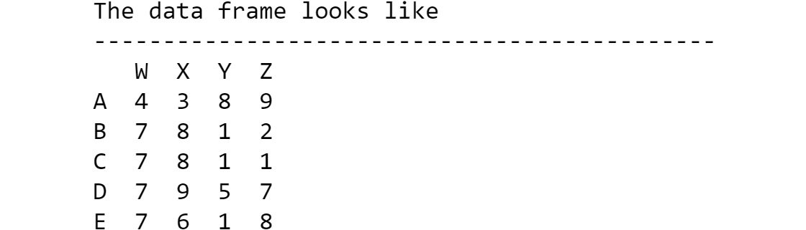
    


5.  Create a DataFrame from a Python dictionary of the lists of integers
    by using the following command:
    
    ```
    d={'a':[10,20],'b':[30,40],'c':[50,60]}
    ```

6.  Pass this dictionary as a data argument to the
    `pd.DataFrame` function. Pass on a list of rows or
    indices. Notice how the dictionary keys became the column names and
    that the values were distributed among multiple rows:

    
    ```
    df2=pd.DataFrame(data=d,index=['X','Y'])
    print(df2)
    ```

    The output is as follows:

    
    
    


**Note:**

To access the source code for this specific section, please refer to
<https://github.com/fenago/data-wrangling-python>.


In this exercise, we created DataFrames manually from scratch, which
will allow us to understand DataFrames better.

**Note:**

The most common way that you will create a pandas DataFrame will be to
read tabular data from a file on your local disk or over the internet --
CSV, text, JSON, HTML, Excel, and so on. We will cover some of these in
the next lab.


Exercise 3.15: Viewing a DataFrame Partially
--------------------------------------------

In the previous exercise, we used `print(df)` to print the
whole DataFrame. For a large dataset, we would like to print only
sections of data. In this exercise, we will read a part of the
DataFrame. Let\'s learn how to do so:

1.  Import the `NumPy` library and execute the following code
    to create a DataFrame with `25` rows. Then, fill it with
    random numbers:
    
    ```
    # 25 rows and 4 columns
    import numpy as np
    import pandas as pd
    matrix_data = np.random.randint(1,100,100).reshape(25,4)
    column_headings = ['W','X','Y','Z']
    df = pd.DataFrame(data=matrix_data,columns=column_headings)
    ```

2.  Run the following code to view only the first five rows of the
    DataFrame:

    
    ```
    df.head()
    ```

    The sample output is as follows (note that your output could be
    different due to randomness):

    
    
    


    By default, `head` shows only five rows. If you want to
    see any specific number of rows, just pass that as an argument.

3.  Print the first eight rows by using the following command:

    
    ```
    df.head(8)
    ```

    The sample output is as follows:

    
    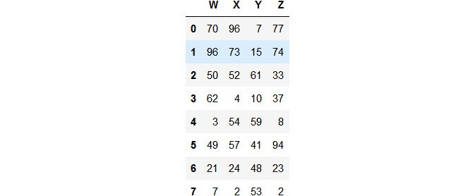
    


    Just like `head` shows the first few rows,
    `tail` shows the last few rows.

4.  Print the DataFrame using the `tail` command, as follows:

    
    ```
    df.tail(10)
    ```

    The sample output (partially shown) is as follows:

    
    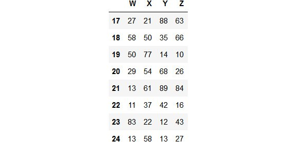
    


**Note:**

To access the source code for this specific section, please refer to
<https://github.com/fenago/data-wrangling-python>.


In this section, we learned how to view portions of the DataFrame
without looking at the whole DataFrame. In the next section, we\'re
going to look at two functionalities: indexing and slicing columns in a
DataFrame.


Indexing and Slicing Columns
----------------------------

There are two methods for indexing and slicing columns in a DataFrame.
They are as follows:

-   The `DOT` method
-   The `bracket` method

The **DOT** method is good if you want to find a specific element. You
will refer to the column after the DOT. An example is
`df.column`. The bracket method is intuitive and easy to
follow. In this method, you can access the data by the generic
name/header of the column.

The following code illustrates these concepts. We can execute them in
our Jupyter Notebook:

```
print("\nThe 'X' column\n",'-'*25, sep='')
print(df['X'])
print("\nType of the column: ", type(df['X']), sep='')
print("\nThe 'X' and 'Z' columns indexed by passing a list\n",\
      '-'*55, sep='')
print(df[['X','Z']])
print("\nType of the pair of columns: ", \
      type(df[['X','Z']]), sep='')
```


The output is as follows (a only the partial output is shown here
because the actual column is long):


This is the output showing the type of column:


This is the output showing the X and Z column indexed by passing a list:


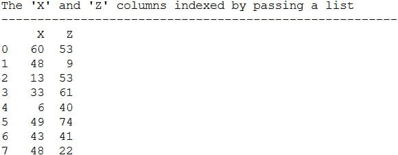


This is the output showing the type of the pair of columns:


**Note:**

For more than one column, the object turns into a DataFrame. But for a
single column, it is a `pandas` series object.

So far, we have seen how to access the columns of DataFrames using both
the DOT method and the bracket method. Dataframes are commonly used for
row/column data.

Now, let\'s look at indexing and slicing rows.


Indexing and Slicing Rows
-------------------------

Indexing and slicing rows in a DataFrame can also be done using the
following methods:

-   The label-based `loc` method
-   The index-based `iloc` method

The `loc` method is intuitive and easy to follow. In this
method, you can access the data by the generic name of the row. On the
other hand, the `iloc` method allows you to access the rows by
their numerical index. This can be very useful for a large table with
thousands of rows, especially when you want to iterate over the table in
a loop with a numerical counter. The following code illustrates the
concepts of `iloc`:

```
matrix_data = np.random.randint(1,10,size=20).reshape(5,4)
row_labels = ['A','B','C','D','E']
column_headings = ['W','X','Y','Z']
df = pd.DataFrame(data=matrix_data, index=row_labels, \
                  columns=column_headings)
print("\nLabel-based 'loc' method for selecting row(s)\n",\
      '-'*60, sep='')
print("\nSingle row\n")
print(df.loc['C'])
print("\nMultiple rows\n")
print(df.loc[['B','C']])
print("\nIndex position based 'iloc' method for selecting "\
      "row(s)\n", '-'*70, sep='')
print("\nSingle row\n")
print(df.iloc[2])
print("\nMultiple rows\n")
print(df.iloc[[1,2]])
```


The sample output is as follows:


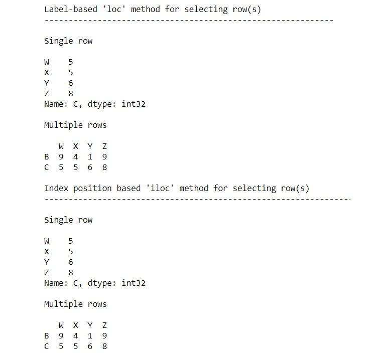


One of the most common tasks in data wrangling is creating or deleting
columns or rows of data from your DataFrame. Sometimes, you want to
create a new column based on some mathematical operation or
transformation involving the existing columns. This is similar to
manipulating database records and inserting a new column based on simple
transformations. We\'ll look at some of these concepts in the upcoming
exercises.


Exercise 3.16: Creating and Deleting a New Column or Row
--------------------------------------------------------

In this exercise, we\'re going to create and delete a new column or a
row from the `stock.csv` dataset. We\'ll also use the
`inplace` function to modify the original DataFrame.

**Note:**

The `stock.csv` file can be found here:
<https://github.com/fenago/data-wrangling-python>.

Let\'s go through the following steps:

1.  Import the necessary Python modules, load the `stocks.csv`
    file, and create a new column using the following snippet:

    
    ```
    import pandas as pd
    df = pd.read_csv("../datasets/stock.csv")
    df.head()
    print("\nA column is created by assigning it in relation\n",\
          '-'*75, sep='')
    df['New'] = df['Price']+df['Price']
    df['New (Sum of X and Z)'] = df['New']+df['Price']
    print(df)
    ```

    **Note:**

    Don\'t forget to change the path (highlighted) based on the location
    of the file on your system.

    The sample output (partially shown) is as follows:

    
    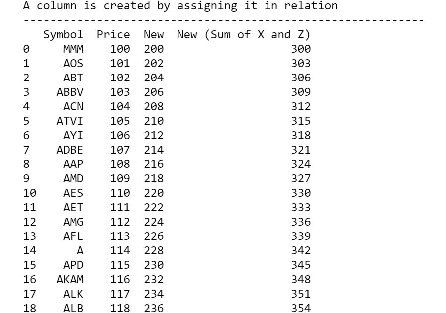
    


2.  Drop a column using the `df.drop` method:

    
    ```
    print("\nA column is dropped by using df.drop() method\n",\
          '-'*55, sep='')
    df = df.drop('New', axis=1) # Notice the axis=1 option
    # axis = 0 is default, so one has to change it to 1
    print(df)
    ```

    The sample output (partially shown) is as follows:

    
    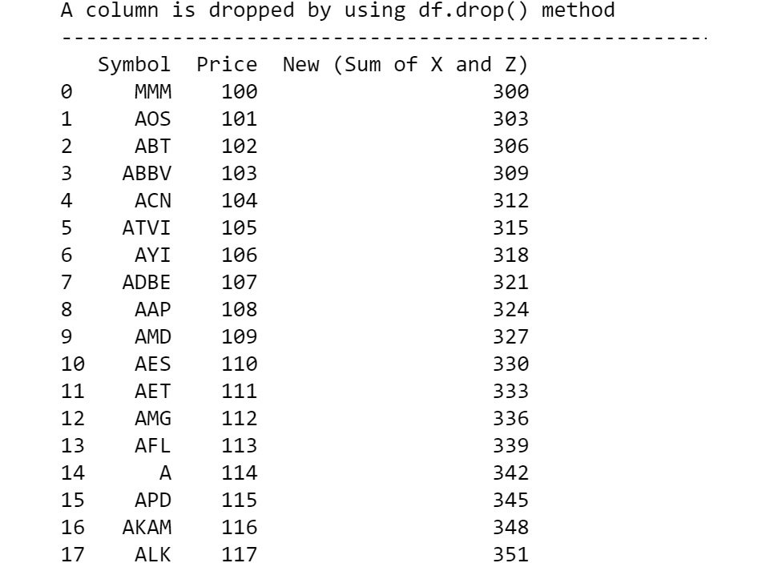
    


3.  Drop a specific row using the `df.drop` method:

    
    ```
    df1=df.drop(1)
    print("\nA row is dropped by using df.drop method and axis=0\n",\
          '-'*65, sep='')
    print(df1)
    ```

    The partial output is as follows:

    
    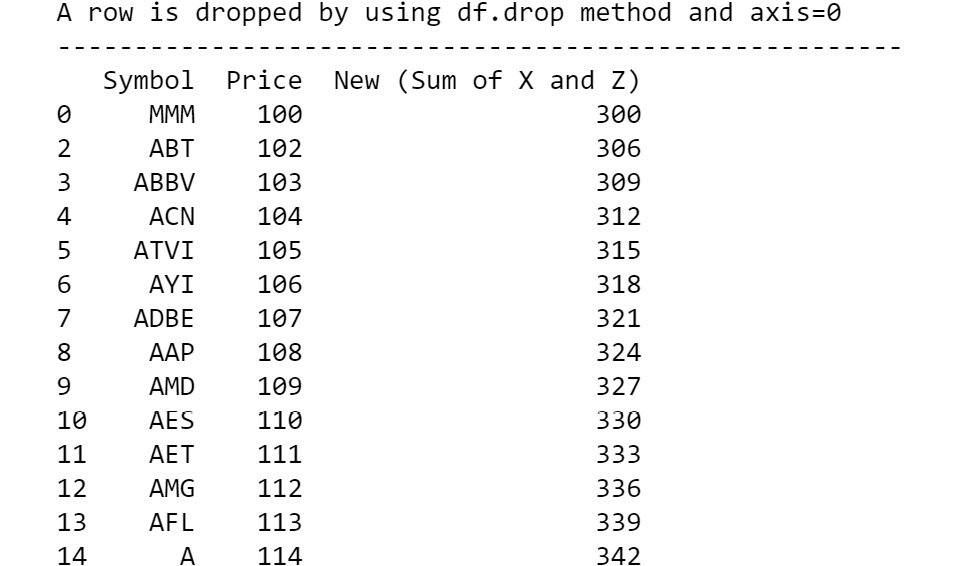
    


    Dropping methods creates a copy of the DataFrame and does not change
    the original DataFrame.

4.  Change the original DataFrame by setting the `inplace`
    argument to `True`:

    
    ```
    print("\nAn in-place change can be done by making ",\
          "inplace=True in the drop method\n",\
          '-'*75, sep='')
    df.drop('New (Sum of X and Z)', axis=1, inplace=True)
    print(df)
    ```

    The sample output is as follows:

    
    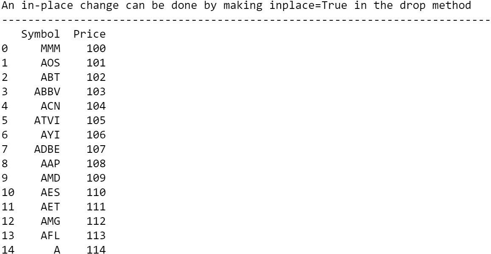
    


**Note:**

To access the source code for this specific section, please refer to
<https://github.com/fenago/data-wrangling-python>.


We have now learned how to modify DataFrames by dropping or adding rows
and columns.

**Note:**

All the normal operations are not in-place, that is, they do not impact
the original DataFrame object and return a copy of the original with
addition (or deletion) instead. The last bit of the preceding code shows
how to make a change in the existing DataFrame with the
`inplace=True` argument. Please note that this change is
irreversible and should be used with caution.


Statistics and Visualization with NumPy and Pandas
==================================================


One of the great advantages of using libraries such as NumPy and pandas
is that a plethora of built-in statistical and visualization methods are
available, for which we don\'t have to search for and write new code.
Furthermore, most of these subroutines are written using C or Fortran
code (and pre-compiled), making them extremely fast to execute.


Refresher on Basic Descriptive Statistics
-----------------------------------------

For any data wrangling task, it is quite useful to extract basic
descriptive statistics, which should describe the data in ways such as
the mean, median, and mode and create some simple visualizations or
plots. These plots are often the first step in identifying fundamental
patterns as well as oddities (if present) in the data. In any
statistical analysis, descriptive statistics is the first step, followed
by inferential statistics, which tries to infer the underlying
distribution or process that the data might have been generated from.
You can imagine that descriptive statistics will inform us of the basic
characteristics of the data, while inferential statistics will help us
understand not only the data we are working with but alternative data
that we might be experimenting with.

Since inferential statistics is intimately coupled with the machine
learning/predictive modeling stage of a data science pipeline,
descriptive statistics naturally becomes associated with the data
wrangling aspect.

There are two broad approaches to descriptive statistical analysis:

-   **Graphical techniques**: Bar plots, scatter plots, line charts, box
    plots, histograms, and so on
-   **The calculation of the central tendency and spread**: Mean,
    median, mode, variance, standard deviation, range, and so on

In this section, we will demonstrate how you can accomplish both of
these tasks using Python. Apart from NumPy and pandas, we will need to
learn the basics of another great package -- `matplotlib` --
which is the most powerful and versatile visualization library in
Python.


Exercise 3.17: Introduction to Matplotlib through a Scatter Plot
----------------------------------------------------------------

In this exercise, we will demonstrate the power and simplicity of
matplotlib by creating a simple scatter plot from self-created data
about the age, weight, and height of a few people. To do so, let\'s go
through the following steps:

1.  First, we will define simple lists of the names of people, along
    with their age, weight (in kgs), and height (in centimeters):
    
    ```
    people = ['Ann','Brandon','Chen','David','Emily',\
              'Farook','Gagan','Hamish','Imran',\
              'Joseph','Katherine','Lily']
    age = [21,12,32,45,37,18,28,52,5,40,48,15]
    weight = [55,35,77,68,70,60,72,69,18,65,82,48]
    height = [160,135,170,165,173,168,175,159,105,\
              171,155,158]
    ```

2.  Import the most important module from `matplotlib`, called
    `pyplot`:
    
    ```
    import matplotlib.pyplot as plt
    ```

3.  Create simple scatter plots of `age` versus
    `weight`:

    
    ```
    plt.scatter(age,weight)
    plt.show()
    ```

    The output is as follows:

    
    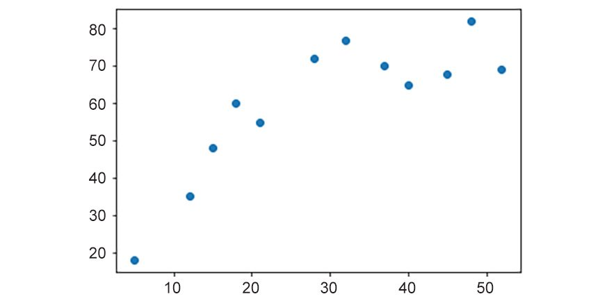
    

    The preceding plot can be improved by enlarging the figure size,
    customizing the aspect ratio, adding a title with a proper font
    size, adding x-axis and y-axis labels with a customized font size,
    adding grid lines, changing the y-axis limit to be between
    `0` and `100`, adding x and y tick marks,
    customizing the scatter plot\'s color, and changing the size of the
    scatter dots.

4.  The code for the improved plot is as follows:

    
    ```
    plt.figure(figsize=(8,6))
    plt.title("Plot of Age vs. Weight (in kgs)",\
              fontsize=20)
    plt.xlabel("Age (years)",fontsize=16)
    plt.ylabel("Weight (kgs)",fontsize=16)
    plt.grid (True)
    plt.ylim(0,100)
    plt.xticks([i*5 for i in range(12)],fontsize=15)
    plt.yticks(fontsize=15)
    plt.scatter(x=age,y=weight,c='orange',s=150,\
                edgecolors='k')
    plt.text(x=20,y=85,s="Weights after 18-20 years of age",\
             fontsize=15)
    plt.vlines(x=20,ymin=0,ymax=80,linestyles='dashed',\
               color=›blue›,lw=3)
    plt.legend([‹Weight in kgs›],loc=2,fontsize=12)
    plt.show()
    ```

    The output is as follows:

    
    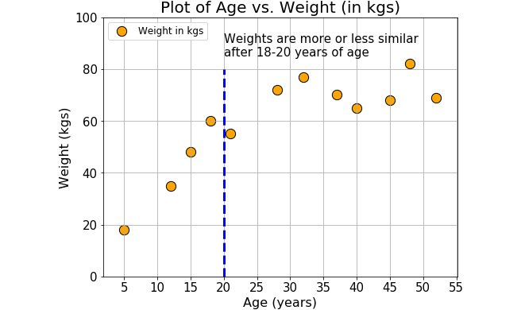
    

We can observe the following things:

-   A tuple (`8,6`) is passed as an argument for the figure
    size.
-   A list comprehension is used inside `xticks` to create a
    customized list of 5-10-15-...-55.
-   A newline (`\n`) character is used inside the
    `plt.text()` function to break up and distribute the text
    into two lines.
-   The `plt.show()` function is used at the very end. The
    idea is to keep on adding various graphics properties (font, color,
    axis limits, text, legend, grid, and so on) until you are satisfied
    and then show the plot with one function. The plot will not be
    displayed without this last function call.

The preceding plot is quite self-explanatory. We can observe that the
variations in weight are reduced after `18-20` years of age.

**Note:**

To access the source code for this specific section, please refer to
<https://github.com/fenago/data-wrangling-python>.


In this exercise, we have gone through the basics of using
`matplotlib`, a popular charting function. In the next
section, we will look at the definition of statistical measures.


The Definition of Statistical Measures -- Central Tendency and Spread
=====================================================================


A measure of central tendency is a single value that attempts to
describe a set of data by identifying the central position within that
set of data. They are also categorized as summary statistics:

-   **Mean**: The mean is the sum of all values divided by the total
    number of values.
-   **Median**: The median is the middle value. It is the value that
    splits the dataset in half. To find the median, order your data from
    smallest to largest, and then find the data point that has an equal
    amount of values above and below it.
-   **Mode**: The mode is the value that occurs the most frequently in
    your dataset. On a bar chart, the mode is the highest bar.

Generally, the mean is a better measure to use for symmetric data while
the median is a better measure for data with a skewed (left- or
right-heavy) distribution. For categorical data, you have to use the
mode:


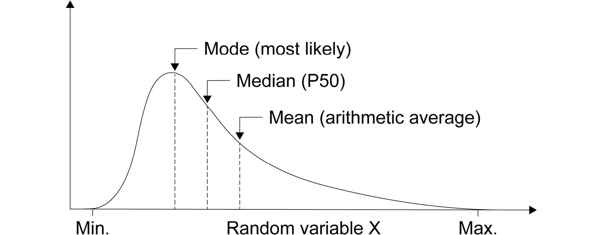


The spread of the data is a measure of by how much the values in the
dataset are likely to differ from the mean of the values. If all the
values are close together, then the spread is low; on the other hand, if
some or all of the values differ by a large amount from the mean (and
each other), then there is a large spread in the data:

-   **Variance**: This is the most common measure of spread. The
    variance is the average of the squares of the deviations from the
    mean. Squaring the deviations ensures that negative and positive
    deviations do not cancel each other out.
-   **Standard deviation**: Because variance is produced by squaring the
    distance from the mean, its unit does not match that of the original
    data. Standard deviation is a mathematical trick that brings back
    parity. It is the positive square root of the variance.


Random Variables and Probability Distribution
---------------------------------------------

A random variable is defined as the value of a given variable that
represents the outcome of a statistical experiment or process.

Although it sounds very formal, pretty much everything around us that we
can measure can be thought of as a random variable.

The reason behind this is that almost all natural, social, biological,
and physical processes are the final outcome of a large number of
complex processes, and we cannot know the details of those fundamental
processes. All we can do is observe and measure the final outcome.

Typical examples of random variables that are around us are as follows:

-   The economic output of a nation
-   The blood pressure of a patient
-   The temperature of a chemical process in a factory
-   The number of friends of a person on Facebook
-   The stock market price of a company

These values can take any discrete or continuous value and follow a
particular pattern (although this pattern may vary over time).
Therefore, they can all be classified as random variables.


What is a Probability Distribution?
-----------------------------------

A probability distribution is a mathematical function that tells you the
likelihood of a random variable taking each different possible value. In
other words, a probability distribution gives the probabilities of the
different possible outcomes in a given situation.

Suppose you go to a school and measure the heights of students who have
been selected randomly. Height is an example of a random variable here.
As you measure height, you can create a distribution of height. This
type of distribution is useful when you need to know which outcomes are
the most likely to occur (that is, which heights are the most common),
the spread of potential values, and the likelihood of different results.

The concepts of central tendency and spread are applicable to a
distribution and are used to describe the properties and behavior of a
distribution.

Statisticians generally divide all distributions into two broad
categories:

-   Discrete distributions
-   Continuous distributions


Discrete Distributions
----------------------

Discrete probability functions, also known as probability mass
functions, can assume a discrete number of values. For example, coin
tosses and counts of events are discrete functions. You can only have
heads or tails in a coin toss. Similarly, if you\'re counting the number
of trains that arrive at a station per hour, you can count 11 or 12
trains, but nothing in between.

Some prominent discrete distributions are as follows:

-   Binomial distribution to model binary data, such as coin tosses
-   Poisson distribution to model count data, such as the count of
    library book checkouts per hour
-   Uniform distribution to model multiple events with the same
    probability, such as rolling a die


Continuous Distributions
------------------------

Continuous probability functions are also known as probability density
functions. You have a continuous distribution if the variable can assume
an infinite number of values between any two values. Continuous
variables are often measurements on a real number scale, such as height,
weight, and temperature.

The most well-known continuous distribution is normal distribution,
which is also known as Gaussian distribution or the bell curve. This
symmetric distribution fits a wide variety of phenomena, such as human
height and IQ scores.

Normal distribution is linked to the famous **68-95-99.7** rule, which
describes the percentage of data that falls within 1, 2, or 3 standard
deviations away from the mean if the data follows a normal distribution.
This means that you can quickly look at some sample data, calculate the
mean and standard deviation, and can have confidence (a statistical
measure of uncertainty) that any future incoming data will fall within
those `68%-95%-99.7%` boundaries. This rule is widely used in
industries, medicine, economics, and social science:

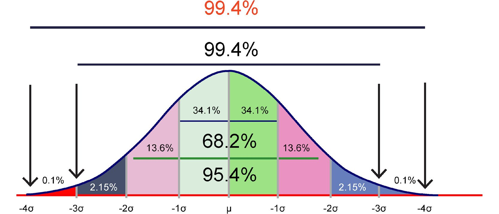


Data Wrangling in Statistics and Visualization
==============================================


A good data wrangling professional is expected to encounter a dizzying
array of diverse data sources each day. As we explained previously, due
to a multitude of complex sub-processes and mutual interactions that
give rise to such data, they all fall into the category of discrete or
continuous random variables.

It would be extremely difficult and confusing for a data wrangler or a
data science team if all of this data continued to be treated as
completely random without any shape or pattern. A formal statistical
basis must be given to such random data streams, and one of the simplest
ways to start that process is to measure their descriptive statistics.

Assigning a stream of data to a particular distribution function (or a
combination of many distributions) is actually part of inferential
statistics. However, inferential statistics starts only when descriptive
statistics is done alongside measuring all the important parameters of
the pattern of the data.

Therefore, as the front line of a data science pipeline, the process of
data wrangling must deal with measuring and quantifying such descriptive
statistics of the incoming data. Along with the formatted and cleaned-up
data, the primary job of a data wrangler is to hand over these measures
(and sometimes accompanying plots) to the next member of the analytics
team.

Plotting and visualization also help a data wrangling team in
identifying potential outliers and misfits in the incoming data stream
and help them take the appropriate action. We will see some examples of
such tasks in the next lab, where we will identify odd data points
by creating scatter plots or histograms and either impute or omit the
data point.


Using NumPy and Pandas to Calculate Basic Descriptive Statistics
----------------------------------------------------------------

Now that we have some basic knowledge of `NumPy`,
`pandas`, and `matplotlib` under our belt, we can
explore a few additional topics related to these libraries, such as how
we can bring them together for advanced data generation, analysis,
and visualization.


Random Number Generation Using NumPy
------------------------------------

`NumPy` offers a dizzying array of random number generation
utility functions, all of which correspond to various statistical
distributions, such as uniform, binomial, Gaussian normal, Beta/Gamma,
and chi-square. Most of these functions are extremely useful and appear
countless times in advanced statistical data mining and machine learning
tasks. Having a solid understanding of these concepts is strongly
encouraged for all of you reading this book.

Here, we will discuss three of the most important distributions that may
come in handy for data wrangling tasks -- **uniform**, **binomial**, and
**gaussian normal**. The goal here is to show an example of simple
function calls that can generate one or more random numbers/arrays
whenever the user needs them.

A **uniform distribution** is a probability distribution that is
concerned with events that are equally likely to occur. Let\'s go
through the following exercise to practice uniform distribution with
random numbers.


Exercise 3.18: Generating Random Numbers from a Uniform Distribution
--------------------------------------------------------------------

In this exercise, we will be generating random numbers from a uniform
distribution of numbers from 1-10. Next, we\'ll generate some artificial
data for a customized use case using the `random` function of
the `NumPy` library. Let\'s go through the following steps:

**Note:**

The results will be different during each run as we will be working with
random numbers.

1.  Import the `NumPy` library:
    
    ```
    import numpy as np
    ```

2.  Generate a random integer between `1` and `10`:

    
    ```
    x = np.random.randint(1,10)
    print(x)
    ```

    The sample output is as follows (your output could be different):

    
    ```
    1
    ```

3.  Generate a random integer between `1` and `10`
    but with `size=1` as an argument. This generates a
    `NumPy` array of size `1`:

    
    ```
    x = np.random.randint(1,10,size=1)
    print(x)
    ```

    The sample output is as follows (your output could be different due
    to it being randomly drawn):

    
    ```
    [8]
    ```

    Therefore, we can easily write the code to generate the outcome of a
    die being thrown (a normal 6-sided die) for `10` trials.

    How about moving away from the integers and generating some real
    numbers? Let\'s say that we want to generate artificial data for the
    weights (in kgs) of `20` adults and that we can measure
    the accurate weights up to two decimal places.

4.  Generate decimal data using the following command:

    
    ```
    x = 50+50*np.random.random(size=15)
    x = x.round(decimals=2)
    print(x)
    ```

    The sample output is as follows:

    
    ```
    [56.24 94.67 50.66 94.36 77.37 53.81 61.47 71.13 59.3 65.3 63.02 65.
     58.21 81.21 91.62]
    ```

    We are not only restricted to one-dimensional arrays. We\'re going
    to use a multi-dimensional array for the next step.

5.  Generate and show a `3x3` matrix with random numbers
    between `0` and `1`:

    
    ```
    x = np.random.rand(3,3)
    print(x)
    ```

    The sample output is as follows (note that your specific output
    could be different due to randomness):

    
    ```
    [[0.99240105 0.9149215  0.04853315]
     [0.8425871  0.11617792 0.77983995]
     [0.82769081 0.57579771 0.11358125]]
    ```

With this exercise, we have a basic idea of how to create random
numbers, specifically, random trials on the basis of probability.

A binomial distribution is the probability distribution of getting a
specific number of successes in a specific number of trials of an event
with a pre-determined chance or probability.

The most obvious example of this is a coin toss. A fair coin may have an
equal chance of heads or tails, but an unfair coin may have more chances
of the head coming up or vice versa. We can simulate a coin toss using
the `NumPy` library. We will look at this in the next
exercise.


Exercise 3.19: Generating Random Numbers from a Binomial Distribution and Bar Plot
----------------------------------------------------------------------------------

In this exercise, we\'re going to generate random numbers from a
binomial distribution and create a bar plot based on the generated
DataFrame. Let\'s consider a scenario. Suppose we have a biased coin
where the probability of heads is `0.6`. We toss this coin 10
times and take note of the number of heads turning up each time. That is
one trial or experiment. Now, we can repeat this experiment (10 coin
tosses) any number of times, say 8 times. Each time, we record the
number of heads. Let\'s see how this works using the `NumPy`
library:

1.  Import the `NumPy` library:
    
    ```
    import numpy as np
    ```

2.  Let\'s generate random numbers from a binomial distribution. This
    experiment can be simulated using the following code:

    
    ```
    x = np.random.binomial(10,0.6,size=8)
    print(x)
    ```

    The sample output is as follows (your specific output will be
    different due to randomness):

    
    ```
    [6 6 5 6 5 8 4 5]
    ```

3.  Plot the result using a bar chart:

    
    ```
    import matplotlib.pyplot as plt
    plt.figure(figsize=(7,4))
    plt.title("Number of successes in coin toss",\
              fontsize=16)
    plt.bar(np.arange(1,9),height=x)
    plt.xlabel("Experiment number",fontsize=15)
    plt.ylabel("Number of successes",fontsize=15)
    plt.show()
    ```

    The sample output is as follows:
    
    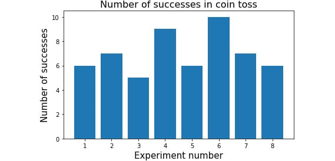
    


**Note:**

The results of the aforementioned plot will vary for you due to the
randomness involved.

As we can observe from the preceding plot, the bar chart represents the
number of successes or number of heads that show up in each draw. We
discussed normal distribution previously in this lab and mentioned
that it is the most important probability distribution because many
pieces of natural, social, and biological data follow this pattern
closely when the number of samples is large. `NumPy` provides
an easy way for us to generate random numbers that correspond to this
distribution.


Exercise 3.20: Generating Random Numbers from a Normal Distribution and Histograms
----------------------------------------------------------------------------------

This exercise will demonstrate how to generate a few random numbers
using normal distribution and histograms. We haven\'t looked at creating
plots with matplotlib and creating a binormal distribution. Creating
charts can be a useful skill sometimes with data wrangling, especially
when working with machine learning. To do so, let\'s go through the
following steps:

1.  Import the `NumPy` library:
    
    ```
    import numpy as np
    ```

2.  Draw a single sample from a normal distribution by using the
    following command:

    
    ```
    x = np.random.normal()
    print(x)
    ```

    The sample output is as follows (note that your specific output
    could be different due to randomness):

    
    ```
    -1.2423774071573694
    ```

    We know that normal distribution is characterized by two parameters
    -- mean (µ) and standard deviation (σ). In fact, the default values
    for this particular function are µ = 0.0 and σ = 1.0.

    Suppose we know that the heights of the teenage (12-16 years old)
    students in a particular school are distributed normally with a mean
    height of 155 cm and a standard deviation of 10 cm.

3.  Generate a histogram of 100 students by using the following command:

    
    ```
    import matplotlib.pyplot as plt
    # Code to generate the 100 samples (heights)
    heights = np.random.normal(loc=155,scale=10,size=100)
    # Plotting code
    #-----------------------
    plt.figure(figsize=(7,5))
    plt.hist(heights,color='orange',edgecolor='k')
    plt.title("Histogram of teenaged students' height",\
              fontsize=18)
    plt.xlabel("Height in cm",fontsize=15)
    plt.xticks(fontsize=15)
    plt.yticks(fontsize=15)
    plt.show()
    ```

    The sample output is as follows:

    
    
    


**Note:** the use of the loc parameter for the mean (`=155`) and
the scale parameter for standard deviation (`=10`). The
`size` parameter is set to 100 for that sample\'s generation.

**Note:**

To access the source code for this specific section, please refer to
<https://github.com/fenago/data-wrangling-python>.


Exercise 3.21: Calculating Descriptive Statistics from a DataFrame
------------------------------------------------------------------

In this exercise, we will be calculating the basic statistics of a
generated DataFrame. DataFrames and statistics are commonly used
together and will be a useful tool to acquire. We will define the age,
weight, and height parameters and put that data in a DataFrame to
calculate various descriptive statistics about them by using the
`describe` method. Let\'s perform the following steps:

**Note:**

The best part of working with a `pandas` DataFrame is that it
has a built-in utility function to show all of these descriptive
statistics with a single line of code.

1.  Construct a dictionary with the available series data by using the
    following command:

    
    ```
    import numpy as np
    import pandas as pd
    people = ['Ann','Brandon','Chen',\
              'David','Emily','Farook',\
              'Gagan','Hamish','Imran',\
              'Joseph','Katherine','Lily']
    age = [21,12,32,45,37,18,28,52,5,40,48,15]
    weight = [55,35,77,68,70,60,72,69,18,65,82,48]
    height = [160,135,170,165,173,168,175,159,105,171,155,158]
    people_dict={'People':people,'Age':age,\
                 'Weight':weight,'Height':height}
    people_df=pd.DataFrame(data=people_dict)
    people_df
    ```

    The output is as follows:

    
    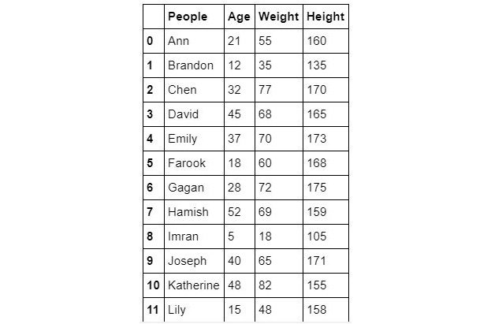
    


2.  Find the number of rows and columns of the DataFrame by executing
    the following command:

    
    ```
    print(people_df.shape)
    ```

    The output is as follows:

    
    ```
    (12, 4)
    ```

3.  Obtain a simple count (any column can be used for this purpose) by
    executing the following command:

    
    ```
    print(people_df['Age'].count())
    ```

    The output is as follows:

    
    ```
    12
    ```

4.  Calculate the sum total of age by using the following command:

    
    ```
    print(people_df['Age'].sum())
    ```

    The output is as follows:

    
    ```
    353
    ```

5.  Calculate the mean age by using the following command:

    
    ```
    print(people_df['Age'].mean())
    ```

    The output is as follows:

    
    ```
    29.416666666666668
    ```

6.  Calculate the median weight by using the following command:

    
    ```
    print(people_df['Weight'].median())
    ```

    The output is as follows:

    
    ```
    66.5
    ```

7.  Calculate the maximum height by using the following command:

    
    ```
    print(people_df['Height'].max())
    ```

    The output is as follows:

    
    ```
    175
    ```

8.  Calculate the standard deviation of the weights by using the
    following command:

    
    ```
    print(people_df['Weight'].std())
    ```

    The output is as follows:

    
    ```
    18.45120510148239
    ```

    **Note:** how we are calling the statistical functions directly from a
    DataFrame object.

9.  To calculate percentile, we can call a function from
    `NumPy` and pass on a particular column (a
    `pandas` series). For example, to calculate the 75th and
    25th percentiles of age distribution and their difference (called
    the interquartile range), use the following code:

    
    ```
    pcnt_75 = np.percentile(people_df['Age'],75)
    pcnt_25 = np.percentile(people_df['Age'],25)
    print("Inter-quartile range: ",pcnt_75-pcnt_25)
    ```

    The output is as follows:

    
    ```
    Inter-quartile range:  24.0
    ```

10. Use the `describe` command to find a detailed description
    of the DataFrame:

    
    ```
    print(people_df.describe())
    ```

    The output is as follows:

    
    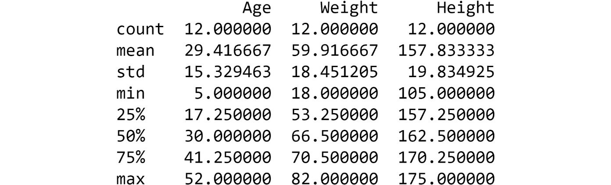
    


We have now seen how to manipulate DataFrames, which are the
cornerstones of data wrangling.

**Note:**

This function only works on columns where numeric data is present. It
has no impact on non-numeric columns, for example, people in this
DataFrame.

To access the source code for this specific section, please refer to
<https://github.com/fenago/data-wrangling-python>.


Exercise 3.22: Built-in Plotting Utilities
------------------------------------------

In this exercise, we will be going through the basic built-in plotting
utilities in the `matplotlib` library and creating useful
plots using numeric data from a DataFrame. We will use the
`people` DataFrame that we referenced in *Exercise 3.21,*
*Calculating Descriptive Statistics from a DataFrame* and generate plots
to visually represent the data. To do so, let\'s go through the
following steps:

1.  Import the necessary libraries:
    
    ```
    import matplotlib.pyplot as plt
    import pandas as pd
    ```

2.  Create the `people` DataFrame:
    
    ```
    people = ['Ann','Brandon','Chen',\
              'David','Emily','Farook',\
              'Gagan','Hamish','Imran',\
              'Joseph','Katherine','Lily']
    age = [21,12,32,45,37,18,28,52,5,40,48,15]
    weight = [55,35,77,68,70,60,72,69,18,65,82,48]
    height = [160,135,170,165,173,168,175,159,105,\
              171,155,158]
    people_dict={'People':people,'Age':age,\
                 'Weight':weight,'Height':height}
    people_df=pd.DataFrame(data=people_dict)
    ```

3.  Find the histogram of the weights by using the `hist`
    function:

    
    ```
    people_df['Weight'].hist()
    plt.show()
    ```

    The output is as follows:

    
    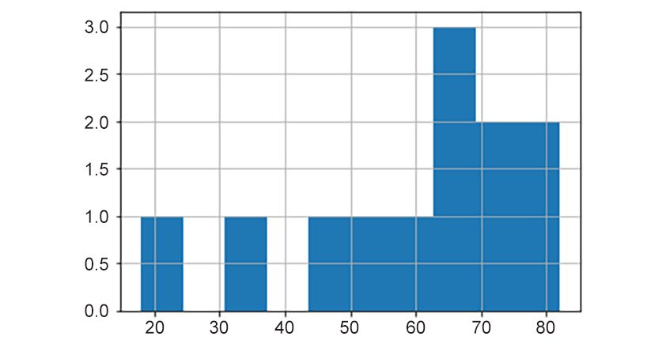
    


    From the preceding histogram, we can determine that there are more
    people that weigh `65` kg than in any other group. If this
    wasn\'t generated from random numbers, then this might be a useful
    observation.

4.  Create a simple scatter plot directly from the DataFrame to plot the
    relationship between `weight` and `height` by
    using the following command:

    
    ```
    people_df.plot.scatter('Weight','Height',s=150,\
                           c='orange',edgecolor='k')
    plt.grid(True)
    plt.title("Weight vs. Height scatter plot",fontsize=18)
    plt.xlabel("Weight (in kg)",fontsize=15)
    plt.ylabel("Height (in cm)",fontsize=15)
    plt.show()
    ```

    The output is as follows:


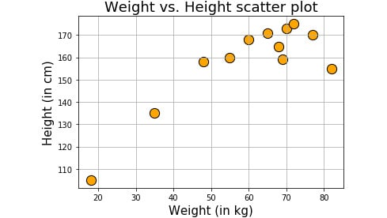


From the preceding plot, we can infer that people in the range of
160-180cms have a weight in the range of 60-80kgs. Charts can be a
powerful tool when trying to understand the nature of data. It is not
uncommon to plot data in the form of various charts before and after
several steps of data wrangling.

**Note:**

You can try regular `matplotlib` methods around this function
call to make your plot pretty.

With all this knowledge, let\'s try our hand at an activity.


Activity 3.01: Generating Statistics from a CSV File
----------------------------------------------------

Suppose you are working with the Boston Housing price dataset. This
dataset is famous in the machine learning community. Many regression
problems can be formulated, and machine learning algorithms can be run
on this dataset. You will perform a basic data wrangling activity
(including plotting some trends) on this dataset (`.csv` file)
by reading it as a `pandas` DataFrame. We will perform a few
statistical operations on this DataFrame.

**Note:**

The Boston Housing dataset can be found here:
<https://github.com/fenago/data-wrangling-python>. The `pandas` function for
reading a CSV file is `read_csv`.

These steps will help you complete this activity:

1.  Load the necessary libraries.

2.  Read in the Boston Housing dataset (given as a `.csv`
    file) from the local directory.

3.  Check the first `10` records. Find the total number of
    records.

4.  Create a smaller DataFrame with columns that do not include
    `CHAS`, `NOX`, `B`, and
    `LSTAT`:

    `Chas`: Charlse River Dummy variable

    `Nox`: Nitric Oxide concentration

    `B`: Proportion of the population that is African American

    `LSTAT`: Percentage of lower-income population

5.  Check the last seven records of the new DataFrame you just created.

6.  Plot the histograms of all the variables (columns) in the new
    DataFrame.

7.  Plot them all at once using a for loop. Try to add a unique title to
    the plot.

8.  Create a scatter plot of crime rate versus price.

9.  Plot `log10(crime)` versus `price`.

10. Calculate some useful statistics, such as mean rooms per dwelling,
    median age, mean distances to five Boston employment centers, and
    the percentage of houses with a low price (`< $20,000`).

    **Hint:** To calculate the percentage of houses below
    `$20,000`, create a `pandas` series with the
    `PRICE` column and directly compare it with
    `20`. You can do this because `pandas` series is
    basically a `NumPy` array and you have seen how to filter
    NumPy array in the exercises in this lab.

The output should be as follows:

Mean rooms per dwelling: `6.284634387351788`

Median age: `77.5`

Mean distances to five Boston employment centers:
`3.795042687747034`

Percentage of houses with a low price (\<\$20,000):
`41.50197628458498`


Summary
=======


In this lab, we started with `NumPy` arrays,
including how to create them and their essential properties.
In the second major topic of this lab, we started with
`pandas` series objects and quickly moved on to a critically
important object -- `pandas` DataFrames.
Next, we covered the basics of plotting with `matplotlib`, the
most widely used and popular Python library for visualization.

In the next lab, we will cover more advanced operations that can be
used on `pandas` DataFrames that will come in very handy in
your journey toward becoming an expert data wrangler.
