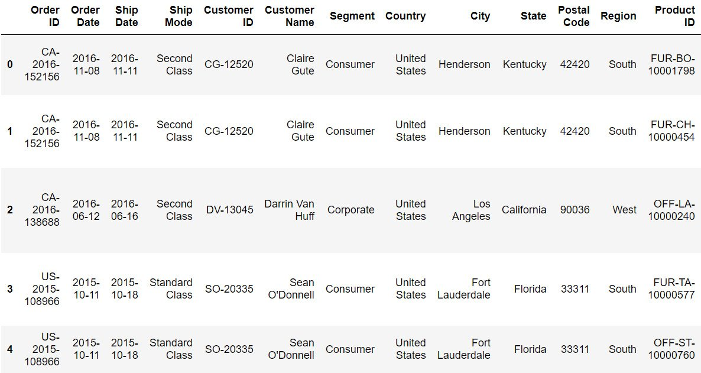
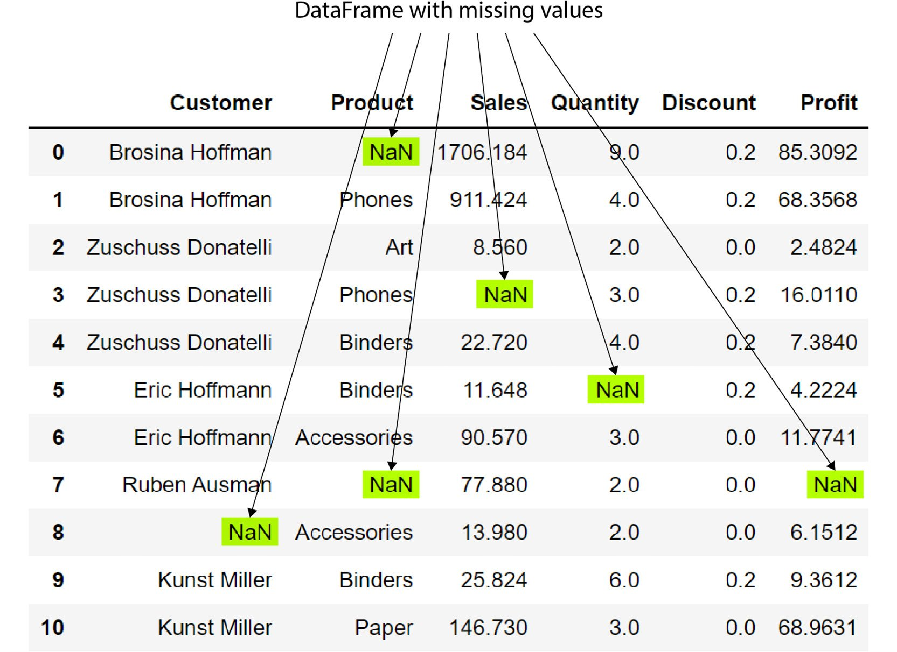
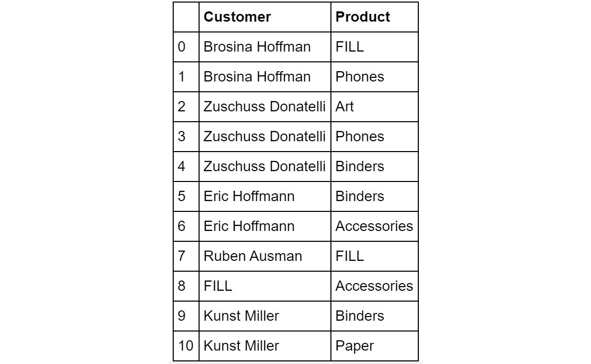
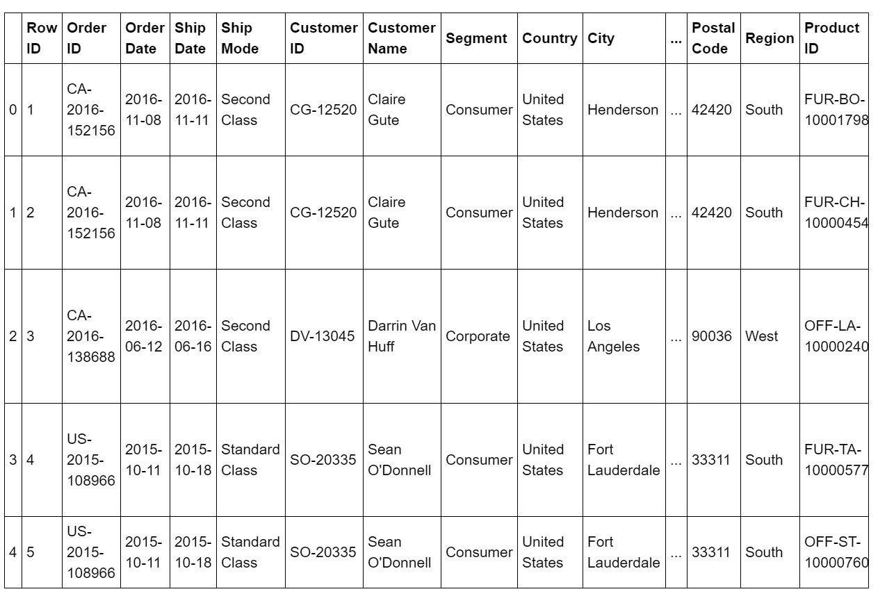
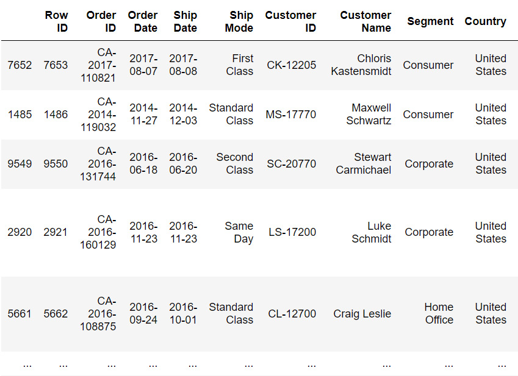

A Deep Dive into Data Wrangling with Python
===========================================


Exercise 4.01: Examining the Superstore Sales Data in an Excel File
-------------------------------------------------------------------

In this exercise, we will read and examine an Excel file called
`Sample-Superstore.xls` and will check all the columns to
check if they are useful for analysis. We\'ll use the `drop`
method to delete the columns that are unnecessary from the
`.xls` file. Then, we\'ll use the `shape` function
to check the number of rows and columns in the dataset.

**Note:**

The `superstore` dataset file can be found here:
<https://github.com/fenago/data-wrangling-python>.

To do so, perform the following steps:

1.  To read an Excel file into `pandas`, you need a small
    package called `xlrd` which is already installed in your system.

2.  Read the Excel file from GitHub into a `pandas` DataFrame
    using the `read_excel` method in `pandas`:

    
    ```
    import numpy as np
    import pandas as pd
    import matplotlib.pyplot as plt
    df = pd.read_excel("../datasets/Sample - Superstore.xls")
    df.head()
    ```

    **Note:**

    The highlighted path must be changed based on the location of the
    file on your system.

    The output (partially shown) is as follows:

    
    
    


    On examining the file, we can see that the first column, called
    `Row ID`, is not very useful because we already have a row
    index on the far left. This is a common occurrence in
    `pandas` and can be resolved in a few ways, most
    importantly by removing the `rowid` column.

3.  Drop this column altogether from the DataFrame by using the
    `drop` method:

    
    ```
    df.drop('Row ID',axis=1,inplace=True)
    df.head()
    ```

    The output is as follows:

    
    

4.  Check the number of rows and columns in the newly created dataset.
    We will use the `shape` function here:

    
    ```
    df.shape
    ```

    The output is as follows:

    
    ```
    (9994, 20)
    ```

In this exercise, we can see that the dataset has `9,994` rows
and `20` columns. We have now seen that a simple way to remove
unwanted columns such as a row count is simple with `pandas`.
Think about how hard this would be if, instead of `pandas`, we
used a list of dictionaries? We would have to write a loop to remove the
`rowid` element from each dictionary in the list.
`pandas` makes this functionality simple and easy.

**Note:**

To access the source code for this specific section, please refer to
<https://github.com/fenago/data-wrangling-python>.


In the next section, we\'ll discuss how to subset a DataFrame.


Subsetting the DataFrame
------------------------

**Subsetting** involves the extraction of partial data based on specific
columns and rows, as per business needs. Let\'s pretend we are creating
a report on our customers at the superstore. Suppose we are interested
only in the following information from this dataset:
`Customer ID`, `Customer Name`, `City`,
`Postal Code`, and `Sales`. For demonstration
purposes, let\'s assume that we are only interested in `5`
records -- rows `5-9`. We can subset the DataFrame to extract
only this much information using a single line of Python code.

We can use the `loc` method to index the
`Sample Superstore` dataset by the names of the columns and
the indexes of the rows, as shown in the following code:

```
df_subset = df.loc[
    [i for i in range(5,10)],
    ['Customer ID','Customer Name','City','Postal Code','Sales']]
df_subset
```


The output is as follows:


We need to pass on two arguments to the `loc` method -- one
for indicating the rows, and another for indicating the columns. When
passing more than one value, you must pass them as a list for a row or
column.

For the rows, we have to pass a list, that is, `[5,6,7,8,9]`,
but instead of writing that explicitly, we use a list comprehension,
that is, `[i for i in range(5,10)]`.

Because the columns we are interested in are not continuous and we
cannot just put in a continuous range, we need to pass on a list
containing the specific names. So, the second argument is just a simple
list with specific column names. The dataset shows the fundamental
concepts of the process of **subsetting** a DataFrame based on business
requirements.

Let\'s look at an example use case and practice subsetting a bit more.


An Example Use Case -- Determining Statistics on Sales and Profit
-----------------------------------------------------------------

Let\'s take a look at a typical use case of subsetting. Suppose we want
to calculate descriptive statistics (mean, median, standard deviation,
and so on) of records `100-199` for sales and profit in the
`SuperStore` dataset. The following code shows how subsetting
helps us achieve that:

```
df_subset = df.loc[[i for i in range(100,199)],['Sales','Profit']]
df_subset.describe()
```


The output is as follows:


We simply extract records `100-199` and run the
`describe` function on them because we don\'t want to process
all the data. For this particular business question, we are only
interested in sales and profit numbers, and therefore we should not take
the easy route and run a `describe` function on all the data.
For a dataset that\'s being used in machine learning analysis, the
number of rows and columns could often be in the millions, and we don\'t
want to compute anything that is not asked for in the data wrangling
task. We always aim to subset the exact data that needs to be processed
and run statistical or plotting functions on that partial data. One of
the most intuitive ways to try and understand the data is through
charting. This can be a critical component of data wrangling.

To better understand sales and profit, let\'s create a box plot of the
data using `matplotlib`:

```
import matplotlib as plt
boxplot = df_subset.boxplot()
```


The output is as follows:


As we can see from the preceding box plot, there are some outliers for
profit. Now, they could be normal outliers, or they could be
`NaN` values. At this point, we can\'t speculate, but this
could cause some further analysis to see how we want to treat those
outliers in profit. In some cases, outliers are fine, but for some
predictive modeling techniques such as regression, outliers can have
unwanted effects.

Before continuing further with filtering methods, let\'s take a quick
detour and explore a super useful function called `unique`. As
its name suggests, this function is used to scan through the data
quickly and extract only the unique values in a column or row.


Exercise 4.02: The unique Function
----------------------------------

In the superstore sales data, you will notice that there are columns
such as `Country`, `State`, and `City`. A
natural question will be to ask how many
`countries/states/cities` are present in the dataset. In this
exercise, we\'ll use the `unique` function to find the number
of unique `countries/states/cities` in the dataset. Let\'s go
through the following steps:

**Note:**

The `superstore` dataset file can be found here:
<https://github.com/fenago/data-wrangling-python>.

1.  Import the necessary libraries and read the file from GitHub by
    using the `read_excel` method in `pandas` into a
    DataFrame:

    
    ```
    import numpy as np
    import pandas as pd
    import matplotlib.pyplot as plt
    df = pd.read_excel("../datasets/Sample - Superstore.xls")
    ```

    **Note:**

    The highlighted path must be changed based on the location of the
    file on your system.

2.  Extract `countries/states/cities` for which the
    information is in the database, with one simple line of code, as
    follows:

    
    ```
    df['State'].unique()
    ```

    The output is as follows:

    
    
    


    You will see a list of all the states whose data is present in the
    dataset.

3.  Use the `nunique` method to count the number of unique
    values in the `State` column, like so:

    
    ```
    df['State'].nunique()
    ```

    The output is as follows:

    
    ```
    49
    ```

    This returns `49` for this dataset. So, one out of
    `50` states in the US does not appear in this dataset.
    Therefore, we can conclude that there\'s one repetition in the
    `State` column.


Similarly, if we run this function on the `Country` column, we
get an array with only one element, `United States`.
Immediately, we can see that we don\'t need to keep the country column
at all because there is no useful information in that column, except
that all the entries are the same. This is how a simple function helped
us to decide about dropping a column altogether -- that is, removing
`9,994` pieces of unnecessary data.


Conditional Selection and Boolean Filtering
-------------------------------------------

Often, we don\'t want to process the whole dataset and would like to
select only a partial dataset whose contents satisfy a particular
condition. This is probably the most common use case of any data
wrangling task. In the context of our `superstore sales`
dataset, think of these common questions that may arise from the daily
activities of the business analytics team:

-   What are the average sales and profit figures in California?
-   Which states have the highest and lowest total sales?
-   What consumer segment has the most variance in sales/profit?
-   Among the top five states in sales, which shipping mode and product
    category are the most popular choices?

Countless examples can be given where the business analytics team or the
executive management wants to glean insight from a particular subset of
data that meets certain criteria.

If you have any prior experience with SQL, you will know that these
kinds of questions require fairly complex SQL query writing. Remember
the `WHERE` clause?

We will show you how to use conditional subsetting and boolean filtering
to answer such questions.

First, we need to understand the critical concept of boolean indexing.
This process essentially accepts a conditional expression as an argument
and returns a dataset of booleans in which the `TRUE` value
appears in places where the condition was satisfied. A simple example is
shown in the following code. For demonstration purposes, we\'re
subsetting a small dataset of `10` records and `3`
columns:

```
df_subset = df.loc[[i for i in range (10)],\
                   ['Ship Mode','State','Sales']]
df_subset
```


The output is as follows:


Now, if we just want to know the records with sales higher than
`$100`, then we can write the following:

```
df_subset['Sales'] > 100
```


This produces the following `boolean` DataFrame:


Let\'s take a look at the `True` and `False` entries
in the `Sales` column. The values in the `Ship Mode`
and `State` columns were not impacted by this code because the
comparison was with a numerical quantity, and the only numeric column in
the original DataFrame was `Sales`.

Now, let\'s see what happens if we pass this `boolean`
DataFrame as an index to the original DataFrame:

```
df_subset[df_subset['Sales']>100]
```


The output is as follows:


We are not limited to conditional expressions involving numeric
quantities only. Let\'s try to extract high sales values
(`>$100`) for entries that do not involve
`California`.

We can write the following code to accomplish this:

```
df_subset[(df_subset['State']!='California') \
          & (df_subset['Sales']>100)]
```


**Note:** the use of a conditional involving string. In this expression, we
are joining two conditionals by an `&` operator. Both
conditions must be wrapped inside parentheses.

The first conditional expression simply matches the entries in the
`State` column to the `California` string and
assigns `TRUE`/`FALSE` accordingly. The second
conditional is the same as before. Together, joined by the `&`
operator, they extract only those rows for which `State` is
*not* `California` and `Sales` is
`> $100`. We get the following result:


**Note:**

Although, in theory, there is no limit to how complex a conditional you
can build using individual expressions and the `&`
(`LOGICAL AND`) and `|` (`LOGICAL OR`)
operators, it is advisable to create intermediate boolean DataFrames
with limited conditional expressions and build your final DataFrame step
by step. This keeps the code legible and scalable.

In the following exercise, we\'ll look at a few different methods we can
use to manipulate the DataFrame.


Exercise 4.03: Setting and Resetting the Index
----------------------------------------------

In this exercise, we will create a pandas DataFrame and set and reset
the index. We\'ll also add a new column and set it as the new index of
this DataFrame. To do so, let\'s go through the following steps:

1.  Import the `numpy` library:
    
    ```
    import numpy as np
    ```

2.  Create the `matrix_data`, `row_labels`, and
    `column_headings` functions using the following commands:
    
    ```
    matrix_data = np.matrix('22,66,140;42,70,148;\
                            30,62,125;35,68,160;25,62,152')
    row_labels = ['A','B','C','D','E']
    column_headings = ['Age', 'Height', 'Weight']
    ```

3.  Import the `pandas` library and then create a DataFrame
    using the `matrix_data`, `row_labels`, and
    `column_headings` functions:

    
    ```
    import pandas as pd
    df1 = pd.DataFrame(data=matrix_data,\
                       index=row_labels,\
                       columns=column_headings)
    print("\nThe DataFrame\n",'-'*25, sep='')
    df1
    ```

    The output is as follows:

    
    
    


4.  Reset the index, as follows:

    
    ```
    print("\nAfter resetting index\n",'-'*35, sep='')
    df1.reset_index()
    ```

    The output is as follows:

    
    
    


5.  Reset the index with `drop` set to `True`, as
    follows:

    
    ```
    print("\nAfter resetting index with 'drop' option TRUE\n",\
          '-'*45, sep='')
    df1.reset_index(drop=True)
    ```

    The output is as follows:

    
    
    
6.  Add a new column using the following command:

    
    ```
    print("\nAdding a new column 'Profession'\n",\
          '-'*45, sep='')
    df1['Profession'] = "Student Teacher Engineer Doctor Nurse"\
                        .split()
    df1
    ```

    The output is as follows:

    
    
    


7.  Now, set the `Profession` column as an `index`
    using the following code:

    
    ```
    print("\nSetting 'Profession' column as index\n",\
          '-'*45, sep='')
    df1.set_index('Profession')
    ```

    The output is as follows:

    
    
    

As we can see, the new data was added at the end of the table.

**Note:**

To access the source code for this specific section, please refer to
<https://github.com/fenago/data-wrangling-python>.


The GroupBy Method
------------------

**GroupBy** refers to a process involving one or more of the following
steps:

-   Splitting the data into groups based on some criteria
-   Applying a function to each group independently
-   Combining the results into a data structure

In many situations, we can split the dataset into groups and do
something with those groups. In the apply step, we may wish to do one of
the following:

-   **Aggregation**: Compute a summary statistic (or statistics) for
    each group -- sum, mean, and so on
-   **Transformation**: Perform a group-specific computation and return
    a like-indexed object -- z-transformation or filling missing data
    with a value
-   **Filtration**: Discard a few groups, according to a group-wise
    computation that evaluates `TRUE` or `FALSE`

There is, of course, a describe method for this `GroupBy`
object, which produces the summary statistics in the form of a
DataFrame.

**Note:**

The name GroupBy should be quite familiar to those who have used a
SQL-based tool before.

GroupBy is not limited to a single variable. If you pass on multiple
variables (as a list), then you will get a structure essentially similar
to a Pivot Table (from Excel). The following exercise shows an example
of where we group together all the states and cities from the whole
dataset (the snapshot is only a partial view).


Exercise 4.04: The GroupBy Method
---------------------------------

In this exercise, we\'re going to create a subset from a dataset. We
will use the `groupBy` object to filter the dataset and
calculate the mean of that filtered dataset. To do so, let\'s go through
the following steps:

**Note:**

The `superstore` dataset file can be found here:
<https://github.com/fenago/data-wrangling-python>.

1.  Import the necessary Python modules and read the Excel file from
    GitHub by using the `read_excel` method in
    `pandas`:

    
    ```
    import numpy as np
    import pandas as pd
    import matplotlib.pyplot as plt
    df = pd.read_excel("../datasets/Sample - Superstore.xls")
    df.head()
    ```

    The output (partially shown) is as follows:

    
    
    


    **Note:**

    The highlighted path must be changed based on the location of the
    file on your system.

2.  Create a 10-record subset using the following command:

    
    ```
    df_subset = df.loc[[i for i in range (10)],\
                       ['Ship Mode','State','Sales']]
    df_subset
    ```

    The output will be as follows:

    
    
    


3.  Create a `pandas` DataFrame using the `groupby`
    method, as follows:

    
    ```
    byState = df_subset.groupby('State')
    byState
    ```

    The output will be similar to:

    
    ```
    <pandas.core.groupby.generic.DataFrameGroupBy object at 0x00000202FB931B08>
    ```

4.  Calculate the mean sales figure by `State` by using the
    following command:

    
    ```
    print("\nGrouping by 'State' column and listing mean sales\n",\
          '-'*50, sep='')
    byState.mean()
    ```

    The output is as follows:

    


5.  Calculate the total sales figure by `State` by using the
    following command:

    
    ```
    print("\nGrouping by 'State' column and listing total "\
          "sum of sales\n", '-'*50, sep='')
    byState.sum()
    ```

    The output is as follows:

    
    
    

6.  Subset that DataFrame for a particular state and show the
    statistics:

    
    ```
    pd.DataFrame(byState.describe().loc['California'])
    ```

    The output is as follows:

    
    
    


7.  Perform a similar summarization by using the `Ship Mode`
    attribute:

    
    ```
    df_subset.groupby('Ship Mode').describe()\
    .loc[['Second Class','Standard Class']]
    ```

    The output will be as follows:

    
    
    

8.  Display the complete summary statistics of sales by every city in
    each state -- all with two lines of code -- by using the following
    command:

    
    ```
    byStateCity=df.groupby(['State','City'])
    byStateCity.describe()['Sales']
    ```

    The output (partially shown) is as follows:

    
    
    


**Note:** how `pandas` has grouped the data by `State`
first and then by cities under each state.

**Note:**

To access the source code for this specific section, please refer to
<https://github.com/fenago/data-wrangling-python>.


We now understand how to use `pandas` to group our dataset and
then find aggregate values such as the mean sales return of our top
employees. We also looked at how pandas will display descriptive
statistics about our data for us. Both of these techniques can be used
to perform analysis on our superstore data.


Detecting Outliers and Handling Missing Values
==============================================


Outlier detection and handling missing values fall under the subtle art
of data quality checking. A modeling or data mining process is
fundamentally a complex series of computations whose output quality
largely depends on the quality and consistency of the input data being
fed. The responsibility of maintaining and gatekeeping that quality
often falls on the shoulders of a data wrangling team.

Apart from the obvious issue of poor-quality data, missing data can
sometimes wreak havoc with the **Machine Learning** (**ML**) model
downstream. A few ML models, such as Bayesian learning, are inherently
robust to outliers and missing data, but common techniques such as
Decision Trees and Random Forest have an issue with missing data because
the fundamental splitting strategy employed by these techniques depends
on an individual piece of data and not a cluster. Therefore, it is
almost always imperative to impute missing data before handing it over
to such an ML model.

Outlier detection is a subtle art. Often, there is no universally agreed
definition of an outlier. In a statistical sense, a data point that
falls outside a certain range may often be classified as an outlier, but
to apply that definition, you need to have a fairly high degree of
certainty about the assumption of the nature and parameters of the
inherent statistical distribution about the data. It takes a lot of data
to build that statistical certainty and even after that, an outlier may
not be just unimportant noise but a clue to something deeper. Let\'s
look at an example with some fictitious sales data from an American
fast-food chain restaurant. If we want to model the daily sales data as
a time series, we will observe an unusual spike in the data somewhere
around mid-April:


A good data scientist or data wrangler should develop curiosity about
this data point rather than just rejecting it just because it falls
outside the statistical range. In the actual anecdote, the sales figure
spiked that day because of an unusual reason. So, the data was real. But
just because it was real does not mean it is useful. In the final goal
of building a smoothly varying time series model, this one point should
not matter and should be rejected. In this lab, however, we\'re
going to look at ways of handling outliers instead of rejecting them.

Therefore, the key to outliers is their systematic and timely detection
in an incoming stream of millions of data or while reading data from
cloud-based storage. In this section, we will quickly go over some basic
statistical tests for detecting outliers and some basic imputation
techniques for filling up missing data.


Missing Values in Pandas
------------------------

One of the most useful functions for detecting missing values is
`isnull`. We\'ll use this function on a DataFrame called
`df_missing` (based on the Superstore DataFrame we are working
with), which, as the name suggests, will contain some missing values.
You can create this DataFrame using the following command:

```
df_missing=pd.read_excel("../datasets/Sample - Superstore.xls",\
                         sheet_name="Missing")
df_missing
```


**Note:**

Don\'t forget to change the path (highlighted) based on the location of
the file on your system.

The output will be as follows:





We can see that the missing values are denoted by `NaN`. Now
let\'s use the `isnull` function on the same DataFrame and
observe the results:

```
df_missing.isnull()
```


The output is as follows:


As you can see, the missing values are indicated by the Boolean value
`True`. Now, let\'s see how we can use the `isnull`
function to deliver results that are a bit more user friendly. Here is
an example of some very simple code to detect, count, and print out
missing values in every column of a DataFrame:

```
for c in df_missing.columns:
    miss = df_missing[c].isnull().sum()
    if miss>0:
        print("{} has {} missing value(s)".format(c,miss))
    else:
        print("{} has NO missing value!".format(c))
```


This code scans every column of the DataFrame, calls the
`isnull` function, and sums up the returned object (a
`pandas` Series object, in this case) to count the number of
missing values. If the missing value is greater than zero, it prints out
the message accordingly. The output looks as follows:


As we can see from the preceding output, the missing values were
detected from the `Superstore` dataset.

To handle missing values, you should look for ways not to drop them
altogether but to fill them somehow. The `fillna` method is a
useful function for performing this task on `pandas`
DataFrames. The `fillna` method may work for string data, but
not for numerical columns such as sales or profits. So, we should
restrict ourselves in regard to this fixed string replacement being used
on non-numeric text-based columns only. The `Pad` or
`ffill` function is used to fill forward the data, that is,
copy it from the preceding data of the series. Forward fill is a
technique where the missing value is filled with the previous value. On
the other hand, backward fill or `bfill` uses the next value
to fill in any missing data. Let\'s practice this with the following
exercise.


Exercise 4.05: Filling in the Missing Values Using the fillna Method
--------------------------------------------------------------------

In this exercise, we are going to perform four techniques in order to
deal with the missing values in a dataset.

**Note:**

The `superstore` dataset file can be found here:
<https://github.com/fenago/data-wrangling-python>.

Firstly, we are going to replace the missing values with static values
using the `fillna` method. Then, we will use the
`ffill` and `bfill` methods to replace the missing
values. Lastly, we will calculate the average of a column and replace
the missing value with that. To do so, let\'s go through the following
steps:

1.  Import the necessary Python modules and read the Excel file from
    GitHub by using the `read_excel` method in
    `pandas`:

    
    ```
    import numpy as np
    import pandas as pd
    import matplotlib.pyplot as plt
    df_missing = pd.read_excel("../datasets/Sample - Superstore.xls",\
                               sheet_name="Missing")
    df_missing.head()
    ```

    **Note:**

    The highlighted path must be changed based on the location of the
    file on your system.

    The output is as follows:

    
    
    


2.  Fill in all the missing values with the `FILL` string by
    using the following command:

    
    ```
    df_missing.fillna('FILL')
    ```

    The output is as follows:

    
    
    


3.  Fill in the specified columns with the `FILL` string by
    using the following command:

    
    ```
    df_missing[['Customer','Product']].fillna('FILL')
    ```

    The output is as follows:

    
    
    


    **Note:**

    In all of these cases, the function works on a copy of the original
    DataFrame. So, if you want to make the changes permanent, you have
    to assign the DataFrames that are returned by these functions to the
    original DataFrame object.

4.  Fill in the values using `ffill` or forward fill by using
    the following command on the `Sales` column:

    
    ```
    df_missing['Sales'].fillna(method='ffill')
    ```

    The output is as follows:

    
    
    


5.  Use `bfill` to fill backward, that is, copy from the next
    data in the series:

    
    ```
    df_missing['Sales'].fillna(method='bfill')
    ```

    The output is as follows:

    
    
    


    Let\'s compare these two series and see what happened in each case:

    
    
    

    You can also fill by using a function average of DataFrames. For
    example, we may want to fill the missing values in `Sales`
    by the average sales amount.

6.  Fill the missing values in `Sales` by the average sales
    amount:

    
    ```
    df_missing['Sales'].fillna(df_missing.mean()['Sales'])
    ```

    The output is as follows:

    
    
    


The following screenshot shows what happened in the preceding code:


Here, we can observe that the missing value in the cell was filled by
the average sales amount.

**Note:**

To access the source code for this specific section, please refer to
<https://github.com/fenago/data-wrangling-python>.


With this, we have now seen how to replace missing values within a
`pandas` DataFrame using four methods: static value, forward
fill, backward fill, and the average. These are the fundamental
techniques when cleaning data with missing values.


The dropna Method
-----------------

This function is used to simply drop the rows or columns that contain
`NaN` or missing values. However, there is some choice
involved.

The following is the syntax of the `dropna()` method:

```
DataFrameName.dropna(axis=0, how='any', \
                     thresh=None, subset=None, \
                     inplace=False)
```


If the `axis` parameter of a `dropna()` method is
set to `0`, then rows containing missing values are dropped;
if the axis parameter is set to `1`, then columns containing
missing values are dropped. These are useful if we don\'t want to drop a
particular row/column if the `NaN` values do not exceed a
certain percentage.

Two arguments that are useful for the `dropna()` method are as
follows:

-   The `how` argument determines if a row or column is
    removed from a DataFrame when we have at least one `NaN`
    value or all `NaN` values.
-   The `thresh` argument requires that many
    non-`NaN` values to keep the row/ column.

We\'ll practice using the `dropna()` method in the following
exercise.


Exercise 4.06: Dropping Missing Values with dropna
--------------------------------------------------

In this exercise, we will remove the cells in a dataset that don\'t
contain data.

**Note:**

The `superstore` dataset file can be found here:
<https://github.com/fenago/data-wrangling-python>.

We are going to use the `dropna` method in order to remove
missing cells in a dataset. To do so, let\'s go through the following
steps:

1.  Import the necessary Python libraries and read the Excel file from
    GitHub by using the `read_excel` method in
    `pandas`:

    
    ```
    import numpy as np
    import pandas as pd
    import matplotlib.pyplot as plt
    df_missing = pd.read_excel("../datasets/Sample - Superstore.xls",\
                               sheet_name="Missing")
    df_missing.head()
    ```

    **Note:**

    The highlighted path must be changed based on the location of the
    file on your system.

    The output is as follows:

    
    
    


    **Note:**

    The outputs you get will vary from the ones shown in this exercise.

2.  To set the `axis` parameter to `zero` and drop
    all missing rows, use the following command:

    
    ```
    df_missing.dropna(axis=0)
    ```

    The output is as follows:

    
    
    


3.  To set the `axis` parameter to `1` and drop all
    missing rows, use the following command:

    
    ```
    df_missing.dropna(axis=1)
    ```

    The output is as follows:

    
    
    


4.  Drop the values with `axis` set to `1` and
    `thresh` set to `10`:

    
    ```
    df_missing.dropna(axis=1,thresh=10)
    ```

    The output is as follows:

    
    
    

As you can see, some `NaN` values still exist, but because of
the minimum threshold, those rows were kept in place.

**Note:**

To access the source code for this specific section, please refer to
<https://github.com/fenago/data-wrangling-python>.


In this exercise, we looked at dropping missing values rows and columns.
This is a useful technique for a variety of cases, including when
working with machine learning. Some machine learning models do not
handle missing data well and removing them ahead of time can be best
practices.


Outlier Detection Using a Simple Statistical Test
-------------------------------------------------

As we\'ve already discussed, outliers in a dataset can occur due to many
factors and in many ways:

-   Data entry errors
-   Experimental errors (data extraction related)
-   Measurement errors due to noise or instrumental failure
-   Data processing errors (data manipulation or mutations due to coding
    errors)
-   Sampling errors (extracting or mixing data from wrong or various
    sources)

It is impossible to pinpoint one universal method for outlier detection.
Here, we will show you some simple tricks for numeric data using
standard statistical tests.

Box plots may show unusual values. We can corrupt two sales values by
assigning negatives, as follows:

```
df_sample = df[['Customer Name','State','Sales','Profit']]\
               .sample(n=50).copy()
df_sample['Sales'].iloc[5]=-1000.0
df_sample['Sales'].iloc[15]=-500.0
```


To plot the box plot, use the following code:

```
df_sample.plot.box()
plt.title("Boxplot of sales and profit", fontsize=15)
plt.xticks(fontsize=15)
plt.yticks(fontsize=15)
plt.grid(True)
```


The output (which will vary with each run) is as follows:


We can create simple box plots to check for any unusual/nonsensical
values. For example, in the preceding example, we intentionally
corrupted two sales values so that they were negative, and they were
readily caught in a box plot.

Note that profit may be negative, so those negative points are generally
not suspicious. But sales cannot be negative in general, so they are
detected as outliers.

We can create a distribution of a numerical quantity and check for
values that lie at the extreme end to see if they are truly part of the
data or outlier. For example, if a distribution is almost normal, then
any value more than four or five standard deviations away may be a
suspect:


Concatenating, Merging, and Joining
===================================


Merging and joining tables or datasets are highly common operations in
the day-to-day job of a data wrangling professional. These operations
are akin to the `JOIN` query in SQL for relational database
tables. Often, the key data is present in multiple tables, and those
records need to be brought into one combined table that matches on that
common key. This is an extremely common operation in any type of sales
or transactional data, and therefore must be mastered by a data
wrangler. The `pandas` library offers nice and intuitive
built-in methods to perform various types of `JOIN` queries
involving multiple DataFrame objects.


Exercise 4.07: Concatenation in Datasets
----------------------------------------

In this exercise, we will concatenate DataFrames along various axes
(rows or columns).

**Note:**

The `superstore` dataset file can be found here:
<https://github.com/fenago/data-wrangling-python>.

This is a very useful operation as it allows you to grow a DataFrame as
the new data comes in or new feature columns need to be inserted into
the table. To do so, let\'s go through the following steps:

1.  Read the Excel file from GitHub by using the `read_excel`
    method in `pandas`:

    
    ```
    import numpy as np
    import pandas as pd
    import matplotlib.pyplot as plt
    df = pd.read_excel("../datasets/Sample - Superstore.xls")
    df.head()
    ```

    **Note:**

    The highlighted path must be changed based on the location of the
    file on your system.

    The output (partially shown) will be as follows:

    
    
    


2.  Sample `4` records each to create three DataFrames at
    random from the original sales dataset we are working with:
    
    ```
    df_1 = df[['Customer Name','State',\
               'Sales','Profit']].sample(n=4)
    df_2 = df[['Customer Name','State',\
               'Sales','Profit']].sample(n=4)
    df_3 = df[['Customer Name','State',\
               'Sales','Profit']].sample(n=4)
    ```

3.  Create a combined DataFrame with all the rows concatenated by using
    the following code:

    
    ```
    df_cat1 = pd.concat([df_1,df_2,df_3], axis=0)
    df_cat1
    ```

    The output (partially shown) is as follows:

    
    
    


    As you can see, concatenation will vertically combine multiple
    DataFrames. You can also try concatenating along the columns,
    although that does not make any practical sense for this particular
    example. However, `pandas` fills in the unavailable values
    with `NaN` for that operation.

    **Note:**

    The outputs you get will vary from the ones shown in this exercise.

4.  Create a combined DataFrame with all the columns concatenated by
    using the following code:

    
    ```
    df_cat2 = pd.concat([df_1,df_2,df_3], axis=1)
    df_cat2
    ```

    The output (partially shown) is as follows:

    
    
    


As we can observe, the cells in the dataset that do not contain any
values are replaced with `NaN` values.

**Note:**

To access the source code for this specific section, please refer to
<https://github.com/fenago/data-wrangling-python>.


Merging by a Common Key
-----------------------

Merging by a common key is an extremely common operation for data tables
as it allows you to rationalize multiple sources of data in one master
database -- that is, if they have some common features/keys.

When joining and merging two DataFrames, we use two separate types:
**inner** and **outer {left\|right}**. Let\'s take a look at them:

-   **Inner**: A combining method that uses a column or key to be
    compared on each dataset. Rows that share the same column or key
    will be present after the join.
-   **Outer**: A way to combine datasets such as inner, but all data on
    the right or left (depending on which is chosen) is kept, and
    matching data from the opposite side is combined.

This is often the first step in building a large database for machine
learning tasks where daily incoming data may be put into separate
tables. However, at the end of the day, the most recent table needs to
be merged with the master data table so that it can be fed into the
backend machine learning server, which will then update the model and
its prediction capacity. Merge is a way to combine DataFrames
vertically, using a column to compare on. The functionality of merge and
join are very similar; their capabilities are the same.


Exercise 4.08: Merging by a Common Key
--------------------------------------

In this exercise, we\'ll create two DataFrames with the
`Customer Name` common key from the Superstore dataset. Then,
we will use the inner and outer joins to merge or combine these
DataFrames. To do so, let\'s go through the following steps:

**Note:**

The Superstore file can be found here: <https://github.com/fenago/data-wrangling-python>.

1.  Import the necessary Python libraries and read the Excel file from
    GitHub by using the `read_excel` method in
    `pandas`:

    
    ```
    import numpy as np
    import pandas as pd
    import matplotlib.pyplot as plt
    df = pd.read_excel("../datasets/Sample - Superstore.xls")
    df.head()
    ```

    **Note:**

    The highlighted path must be changed based on the location of the
    file on your system.

    The partial output of the preceding step is as follows:

    
    
    


    One DataFrame, `df_1`, will have shipping information
    associated with the customer name, and another table,
    `df_2`, will have the product information tabulated.

2.  Create the `df1` DataFrame with the
    `Customer Name` common key:

    
    ```
    df_1=df[['Ship Date','Ship Mode','Customer Name']][0:4]
    df_1
    ```

    The output of the first DataFrame is as follows:

    
    
    


3.  Create the second DataFrame, `df2`, with the
    `Customer Name` common key, as follows:

    
    ```
    df_2=df[['Customer Name','Product Name','Quantity']][0:4]
    df_2
    ```

    The output is as follows:

    
    
    


4.  Join these two tables with an inner join by using the following
    command:

    
    ```
    pd.merge(df_1,df_2,on='Customer Name',how='inner')
    ```

    The output is as follows:

    
    
    


5.  Drop the duplicates by using the following command:

    
    ```
    pd.merge(df_1,df_2,on='Customer Name',\
             how='inner').drop_duplicates()
    ```

    The output is as follows:

    
    

6.  Extract another small table called `df_3` to show the
    concept of an outer join:

    
    ```
    df_3=df[['Customer Name','Product Name','Quantity']][2:6]
    df_3
    ```

    The output is as follows:

    
    
    


7.  Perform an inner join on `df_1` and `df_3` by
    using the following command:

    
    ```
    pd.merge(df_1,df_3,on='Customer Name',\
             how='inner').drop_duplicates()
    ```

    The output is as follows:

    
    


8.  Perform an outer join on `df_1` and `df_3` by
    using the following command:

    
    ```
    pd.merge(df_1,df_3,on='Customer Name',\
             how='outer').drop_duplicates()
    ```

    The output is as follows:

    
    
    


Notice how some `NaN` and `NaT` values are inserted
automatically because no corresponding entries could be found for those
records, as those are the entries with unique customer names from their
respective tables. `NaT` represents a `Not a Time`
object, as the objects in the `Ship Date` column are
timestamped objects.

**Note:**

To access the source code for this specific section, please refer to
<https://github.com/fenago/data-wrangling-python>.


With this, we have gone over how to use the `merge` method to
do inner and outer joins.


The join Method
---------------

Joining is performed based on **index keys** and is done by combining
the columns of two potentially differently indexed DataFrames into a
single one. It offers a faster way to accomplish merging by row indices.
This is useful if the records in different tables are indexed
differently but represent the same inherent data and you want to merge
them into a single table:


Exercise 4.09: The join Method
------------------------------

In this exercise, we will create two DataFrames and perform the
different kind of joins on these DataFrames.

**Note:**

The Superstore file can be found here: <https://github.com/fenago/data-wrangling-python>.

To complete this exercise, perform the following steps:

1.  Import the Python libraries and load the file from GitHub by using
    the `read_excel` method in `pandas`:

    
    ```
    import numpy as np
    import pandas as pd
    import matplotlib.pyplot as plt
    df = pd.read_excel("../datasets/Sample - Superstore.xls")
    df.head()
    ```

    **Note:**

    The highlighted path must be changed based on the location of the
    file on your system.

    The partial output of the code is as follows:

    
    
    


2.  Create `df1` with `Customer Name` as the index
    by using the following command:

    
    ```
    df_1=df[['Customer Name','Ship Date','Ship Mode']][0:4]
    df_1.set_index(['Customer Name'],inplace=True)
    df_1
    ```

    The output is as follows:

    
    
    


3.  Create `df2` with `Customer Name` as the index
    by using the following command:

    
    ```
    df_2=df[['Customer Name','Product Name','Quantity']][2:6]
    df_2.set_index(['Customer Name'],inplace=True) 
    df_2
    ```

    The output is as follows:

    
    
    


4.  Perform a left join on `df_1` and `df_2` by
    using the following command:

    
    ```
    df_1.join(df_2,how='left').drop_duplicates()
    ```

    The output is as follows:

    
    

5.  Perform a right join on `df_1` and `df_2` by
    using the following command:

    
    ```
    df_1.join(df_2,how='right').drop_duplicates()
    ```

    The output is as follows:

    
    
    

6.  Perform an inner join on `df_1` and `df_2` by
    using the following command:

    
    ```
    df_1.join(df_2,how='inner').drop_duplicates()
    ```

    The output is as follows:

    
    
    
7.  Perform an outer join on `df_1` and `df_2` by
    using the following command:

    
    ```
    df_1.join(df_2,how='outer').drop_duplicates()
    ```

    The output is as follows:

    
    
    


We have now gone through the basic functionality of `pandas`
DataFrame joining. We used inner and out joining and showed you how we
can use indexes to perform a join and how it can help in analysis.


Exercise 4.10: Randomized Sampling
----------------------------------

In this exercise, we are going to randomly take five samples from the
Superstore dataset and calculate a definite fraction of the data to be
sampled. To do so, let\'s go through the following steps:

**Note:**

The Superstore file can be found here: <https://github.com/fenago/data-wrangling-python>.

1.  Import the necessary Python modules and read them from GitHub by
    using the `read_excel` method in `pandas`:

    
    ```
    import numpy as np
    import pandas as pd
    import matplotlib.pyplot as plt
    df = pd.read_excel("../datasets/Sample - Superstore.xls")
    df.head()
    ```

    **Note:**

    The highlighted path must be changed based on the location of the
    file on your system.

    The partial output will be:

    
    
    


2.  Specify the number of samples that we require from the DataFrame by
    using the following command:

    
    ```
    df.sample(n=5)
    ```

    The random output (partially shown) is as follows:

    
    
    


    **Note:**

    The outputs you get will vary from the ones shown in this exercise.

3.  Specify a definite fraction (percentage) of the data to be sampled
    by using the following command:

    
    ```
    df.sample(frac=0.1)
    ```

    The output is as follows:

    
    
    


    You can also choose if sampling is done with replacement, that is,
    whether the same record can be chosen more than once. The default
    `replace` choice is `FALSE`, that is, no
    repetition and sampling will try to choose new elements only.

4.  Choose the sampling by using the following command:

    
    ```
    df.sample(frac=0.1, replace=True)
    ```

    The output is as follows:

    
    
    

Here, as you can see, we have encouraged repetitions in the sampled data
by setting the `replace` parameter to `True`.
Therefore, the same elements could be chosen again while performing
random sampling.

**Note:**

To access the source code for this specific section, please refer to
<https://github.com/fenago/data-wrangling-python>.


The value\_counts Method
------------------------

We discussed the `unique` method previously, which finds and
counts the unique records from a DataFrame. Another useful function in a
similar vein is `value_counts`. This function returns an
object containing counts of unique values. In the object that is
returned, the first element is the most frequently used object. The
elements are arranged in descending order.

Let\'s consider a practical application of this method to illustrate its
utility. Suppose your manager asks you to list the top 10 customers from
the big sales database that you have. So, the business question is:
which 10 customers\' names occur the most frequently in the sales table?
You can achieve this with a SQL query if the data is in an RDBMS, but in
pandas, this can be done by using one simple function:

```
df['Customer Name'].value_counts()[:10]
```


The output is as follows:


The `value_counts` method returns a series of counts of all
unique customer names sorted by the frequency of the count. By asking
for only the first 10 elements of that list, this code returns a series
of the most frequently occurring top 10 customer names.


Pivot Table Functionality
-------------------------

Similar to group by, pandas also offer pivot table functionality, which
works the same as a Pivot Table in spreadsheet programs such as MS
Excel. For example, in this sales database, you want to know the average
sales, profit, and quantity sold by Region and State (two levels of
index).

We can extract this information by using one simple piece of code (we
sample 100 records first to keep the computation fast and then apply the
code):

```
df_sample = df.sample(n=100)
df_sample.pivot_table(values=['Sales','Quantity','Profit'],\
                      index=['Region','State'],aggfunc='mean')
```


The output is as follows (note that your specific output may be
different due to random sampling):


Sorting a table by a particular column is one of the most frequently
used operations in the daily work of an analyst. Sorting can help you
understand your data better while presenting it in a specific view of
the data. When training a machine learning model, the way data is sorted
can impact the performance of a model based on the sampling that\'s
being done. Not surprisingly, `pandas` provide a simple and
intuitive method for sorting called the `sort_values` method.
We\'ll practice using this in the following exercise.


Exercise 4.11: Sorting by Column Values -- the sort\_values Method
------------------------------------------------------------------

In this exercise, we will take a random sample of `15` records
from the Superstore dataset.

**Note:**

The Superstore file can be found here: <https://github.com/fenago/data-wrangling-python>.

We will sort the column values in the dataset with respect to column
names using the `sort_values` method. To do so, let\'s go
through the following steps:

1.  Import the necessary Python modules and read the Excel file from
    GitHub by using the `read_excel` method in
    `pandas`:

    
    ```
    import numpy as np
    import pandas as pd
    import matplotlib.pyplot as plt
    df = pd.read_excel("../datasets/Sample - Superstore.xls")
    df.head()
    ```

    **Note:**

    The highlighted path must be changed based on the location of the
    file on your system.

    The output (partially shown) will be as follows:

    
    
    


2.  Take a random sample of `15` records and then sort by the
    `Sales` column and then by both the `Sales` and
    `State` columns together:

    
    ```
    df_sample=df[['Customer Name','State',\
                  'Sales','Quantity']].sample(n=15)
    df_sample
    ```

    The output is as follows:

    
    
    


    **Note:**

    The outputs you get will vary from the ones shown in this exercise.

3.  Sort the values with respect to `Sales` by using the
    following command:

    
    ```
    df_sample.sort_values(by='Sales')
    ```

    The output is as follows:

    
    
    


4.  Sort the values with respect to `Sales` and
    `State`:

    
    ```
    df_sample.sort_values(by=['State','Sales'])
    ```

    The output is as follows:

    
    
    


**Note:**

To access the source code for this specific section, please refer to
<https://github.com/fenago/data-wrangling-python>.


The `pandas` library provides great flexibility for working
with user-defined functions of arbitrary complexity through the
`apply` method. Much like the native Python `apply`
function, this method accepts a user-defined function and additional
arguments and returns a new column after applying the function on a
particular column elementwise.

As an example, suppose we want to create a column of categorical
features such as high/medium/low based on the sales price column. **Note:**
that this is a conversion from a numeric value into a categorical factor
(string) based on certain conditions (threshold values of sales).


Exercise 4.12: Flexibility of User-Defined Functions with the apply Method
--------------------------------------------------------------------------

In this exercise, we will create a user-defined function called
`categorize_sales` that categorizes Sales data based on price.
If the `price` is less than `50`, it is classified
as `Low`, if the `price` is less than
`200`, it is classified as `Medium`, or
`High` if the `price` doesn\'t fall under either of
these categories.

**Note:**

The Superstore file can be found here: <https://github.com/fenago/data-wrangling-python>.

We\'ll then take 100 random samples from the `superstore`
dataset and use the `apply` method on the
`categorize_sales` function in order to create a new column to
store the values returned by the function. To do so, perform the
following steps:

1.  Import the necessary Python modules and read the Excel file from
    GitHub by using the `read_excel` method in
    `pandas`:

    
    ```
    import numpy as np
    import pandas as pd
    import matplotlib.pyplot as plt
    df = pd.read_excel("../datasets/Sample - Superstore.xls")
    df.head()
    ```

    **Note:**

    The highlighted path must be changed based on the location of the
    file on your system.

    The output (partially shown) will be:

    
    
    


2.  Create a user-defined function, as follows:
    
    ```
    def categorize_sales(price):
        if price < 50:
            return "Low"
        elif price < 200:
            return "Medium"
        else:
            return "High"
    ```

3.  Sample `100` records randomly from the database:

    
    ```
    df_sample=df[['Customer Name',\
                  'State','Sales']].sample(n=100)
    df_sample.head(10)
    ```

    The output is as follows:

    
    
    


    **Note:**

    The outputs you get will vary from the ones shown in this exercise.

4.  Use the `apply` method to apply the categorization
    function to the `Sales` column. We need to create a new
    column to store the category string values that are returned by the
    function:

    
    ```
    df_sample['Sales Price Category']=df_sample['Sales']\
                                      .apply(categorize_sales)
    df_sample.head(10)
    ```

    The output is as follows:

    
    
    

    The `apply` method also works with the built-in native
    Python functions.

5.  For practice, let\'s create another column for storing the length of
    the name of the customer. We can do this using the familiar
    `len` function:

    
    ```
    df_sample['Customer Name Length']=df_sample['Customer Name']\
                                      .apply(len)
    df_sample.head(10)
    ```

    The output is as follows:

    
    
    


    Instead of writing out a separate function, we can even insert
    *lambda expressions* directly into the `apply` method for
    short functions. For example, let\'s say we are promoting our
    product and want to show the discounted sales price if the original
    price is *\> \$200*.

6.  Use a `lambda` function and the `apply` method
    to do so:

    
    ```
    df_sample['Discounted Price']=df_sample['Sales']\
                                  .apply(lambda x:0.85*x if x>200 \
                                  else x)
    df_sample.head(10)
    ```

    The output is as follows:

    
    
    


**Note:**

The lambda function contains a conditional, and a discount is applied to
those records where the original sales price is `>$200`.

To access the source code for this specific section, please refer to
<https://github.com/fenago/data-wrangling-python>.


After going through this exercise, we know how to apply a function to a
column in a DataFrame. This method is very useful for going beyond the
basic functions that are present in `pandas`.


Activity 4.01: Working with the Adult Income Dataset (UCI)
----------------------------------------------------------

In this activity, we will detect outliers in the
Adult Income Dataset from the UCI machine learning portal.

You can find a description of the dataset <https://github.com/fenago/data-wrangling-python/blob/master/lab04/datasets/adult_income_data.csv>.
We will use the concepts we\'ve learned throughout this lab, such as
subsetting, applying user-defined functions, summary statistics,
visualizations, boolean indexing, and group by to find a whole group of
outliers in a dataset. We will create a bar plot to plot this group of
outliers. Finally, we will merge two datasets by using a common key.

These are the steps that will help you solve this activity:

1.  Load the necessary libraries.

2.  Read the adult income dataset from the following URL:
    <https://github.com/fenago/data-wrangling-python/blob/master/lab04/datasets/adult_income_data.csv>.

3.  Create a script that will read a text file line by line.

4.  Add a name of `Income` for the response variable to the
    dataset.

5.  Find the missing values.

6.  Create a DataFrame with only age, education, and occupation by
    using subsetting.

7.  Plot a histogram of age with a bin size of `20`.

8.  Create a function to strip the whitespace characters.

9.  Use the `apply` method to apply this function to all the
    columns with string values, create a new column, copy the values
    from this new column to the old column, and drop the new column.

10. Find the number of people who are aged between `30` and
    `50`.

11. Group the records based on age and education to find how the mean
    age is distributed.

12. Group by occupation and show the summary statistics of age. Find
    which profession has the oldest workers on average and which
    profession has its largest share of the workforce above the 75th
    percentile.

13. Use `subset` and `groupBy` to find the outliers.

14. Plot the outlier values on a bar chart. It should look something
    like this:

    
    
    


15. Merge the two DataFrames using common keys to drop duplicate values.

    The output should look like this:

    
    
    


As you can see, we now have a single DataFrame because we have merged
two DataFrames into one.

With that, we conclude this activity and the lab.


Summary
=======


In this lab, we deep-dived into the `pandas` library to
learn advanced data wrangling techniques.

Next, we learned about a particular topic that has a deep connection
with traditional relational database systems -- the `groupBy`
method. We saw the `join` method and how it compares to a
similar operation in SQL. Lastly, miscellaneous useful methods on DataFrames, such as randomized
sampling, `unique`, `value_count`,
`sort_values`, and pivot table functionality were covered.

In the next lab, we will show
you how to work with a wide variety of data sources; that is, you will
learn how to read data in tabular format in `pandas` from
different sources.
