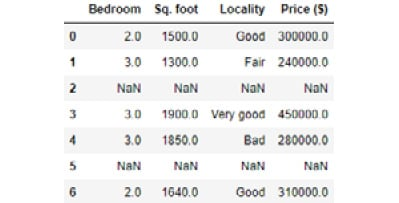

Getting Comfortable with Different Kinds of Data Sources
===========================================================


Exercise 5.01: Working with Headers When Reading Data from a CSV File
---------------------------------------------------------------------

In this exercise, you will see how to read data from a `.csv`
file. This exercise acts as a demonstration of how to work with headers and what to
do when the headers are missing. At times, you will encounter situations
where headers are not present, and you may have to add proper headers or
column names of your own. Let\'s have a look at how this can be done:

1.  Open a new Jupyter Notebook and read the example `.csv`
    file (with a header) using the following code and examine the
    resulting DataFrame, as follows:

    
    ```
    import numpy as np
    import pandas as pd
    df1 = pd.read_csv("../datasets/CSV_EX_1.csv")
    df1
    ```

    **Note:**

    Throughout this exercise, don\'t forget to change the path
    (highlighted) of the CSV file based on its location on your system.

    The output is as follows:

    
    
    


2.  Read a `.csv` file with no header using a
    `pandas` DataFrame:

    
    ```
    df2 = pd.read_csv("../datasets/CSV_EX_2.csv")
    df2
    ```

    The output is as follows:

    
    
    


    The top data row has been mistakenly read as the column header. You
    can specify `header=None` to avoid this.

3.  Read the `.csv` file by setting the `header` to
    `None`, as follows:

    
    ```
    df2 = pd.read_csv("../datasets/CSV_EX_2.csv",header=None)
    df2
    ```

    However, without any header information, you will get back the
    following output. The default headers will be just some default
    numeric indices starting from `0`. This is how the
    `pandas` library treats a headerless CSV file when you ask
    it not to consider the first line (which is a data row in this case)
    as `header`:

    
    
    

    This may be fine for data analysis purposes, but if you want the
    DataFrame to have meaningful headers, then you will have to add them
    using the `names` argument.

4.  Add the `names` argument to get the correct headers:

    
    ```
    df2 = pd.read_csv("../datasets/CSV_EX_2.csv",\
                      header=None, names=['Bedroom','Sq.ft',\
                                          'Locality','Price($)'])
    df2
    ```

    Finally, you will get a DataFrame that will look like this:

    
    


As you can see in the preceding figure, the headers have been added in
the right places.


Up until now, we\'ve been comfortable reading from files where a comma
acts as a delimiter. Let\'s look at the following exercise, where we
will be reading from a CSV file where the values are not separated by
commas.


Exercise 5.02: Reading from a CSV File Where Delimiters Are Not Commas
----------------------------------------------------------------------

It is fairly common to encounter raw data files where the
separator/delimiter is a character and not a comma. This exercise will
demonstrate how you can read data from a file in such a case.

**Note:**

The file can be found here: <https://github.com/fenago/data-wrangling-python>.

Let\'s go through the following steps:

1.  Read a `.csv` file using `pandas` DataFrames:

    
    ```
    import numpy as np
    import pandas as pd
    df3 = pd.read_csv("../datasets/CSV_EX_3.csv")
    df3
    ```

    **Note:**

    Throughout this exercise, don\'t forget to change the path
    (highlighted) of the CSV file based on its location on your system.

    The output will be as follows:

    
    
    


    Clearly, the `;` separator was not expected, and the
    reading is flawed. A simple workaround is to specify the
    separator/delimiter explicitly in the `read` function.

2.  Specify the delimiter:

    
    ```
    df3 = pd.read_csv("../datasets/CSV_EX_3.csv",sep=';')
    df3
    ```

    The output is as follows:

    
    
    


As we can see, it is fairly simple to read from a csv file when the
delimiter is specified in the `read_csv` function.

**Note:**

To access the source code for this specific section, please refer to
<https://github.com/fenago/data-wrangling-python>.


In the following exercise, we will see how to bypass the headers if your
CSV file already comes with headers.


Exercise 5.03: Bypassing and Renaming the Headers of a CSV File
---------------------------------------------------------------

This exercise will demonstrate how to bypass the headers of a CSV file
and put in your own. To do that, you have to specifically set
`header=0`. If you try to set the `names` variable
to your `header` list, unexpected things can happen. Follow
these steps:

1.  Add `names` to a `.csv` file that has headers,
    as follows:

    
    ```
    import numpy as np
    import pandas as pd
    df4 = pd.read_csv("../datasets/CSV_EX_1.csv",\
                      names=['A','B','C','D'])
    df4
    ```

    **Note:**

    Throughout this exercise, don\'t forget to change the path
    (highlighted) of the CSV file based on its location on your system.

    The output is as follows:

    
    
    


2.  To avoid this, set `header` to zero and provide a
    `names` list:

    
    ```
    df4 = pd.read_csv("../datasets/CSV_EX_1.csv",header=0,\
                      names=['A','B','C','D'])
    df4
    ```

    The output is as follows:

    
    
    


Keep in mind that this representation is just in memory at the moment
and only available in the present session of the notebook; it is not
reflected in the physical CSV file. The original file has not changed
due to our manipulation.

**Note:**

To access the source code for this specific section, please refer to
<https://github.com/fenago/data-wrangling-python>.


We observed some operations that we can do on the headers in a file.
However, some CSV files may have an even more complex structure than the
simple ones that we have been using so far. In the following exercise,
we will discover some tricks to deal with such complex structures.


Exercise 5.04: Skipping Initial Rows and Footers When Reading a CSV File
------------------------------------------------------------------------

In this exercise, we will skip the first few rows because, most of the
time, the first few rows of a CSV data file are metadata about the data
source or similar information, which is not read into the table. Also,
we will go ahead and remove the footer of the file, which might
sometimes contain information that\'s not very useful. Let\'s see how we
can do that using the example shown in the following screenshot:


**Note:**

The first two lines in the CSV file are irrelevant data. The file can be
found here <https://github.com/fenago/data-wrangling-python>

1.  Read the CSV file and examine the results:

    
    ```
    import numpy as np
    import pandas as pd
    df5 = pd.read_csv("../datasets/CSV_EX_skiprows.csv")
    df5
    ```

    **Note:**

    Throughout this exercise, don\'t forget to change the path
    (highlighted) of the CSV file based on its location on your system.

    The output is as follows:

    
    
    


2.  Skip the first two rows and read the file:

    
    ```
    df5 = pd.read_csv("CSV_EX_skiprows.csv",skiprows=2)
    df5
    ```

    The output is as follows:

    
    
    


    Similar to skipping the initial rows, it may be necessary to skip
    the footer of a file. For example, we do not want to read the data
    at the end of the following file:

    
    
    


    We have to use `skipfooter` and the
    `engine='python'` option to enable this. There are two
    engines for these CSV reader functions, based on C or Python, of
    which only the Python engine supports the `skipfooter`
    option.

3.  Use the `skipfooter` option in Python:

    
    ```
    df6 = pd.read_csv("../datasets/CSV_EX_skipfooter.csv",\
                      skiprows=2,skipfooter=1, engine='python')
    df6
    ```

    The output is as follows:

    
    
    


We\'ve now seen how to read values skipping the headers and footers from
a file. It can very often be very handy while dealing with data
collected from several different sources, especially in situations where
a file contains unnecessary and junk information.


Reading Only the First N Rows
-----------------------------

A simple option, called `nrows`, in the `read_csv`
function, enables us to do just that. We will specify the number of rows
we want to read and pass it as an argument to `nrows` like so:

```
df7 = pd.read_csv("../datasets/CSV_EX_1.csv",nrows=2)
df7
```


**Note:**

The path (highlighted) would need to be changed based on where the file
is saved on your system.

The output is as follows:


The ability to be able to read only a selected number of rows is useful,
specifically if you are dealing with large CSV files.


Exercise 5.05: Combining skiprows and nrows to Read Data in Small Chunks
------------------------------------------------------------------------

This exercise will demonstrate how we can read from a very large data
file. To do that, we can cleverly combine `skiprows` and
`nrows` to read in a large file in small chunks of
pre-determined sizes. We will read from the
`Boston_housing.csv` file, which contains data about the
pricing of houses in the Boston area in the US. It contains information
such as per capita crime rate by town and the average number of rooms
per dwelling. To do this, let\'s go through the following steps:

**Note:**

Each exercise continues directly from the previous one. You do not need
to open a new Jupyter Notebook each time.

The dataset can be found here: <https://github.com/fenago/data-wrangling-python>

1.  Create a list where DataFrames will be stored:
    
    ```
    list_of_dataframe = []
    ```

2.  Store the number of rows to be read into a variable:
    
    ```
    rows_in_a_chunk = 10
    ```

3.  Create a variable to store the number of chunks to be read:
    
    ```
    num_chunks = 5
    ```

4.  Create a dummy DataFrame to get the column names:

    
    ```
    import pandas as pd
    df_dummy = pd.read_csv("../datasets/Boston_housing.csv",nrows=2)
    colnames = df_dummy.columns
    ```

    **Note:**

    Throughout this exercise, don\'t forget to change the path
    (highlighted) of the CSV file based on its location on your system.

5.  Loop over the CSV file to read only a fixed number of rows at a
    time:

    
    ```
    for i in range(0,num_chunks*rows_in_a_chunk,rows_in_a_chunk):
        df = pd.read_csv("Boston_housing.csv", header=0,\
                         skiprows=i, nrows=rows_in_a_chunk,\
                         names=colnames)
        list_of_dataframe.append(df)
    ```

    **Note:**

    This particular step will not show any output as the values are
    getting appended to the list.

**Note:** how the `iterator` variable is set up inside the
`range` function to break it into chunks. Say the number of
chunks is `5` and the rows per chunk is `10`, then
the iterator will have a range of `(0,5*10,10)`, where the
final `10` is step-size, that is, it will iterate with indices
of `(0,9,19,29,39,49)`.

**Note:**

To access the source code for this specific section, please refer to
<https://github.com/fenago/data-wrangling-python>.


Setting the skip\_blank\_lines Option
-------------------------------------

By default, `read_csv` ignores blank lines, which means if
there are row entries with `NaN` values, the
`read_csv` function will not read that data. However, in some
situations, you may want to read them in as `NaN` so that you
can count how many blank entries were present in the raw data file. In
some situations, this is an indicator of the default data streaming
quality and consistency. For this, you have to disable the
`skip_blank_lines` option:

```
df9 = pd.read_csv("../datasets/CSV_EX_blankline.csv",\
                  skip_blank_lines=False)
df9
```


The output is as follows:

**Note:**

The path (highlighted) would need to be changed based on where the file
is located on your system.





In the next section, we are going to read CSV data from a zip file.


Reading CSV Data from a Zip File
--------------------------------

This is an awesome feature of `pandas`, and it allows you to
read directly from a compressed file, such as `.zip`,
`.gz`, `.bz2`, or `.xz`. The only
requirement is that the intended data file (`CSV`) should be
the only file inside the compressed file. For example, we might need to
compress a large csv file, and in that case, it will be the only file
inside the `.zip` folder.

In this example, we compressed the example CSV file with the
`7-Zip` program and read from it directly using the
`read_csv` method:

```
df10 = pd.read_csv('../datasets/CSV_EX_1.zip')
df10
```


The output is as follows:


Next, we will turn our attention to a Microsoft Excel file. It turns out
that most of the options and methods we learned about in the previous
exercises with the CSV file apply directly to reading Excel files too.


Reading from an Excel File Using sheet\_name and Handling a Distinct sheet\_name
--------------------------------------------------------------------------------

In this section, we will focus on the differences between the methods of
reading from an Excel file. An Excel file can consist of multiple
worksheets, and we can read a specific sheet by passing in a particular
argument, that is, `sheet_name`.

For example, in the `Housing_data.xlsx` file, we have three
worksheets. The following code reads them one by one into three separate
DataFrames:

```
df11_1 = pd.read_excel("../datasets/Housing_data.xlsx",\
                       sheet_name='Data_Tab_1')
df11_2 = pd.read_excel("../datasets/Housing_data.xlsx",\
                       sheet_name='Data_Tab_2')
df11_3 = pd.read_excel("../datasets/Housing_data.xlsx",\
                       sheet_name='Data_Tab_3')
```


If the Excel file has multiple distinct worksheets but the
`sheet_name` argument is set to `None`, then an
ordered dictionary will be returned by the `read_excel`
function. That ordered `dict` will have the data from all the
worksheets, and the top-level keys will indicate the name of the
worksheet. Thereafter, we can simply iterate over that dictionary or its
keys to retrieve individual DataFrames.

Let\'s consider the following example:

```
dict_df = pd.read_excel("../datasets/Housing_data.xlsx",\
                        sheet_name=None)
dict_df.keys()
```


The output is as follows:

```
odict_keys(['Data_Tab_1', 'Data_Tab_2', 'Data_Tab_3'])
```


Therefore, we can access these individual worksheets using the distinct
keys.


Exercise 5.06: Reading a General Delimited Text File
----------------------------------------------------

In this exercise, we will read from general delimited text files and see
that this can be done as easily as reading from CSV files. However, we
will have to use the right separator if it is anything other than a
whitespace or a tab. To see this in action, let\'s go through the
following steps:

1.  Read the data from a `.txt` file using the
    `read_table` command:

    
    ```
    import pandas as pd
    df13 = pd.read_table("../datasets/Table_EX_1.txt")
    df13
    ```

    The output is as follows:

    
    
    


    **Note:**

    Throughout this exercise, don\'t forget to change the path
    (highlighted) of the text file based on its location on your system.

    A comma-separated file saved with the `.txt` extension
    will result in the preceding DataFrame if read without explicitly
    setting the separator. As you can see, for each value read, there is
    a comma appended. In this case, we have to set the separator
    explicitly.

2.  Set the separator as a comma in the `sep` variable as
    follows:

    
    ```
    df13 = pd.read_table("../datasets/Table_EX_1.txt", sep=',')
    df13
    ```

    The output is as follows:

    
    
    
We can see in the figure that the data is read as expected from the `.txt` file.


Exercise 5.08: Reading from a JSON File
---------------------------------------

In this exercise, we will read data from the `movies.json`
file. This file contains the cast, genre, title, and year (of release)
information for almost all major movies since `1900`. Let\'s
go through the following steps:

**Note:**

The `.json` file could be found at
<https://github.com/fenago/data-wrangling-python>.

1.  Extract the list of movies from the file into a DataFrame.

    
    ```
    import pandas as pd
    df16 = pd.read_json("../datasets/movies.json")
    df16.head()
    ```

    **Note:**

    Don\'t forget to change the path (highlighted) of the JSON file
    based on its location on your system.

    The output is as follows:

    
    
    


2.  To look for the cast where the title is `Avengers`, use
    filtering:

    
    ```
    cast_of_avengers = df16[(df16['title']=="The Avengers") \
                       & (df16['year']==2012)]['cast']
    print(list(cast_of_avengers))
    ```

    The output will be as follows:

    
    ```
     [['Robert Downey, Jr.', 'Chris Evans', 'Mark Ruffalo', 
       'Chris Hemsworth', 'Scarlett Johansson', 'Jeremy Renner', 
       'Tom Hiddleston', 'Clark Gregg', 'Cobie Smulders', 
       'Stellan SkarsgÃyrd', 'Samuel L. Jackson']]
    ```


Exercise 5.09: Reading Tabular Data from a PDF File
---------------------------------------------------

In this exercise, we will first read from two different pages of a PDF
file from <https://github.com/fenago/data-wrangling-python> in tabular format, and then we
will perform a few simple operations to handle the headers of these
files.

Let\'s go through the following steps to do so:

1.  The following code retrieves the tables from two pages and joins
    them to make one table:

    
    ```
    from tabula import read_pdf
    df18_1 = read_pdf('../datasets/Housing_data.pdf',\
                      pages=[1], pandas_options={'header':None})
    df18_1
    ```

    **Note:**

    Throughout this exercise, don\'t forget to change the path
    (highlighted) of the PDF based on its location on your system.

    The output is as follows:

    
    
    

2.  Retrieve the table from another page of the same PDF by using the
    following command:

    
    ```
    df18_2 = read_pdf('../datasets/Housing_data.pdf',\
                      pages=[2], pandas_options={'header':None})
    df18_2
    ```

    The output is as follows:

    
    
    


3.  To concatenate the tables that were derived from the first two
    steps, execute the following code:

    
    ```
    import pandas as pd
    df1 = pd.DataFrame(df18_1)
    df2 = pd.DataFrame(df18_2)
    df18=pd.concat([df1,df2],axis=1)
    df18.values.tolist()
    ```

    The output is as follows:

    
    
    


    With PDF extraction, most of the time, headers will be difficult to
    extract automatically.

4.  Pass on the list of headers with the `names` argument in
    the `read-pdf` function set to `pandas_option`,
    as follows:

    
    ```
    names = ['CRIM','ZN','INDUS','CHAS','NOX','RM','AGE','DIS',\
             'RAD','TAX','PTRATIO','B','LSTAT','PRICE']
    df18_1 = read_pdf('../datasets/Housing_data.pdf',pages = [1], \
                      pandas_options = {'header':None,\
                                        'names':names[:10]})
    df18_2 = read_pdf('../datasets/Housing_data.pdf',pages = [2],\
                      pandas_options = {'header':None,\
                                        'names':names[10:]})
    df1 = pd.DataFrame(df18_1)
    df2 = pd.DataFrame(df18_2)
    df18 = pd.concat([df1,df2],axis = 1)
    df18.values.tolist()
    ```

    The output is as follows:


We will have a full activity on reading tables from a PDF report and
processing them at the end of this lab. Let\'s dive into web page
scraping and the library used to do that, Beautiful Soup 4.


Exercise 5.10: Reading an HTML File and Extracting Its Contents Using Beautiful Soup
------------------------------------------------------------------------------------

In this exercise, we will do the simplest thing possible. We will import
the `Beautiful Soup` or `bs4` library and then use
it to read an HTML document. Then, we will examine the different kinds
of objects it returns. While doing the exercises for this topic, you
should have the example HTML file (called `test.html`) open in
a text editor so that you can check for the different tags and their
attributes and contents:

1.  Import the `bs4` library:
    
    ```
    from bs4 import BeautifulSoup
    ```

2.  Please download the following test HTML file and save it on your
    disk, and then use `bs4` to read it from the disk:

    
    ```
    with open("../datasets/test.html", "r") as fd:
        soup = BeautifulSoup(fd)
        print(type(soup))
    ```

    **Note:**

    Throughout this exercise, don\'t forget to change the path
    (highlighted) of the HTML file based on its location on your system.

    The output is as follows:

    
    ```
    <class 'bs4.BeautifulSoup'>
    ```

    You can pass a file handler directly to the constructor of the
    `BeautifulSoup` object and it will read the contents from
    the file that the handler is attached to. We will see that the
    return type is an instance of `bs4.BeautifulSoup`. This
    class holds all the methods we need to navigate through the DOM tree
    that the document represents.

3.  Print the contents of the file in a nice way, by which we mean that
    the printing will keep some kind of nice indentation by using the
    `prettify` method from the class, like this:

    
    ```
    print(soup.prettify())
    ```

    The output is as follows:

    
    
    

4.  Read the HTML file:

    
    ```
    with open("../datasets/test.html", "r") as fd:
        soup = BeautifulSoup(fd)
        print(soup.p)
    ```

    The output is as follows:

    
    
    


    As we can see, this is the content of the `<p>` tag.

    We saw how to read a tag in the last exercise, but we can easily see
    the problem with this approach. When we look into our HTML document,
    we can see that we have more than one `<p>` tag there. How
    can we access all the `<p>` tags? It turns out that this
    is easy.

5.  Use the `findall` method to extract the content from the
    tag:

    
    ```
    with open("../datasets/test.html", "r") as fd:
        soup = BeautifulSoup(fd)
        all_ps = soup.find_all('p')
        print("Total number of <p>  --- {}".format(len(all_ps)))
    ```

    The output is as follows:

    
    ```
    Total number of <p>  --- 6
    ```

    This will print `6`, which is exactly the number of
    `<p>` tags in the document.

    We have seen how to access all the tags of the same type. We have
    also seen how to get the content of the entire HTML document.

6.  Now we will see how to get the contents of a particular HTML tag:

    
    ```
    with open("../datasets/test.html", "r") as fd:
        soup = BeautifulSoup(fd)
        table = soup.table
        print(table.contents)
    ```

    The output is as follows:

    
    
    


    Here, we are getting the (first) table from the document and then
    using the same `.` notation to get the contents of that
    tag. We saw in the previous step that we can access the entire
    content of a particular tag. However, HTML is represented as a tree,
    and we are able to traverse the children of a particular node. There
    are a few ways to do this.

7.  The first way is by using the `children` generator from
    any `bs4` instance, as follows:

    
    ```
    with open("../datasets/test.html", "r") as fd:
        soup = BeautifulSoup(fd)
        table = soup.table
        for child in table.children:
            print(child)
            print("*****")
    ```

    When we execute the code, we will see something like the following:

    
    
    


    It seems that the loop has only been executed twice. Well, the
    problem with the `children` generator is that it only
    takes into account the immediate children of the tag. We have
    `<tbody>` under `<table>`, and our whole table
    structure is wrapped in it. That\'s why it was considered a single
    child of the `<table>` tag.

    We have looked into how to browse the immediate children of a tag.
    We will see how we can browse all the possible children of a tag and
    not only the immediate one.

8.  To do that, we use the `descendants` generator from the
    `bs4` instance, as follows:

    
    ```
    with open("../datasets/test.html", "r") as fd:
        soup = BeautifulSoup(fd)
        table = soup.table
        children = table.children
        des = table.descendants
        print(len(list(children)), len(list(des)))
    ```

    The output is as follows:

    
    ```
    9 61
    ```

The comparison print at the end of the code block will show us the
difference between `children` and `descendants`. The
length of the list we got from `children` is only
`9`, whereas the length of the list we got from
`descendants` is `61`.


Exercise 5.11: DataFrames and BeautifulSoup
-------------------------------------------

In this exercise, we will extract the data from the
`test.html` page using the `BeautifulSoup` library.
We will then perform a few operations for data preparation and display
the data in an easily readable tabular format. To do that, let\'s go
through the following steps:

1.  Import `pandas` and read the document, as follows:

    
    ```
    import pandas as pd
    from bs4 import BeautifulSoup
    fd = open("../datasets/test.html", "r")
    soup = BeautifulSoup(fd)
    data = soup.findAll('tr')
    print("Data is a {} and {} items long".format(type(data),\
          len(data)))
    ```

    **Note:**

    Don\'t forget to change the path (highlighted) of the HTML file
    based on its location on your system.

    The output is as follows:

    
    ```
    Data is a <class 'bs4.element.ResultSet'> and 4 items long
    ```

2.  Check the original table structure in the HTML source. You will see
    that the first row is the column heading and all of the following
    rows are the data from the HTML source. We\'ll assign two different
    variables for the two sections, as follows:

    
    ```
    data_without_header = data[1:]
    headers = data[0]
    headers
    ```

    The output is as follows:

    
    ```
    <tr>
    <th>Entry Header 1</th>
    <th>Entry Header 2</th>
    <th>Entry Header 3</th>
    <th>Entry Header 4</th>
    </tr>
    ```

    **Note:**

    Keep in mind that the art of scraping an HTML page goes hand in hand
    with an understanding of the source HTML structure. So, whenever you
    want to scrape a page, the first thing you need to do is right-click
    on it and then use `View Source` from the browser to see
    the source HTML.

3.  Once we have separated the two sections, we need two list
    comprehensions to make them ready to go in a DataFrame. For the
    header, this is easy:

    
    ```
    col_headers = [th.getText() for th in headers.findAll('th')]
    col_headers
    ```

    The output is as follows:

    
    ```
    ['Entry Header 1', 'Entry Header 2', 'Entry Header 3', 'Entry Header 4']
    ```

    Data preparation is a bit tricky for a `pandas` DataFrame.
    You need to have a two-dimensional list, which is a list of lists.
    We accomplish that in the following way, using the tricks we learned
    earlier about list comprehension.

4.  Use the `for…in` loop to iterate over the data:

    
    ```
    df_data = [[td.getText() for td in tr.findAll('td')] \
               for tr in data_without_header]
    df_data
    ```

    The output is as follows:

    
    
    


5.  Invoke the `pd.DataFrame` method and supply the right
    arguments by using the following code:

    
    ```
    df = pd.DataFrame(df_data, columns=col_headers)
    df.head()
    ```

    The output is as follows:


Thus, we conclude our exercise on creating a data frame from an HTML
table.


In the following exercise, we\'ll export a DataFrame as an Excel file.


Exercise 5.12: Exporting a DataFrame as an Excel File
-----------------------------------------------------

In this exercise, we will see how we can save a DataFrame as an Excel
file. `Pandas` can do this natively, but it needs the help of
the `openpyxl` library to achieve this goal.
`openpyxl` is a Python library for reading/writing Excel 2010
`xlsx/xlsm/xltx/xltm` files.

**Note:**

This exercise is continued from the previous exercise. You\'ll need to
continue in the same Jupyter Notebook.

Let\'s perform the following step:


1.  To save the DataFrame as an Excel file, use the following command
    from inside of the Jupyter notebook:

    
    ```
    writer = pd.ExcelWriter('../datasets/test_output.xlsx')
    df.to_excel(writer, "Sheet1")
    writer.save()
    writer
    ```

    **Note:**

    Don\'t forget to change the path (highlighted) of the Excel file
    based the folder structure of your local system.

    The output is as follows:

    
    ```
    <pandas.io.excel._XlsxWriter at 0x24feb2939b0>
    ```

This is the way in which we can export a `pandas` DataFrame to
Excel. Given that Excel is a very popular format among many types of
users, this is a very important trick you need to master.


Exercise 5.13: Stacking URLs from a Document Using bs4
------------------------------------------------------

In this exercise, we will append the URLs one after the other from the
`test.html` web page. In that file, HTML file links or
`<a>` tags are under a `<ul>` tag, and each of them
is contained inside a `</li>` tag. We are going to find all
the `<a>` tags and create a stack with them.

**Note:**

This exercise is continued from the previous exercise. You\'ll need to
continue in the same Jupyter Notebook.

To do so, let\'s go through the following steps:

1.  Find all the `<a>` tags by using the following command:

    
    ```
    d = open("../datasets/test.html", "r")
    soup = BeautifulSoup(d)
    lis = soup.find('ul').findAll('li')
    stack = []
    for li in lis:
        a = li.find('a', href=True)
    ```

    **Note:**

    Don\'t forget to change the path (highlighted) of the HTML file
    based on its location on your system.

2.  Define a stack before you start the loop. Then, inside the loop, use
    the `append` method to push the links in the stack:
    
    ```
    stack.append(a['href'])
    ```

3.  Print the stack:

    
    ```
    print(stack)
    ```

    The output is as follows:

    
    ```
    ['https://www.imdb.com/chart/top']
    ```


Let\'s put together everything we have learned so far in this lab
and get started with an activity.


Activity 5.01: Reading Tabular Data from a Web Page and Creating DataFrames
---------------------------------------------------------------------------

In this activity, you have been given a Wikipedia
page where you have the GDP of all countries listed. You have to create
three `DataFrames` from the three sources mentioned on the
page
(<https://en.wikipedia.org/wiki/List_of_countries_by_GDP_(nominal>)).

You will have to do the following:

1.  Open the page in a separate Chrome/Firefox tab and use something
    like an `Inspect Element` tool to view the source HTML and
    understand its structure.
2.  Read the page using `bs4`.
3.  Find the table structure you will need to deal with (how many tables
    are there?).
4.  Find the right table using `bs4`.
5.  Separate the source names and their corresponding data.
6.  Get the source names from the list of sources you have created.
7.  Separate the header and data from the data that you separated before
    for the first source only, and then create a DataFrame using that.
8.  Repeat the last task for the other two data sources.

The output should look like this:


Summary
=======

In this lab, we have looked into several different types of data
formats and how to work with them. We learned about `bs4` (`BeautifulSoup 4`), a Python
library that gives us Pythonic ways to read and query HTML documents.
We also looked at how we can create a `pandas` DataFrame from
an HTML document (which contains a table). Finally, we looked at how we can create a stack in our code.

In the next lab, we will discuss list
comprehensions, the `.zip` format, and outlier detection and
cleaning.