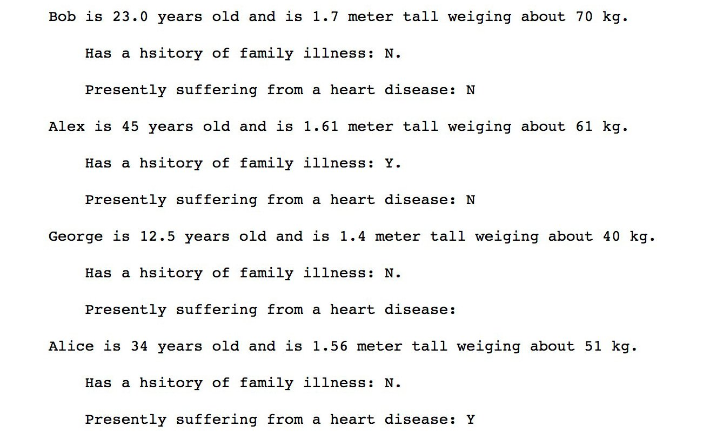
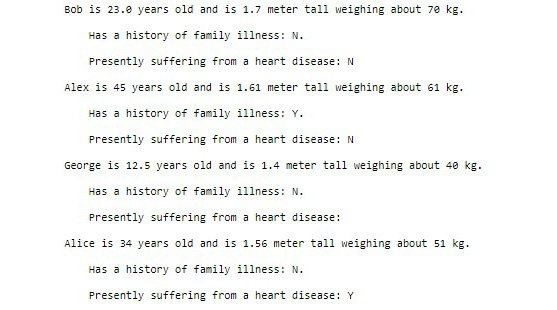

Learning the Hidden Secrets of Data Wrangling
================================================


Exercise 6.01: Generator Expressions
------------------------------------

In this exercise, we will be working with generator expressions, which
are considered another brick of functional programming (as a matter of
fact, they are inspired by the pure functional language known as
Haskell). We will create a list of odd numbers using list comprehension
and check the memory occupied by the list. We will then create the same
list using a generator expression and see the advantage of using it over
list comprehension. To do so, let\'s go through the following steps:

1.  Open a new Jupyter Notebook and write the following code using list
    comprehension to generate a list of all the odd numbers between 0
    and 10,0000:
    
    ```
    odd_numbers2 = [x for x in range(100000) if x % 2 != 0]
    ```

2.  Use `getsizeof` from `sys` by using the
    following code to understand the bytes of memory the generator
    expressions occupy:

    
    ```
    from sys import getsizeof
    getsizeof(odd_numbers2)
    ```

    The output is as follows:

    
    ```
    406496
    ```


3.  Write the equivalent generator expression for the aforementioned
    list comprehension:

    
    ```
    odd_numbers = (x for x in range(100000) if x % 2 != 0)
    ```

    Notice that the only change we made is to surround the list
    comprehension statement with round brackets instead of square ones.
    This makes it shrink to only around `100` bytes. This is
    because this is a generator expression, so no explicit memory has
    been allocated for it. There\'s just enough memory to hold the logic
    of the generation of numbers. This makes it become a lazy
    evaluation, and thus is more efficient.

4.  Print the first 10 odd numbers, as follows:

    
    ```
    for i, number in enumerate(odd_numbers):
        print(number)
        if i > 10:
            break
    ```

    The output is as follows:

    
    ```
    1
    3
    5
    7
    9
    11
    13
    15
    17
    19
    21
    23
    ```

As we can see, the first 10 odd numbers are being printed on the
console.

**Note:**

To access the source code for this specific section, please refer to
<https://github.com/fenago/data-wrangling-python>.


In the next exercise, we\'ll take a look at how to write a generator
expression in one line.


Exercise 6.02: Single-Line Generator Expression
-----------------------------------------------

In this exercise, we will use our knowledge of generator expressions to
generate an expression that will read one word at a time from a list of
words and will remove newline characters at the end of them while making
them lowercase. This can certainly be done using a `for` loop
explicitly. To do so, let\'s go through the following steps:

1.  Create a new Jupyter Notebook and create a `words` string,
    as follows:
    
    ```
    words = ["Hello\n", "My name", "is\n",\
             "Bob", "How are you", "doing\n"]
    ```

2.  Write the following generator expression to achieve this task, as
    follows:
    
    ```
    modified_words = (word.strip().lower() for word in words)
    ```

3.  Create a list comprehension to get words one by one from the
    generator expression and finally print the list, as follows:

    
    ```
    final_list_of_word = [word for word in modified_words]
    final_list_of_word
    ```

    The output is as follows:

    
    ```
    ['hello', 'my name', 'is', 'bob', 'how are you', 'doing']
    ```

As we can see, we created a one-liner generator expression efficiently
using a simple `for` loop.

**Note:**

To access the source code for this specific section, please refer to
<https://github.com/fenago/data-wrangling-python>.


In the next exercise, we\'ll extract a list using single words.


Exercise 6.03: Extracting a List with Single Words
--------------------------------------------------

If we look at the output of the previous exercise, we will notice that
due to the messy nature of the source data (which is normal in the real
world), we ended up with a list where, in some cases, we have more than
one word together as a phrase, separated by a space. To improve this and
to get a list of single words, we will have to modify the generator
expressions. Let\'s see how to do that:

1.  Write the generator expression and then write the equivalent nested
    `for` loops so that we can compare the results:

    
    ```
    words = ["Hello\n", "My name", "is\n", \
             "Bob", "How are you", "doing\n"]
    modified_words2 = (w.strip().lower() for word \
                       in words for w in word.split(" "))
    final_list_of_word = [word for word in modified_words2]
    final_list_of_word
    ```

    The output is as follows:

    
    ```
    ['hello', 'my', 'name', 'is', 'bob', 'how', 'are', 'you', 'doing']
    ```

2.  Write an equivalent to the preceding code by using a nested
    `for` loop, as follows:

    
    ```
    modified_words3 = []
    for word in words:
        for w in word.split(" "):
            modified_words3.append(w.strip().lower())
    modified_words3
    ```

    The output is as follows:

    
    ```
    ['hello', 'my', 'name', 'is', 'bob', 'how', 'are', 'you', 'doing']
    ```

We must admit that the generator expression is not only space- and
time-saving but also a more elegant way to write the same logic.

**Note:**

To access the source code for this specific section, please refer to
<https://github.com/fenago/data-wrangling-python>.


To remember how the nested loop works in generator expressions, keep in
mind that the loops are evaluated from left to right and the final loop
variable (in our example, which is denoted by the single letter
`w`) is given back (thus, we could call `strip` and
`lower` on it).

The following diagram will help you remember the trick about using
nested `for` loops in list comprehension or generator
expressions:


We have learned about nested `for` loops in generator
expressions previously, but now we are going to learn about independent
`for` loops in a generator expression. We will have two output
variables from two `for` loops and they must be treated as a
tuple so that they don\'t have ambiguous grammar in Python.

Create the following two lists:

```
marbles = ["RED", "BLUE", "GREEN"]
counts = [1, 5, 13]
```


You are asked to generate all possible combinations of the values in the
`marbles` array and `counts` array after being given
the preceding two lists. How will you do that? Surely using a nested
`for` loop and the `append` method, you can
accomplish the task. How about a generator expression? A more elegant
and easy solution is as follows:

```
marble_with_count = ((m, c) for m in marbles for c in counts)
```


This generator expression creates a tuple in each iteration of the
simultaneous `for` loops. This code is equivalent to the
following explicit code:

```
marble_with_count_as_list_2 = []
for m in marbles:
    for c in counts:
        marble_with_count_as_list_2.append((m, c))
marble_with_count_as_list_2
```


The output is as follows:

```
 [('RED', 1),
 ('RED', 5),
 ('RED', 13),
 ('BLUE', 1),
 ('BLUE', 5),
 ('BLUE', 13),
 ('GREEN', 1),
 ('GREEN', 5),
 ('GREEN', 13)]
```


This generator expression creates a tuple in each iteration of the
simultaneous `for` loops. Once again, the generator expression
is easy, elegant, and efficient compared to the `for..in`
loop.

Let\'s move on to the next exercise, where we will examine the
`zip` function and compare it with the generator expression.


Exercise 6.04: The zip Function
-------------------------------

In this exercise, we will examine the `zip` function and
compare it with the generator expression we wrote in the previous
exercise. The problem with the previous generator expression is the fact
that it produced all possible combinations. For instance, if we need to
relate countries with their capitals, doing so using a generator
expression will be difficult. Fortunately, Python gives us a built-in
function called `zip` for just this purpose:

1.  Open a new Jupyter Notebook and create the following two lists:
    
    ```
    countries = ["India", "USA", "France", "UK"]
    capitals = ["Delhi", "Washington", "Paris", "London"]
    ```

2.  Generate a list of tuples where the first element is the name of the
    country and the second element is the name of the capital by using
    the following commands:

    
    ```
    countries_and_capitals = [t for t in zip(countries, capitals)]
    countries_and_capitals
    ```

    The output is:

    
    ```
    [('India', 'Delhi'),
     ('USA', 'Washington'),
     ('France', 'Paris'),
     ('UK', 'London')]
    ```

    This is not very well represented. It would make more sense if we
    can use `dict` where keys are the names of the countries,
    while the values are the names of the capitals.

3.  Use the following command, where keys are the names of the
    countries:

    
    ```
    countries_and_capitals_as_dict = dict(zip(countries, capitals))
    countries_and_capitals_as_dict
    ```

    The output is as follows:

    
    ```
    {'India': 'Delhi', 'USA': 'Washington', 
    'France': 'Paris', 'UK': 'London'}
    ```

As always, in real life, data is messy. So, the nice equal length lists
of countries and capitals that we just saw are not always available. The
`zip` function cannot be used with unequal length lists,
because `zip` will stop working as soon as one of the lists
comes to an end.

**Note:**

To access the source code for this specific section, please refer to
<https://github.com/fenago/data-wrangling-python>.


Let\'s look at the following exercise to understand how we can handle
messy data.


Exercise 6.05: Handling Messy Data
----------------------------------

In this exercise, we\'re going to use the `zip` function to
handle messy data in lists of unequal length. In such a situation, we
will use the `ziplongest` function from the
`itertools` module. Let\'s perform the following steps:

1.  Open a new Jupyter Notebook and create two lists of unequal length,
    as follows:
    
    ```
    countries = ["India", "USA", "France", "UK", "Brazil", "Japan"]
    capitals = ["Delhi", "Washington", "Paris", "London"]
    ```

2.  Create the final dictionary. `None` will be displayed as
    the value for the countries that do not have a capital in the
    capital\'s list:

    
    ```
    from itertools import zip_longest
    countries_and_capitals_as_dict_2 = dict(zip_longest(countries, \
                                                        capitals))
    countries_and_capitals_as_dict_2
    ```

    The output is as follows:

    
    ```
    {'India': 'Delhi',
     'USA': 'Washington',
     'France': 'Paris',
     'UK': 'London',
     'Brazil': None,
     'Japan': None}
    ```

We should pause here for a second and think about how many lines of
explicit code and difficult-to-understand `if-else`
conditional logic we just saved by calling a single function and just
giving it the two source data lists. It is indeed amazing.

**Note:**

To access the source code for this specific section, please refer to
<https://github.com/fenago/data-wrangling-python>.


With these exercises, we are ending the first topic of this lab.
Advanced list comprehension, generator expressions, and functions such
as `zip` and `ziplongest` are some very important
tricks that we need to master if we want to write clean, efficient, and
maintainable code. Code that does not have these three qualities are
considered subpar in the industry, and we certainly don\'t want to write
such code.

However, we did not cover one important point here, that is, generators.
Generators are a special type of function that shares behavioral traits
with generator expressions. However, being functions, they have a
broader scope and they are much more flexible. We strongly encourage you
to learn about them.

**Note:**

You can read more about generators here:
<https://wiki.python.org/moin/Generators>.


Data Formatting
===============


In this section, we will format a given dataset. The main motivations
behind formatting data properly are as follows:

-   It helps all the downstream systems have a single and pre-agreed
    form of data for each data point, thus avoiding surprises and, in
    effect, there is no risk which might break the system.
-   To produce a human-readable report from lower-level data that is,
    most of the time, created for machine consumption.
-   To find errors in data.

There are a few ways to perform data formatting in Python. We will begin
with the modulus `%` operator.


The % operator
--------------

Python gives us the modulus `%` operator to apply basic
formatting on data. To demonstrate this, we will load the data by
reading the `combined_data.csv` file, and then we will apply
some basic formatting to it.

**Note:**

The `combined_data.csv` file contains some sample medical data
for four individuals. The file can be found here:
<https://github.com/fenago/data-wrangling-python>.

We can load the data from the CSV file by using the following command:

```
from csv import DictReader
raw_data = []
with open("../datasets/combinded_data.csv", "rt") as fd:
    data_rows = DictReader(fd)
    for data in data_rows:
        raw_data.append(dict(data))
```


Now, we have a list called `raw_data` that contains all the
rows of the CSV file. Feel free to print it to see what the content of
the `.csv` file looks like.

The output is as follows:


We will be producing a report on this data. This report will contain one
section for each data point and will report the name, age, weight,
height, history of family disease, and finally the present heart
condition of the person. These points must be clear and easily
understandable English sentences.

We do this in the following way:

```
for data in raw_data:
    report_str = \
    """%s is %s years old and is %s meter tall weighing \
about %s kg.\n 
Has a history of family illness: %s.\n
Presently suffering from a heart disease: %s
    """ % (data["Name"], data["Age"], \
           data["Height"], data["Weight"], \
           data["Disease_history"], data["Heart_problem"])
    print(report_str)
```


The output is as follows:


The `%` operator is used in two different ways:

-   When used inside a quote, it signifies what kind of data to expect
    here. `%s` stands for string, whereas `%d`
    stands for integer. If we indicate a wrong data type, it will throw
    an error. Thus, we can effectively use this kind of formatting as an
    error filter in the incoming data.
-   When we use the `%` operator outside the quote, it
    basically tells Python to start replacing all the data inside with
    the values provided for them outside.


Using the format Function
-------------------------

In this section, we will be looking at the exact same formatting
problem, but this time, we will use a more advanced approach. We will
use Python\'s `format` function.

To use the `format` function, we do the following:

```
for data in raw_data:
    report_str = \
    """{} is {} years old and is {} meter tall weighing \
about {} kg.\n
Has a history of family illness: {}.\n
Presently suffering from a heart disease: {}
    """.format(data["Name"], data["Age"], data["Height"], \
    data["Weight"],data["Disease_history"], data["Heart_problem"])
    print(report_str)
```


The output is as follows:





Notice that we have replaced `%s` with `{}` and,
instead of `%` outside the quote, we have called the
`format` function.

We will see how powerful the `format` function is by making
the previous code a lot more readable and understandable. Instead of
simple and blank `{}`, we mention the key names inside and
then use the special Python `**` operation on a
`dict` to unpack it and give that to the `format`
function. It is smart enough to figure out how to replace the key names
inside the quote with the values from the actual `dict` by
using the following command:

```
for data in raw_data:
    report_str = \
    """{Name} is {Age} years old and is {Height} meter tall \
weighing about {Weight} kg.\n
Has a history of family illness: {Disease_history}.\n
Presently suffering from a heart disease: {Heart_problem}
    """.format(**data)
    print(report_str)
```


The output is as follows:





This approach is indeed much more concise and maintainable.


Exercise 6.06: Data Representation Using {}
-------------------------------------------

In this exercise, the `{}` notation inside the quote is
powerful and we can change our data representation significantly by
using it, which means we can apply basic data transformation such as
printing up to a certain decimal place, changing binary to decimal
numbers, and more just using this operator and without writing many
lines of code. Let\'s perform the following steps:

1.  Change a decimal number into its binary form by using the following
    command:

    
    ```
    original_number = 42
    print("The binary representation of 42 is - {0:b}"\
          .format(original_number))
    ```

    The output is as follows:

    
    ```
    The binary representation of 42 is - 101010
    ```

2.  Print a string that\'s center oriented:

    
    ```
    print("{:^42}".format("I am at the center"))
    ```

    The output is as follows:

    
    ```
                 I am at the center          
    ```

3.  Printing a string that\'s center oriented, but this time with
    padding on both sides:

    
    ```
    print("{:=^42}".format("I am at the center"))
    ```

    The output is as follows:

    
    ```
    ============I am at the center============
    ```

    As we\'ve already mentioned, the `format` statement is a
    powerful one.

In this exercise, we saw how powerful the `{}` notation is and
how its use can benefit data representation immensely.

**Note:**

To access the source code for this specific section, please refer to
<https://github.com/fenago/data-wrangling-python>.


**Formatting Dates**

It is important to format a date as dates have various formats,
depending on what the source of the data is, and it may need several
transformations inside the data wrangling pipeline.

We can use the familiar date formatting notations with
`format` as follows:

```
from datetime import datetime
print("The present datetime is {:%Y-%m-%d %H:%M:%S}"\
      .format(datetime.utcnow()))
```


The output is as follows:


Compare this with the actual output of `datetime.utcnow` and
you will see the power of this expression easily.


Exercise 6.07: Outliers in Numerical Data
-----------------------------------------

In this exercise, we will construct a notion of an outlier based on
numerical data. Imagine a cosine curve. If you remember the math for
this from high school, then a cosine curve is a very smooth curve within
the limit of `[1, -1]`. We will plot this cosine curve using
the `plot` function of `matplotlib`. Let\'s go
through the following steps:

1.  To construct a cosine curve, execute the following command:
    
    ```
    from math import cos, pi
    ys = [cos(i*(pi/4)) for i in range(50)]
    ```

2.  Plot the data by using the following code:

    
    ```
    import matplotlib.pyplot as plt 
    %matplotlib inline 
    plt.plot(ys)
    ```

    The output is as follows:

    
    
    


    As we can see, it is a very smooth curve, and there are no outliers.
    However, we are going to introduce some now.

3.  Introduce some outliers by using the following command:
    
    ```
    ys[4] = ys[4] + 5.0
    ys[20] = ys[20] + 8.0
    ```

4.  Plot the curve:

    
    ```
    plt.plot(ys)
    ```

    The output is as follows:

    
    


We can see that we have successfully introduced two values in the curve,
which broke the smoothness and hence can be considered as outliers.


A good way to detect whether our dataset has an outlier is to create a
box plot. A box plot is a way of plotting numerical data based on their
central tendency and some `buckets` (in reality, we call them
`quartiles`). In a box plot, the outliers are usually drawn as
separate points. The `matplotlib` library helps draw box plots
out of a series of numerical data, which isn\'t hard at all. This is how
we do it:

```
plt.boxplot(ys)
```


Once you execute the preceding code, you will be able to see that there
is a nice box plot where the two outliers that we created are clearly
shown, just like in the following diagram:


Z-score
-------

Use SciPy and calculate the z-score by using the following command:

```
from scipy import stats
cos_arr_z_score = stats.zscore(ys)
cos_arr_z_score
```


The output is as follows:


With this, we have observed how to calculate a z-score. In the following
exercise, we will learn how to use this to remove outliers.


Exercise 6.08: The Z-Score Value to Remove Outliers
---------------------------------------------------

This exercise will demonstrate how to get rid of outliers in a set of
data. In the previous exercise, we calculated the z-score of each data
point. In this exercise, we will continue directly from the previous
exercise and use the z-score values to remove outliers from our data. To
do so, let\'s go through the following steps:

1.  Import `pandas` and create a DataFrame:
    
    ```
    import pandas as pd
    from math import cos, pi
    ys = [cos(i*(pi/4)) for i in range(50)]
    ys[4] = ys[4] + 5.0
    ys[20] = ys[20] + 8.0
    df_original = pd.DataFrame(ys)
    ```

2.  Assign outliers with a `z-score` value of less than
    `3`:
    
    ```
    from scipy import stats
    cos_arr_z_score = stats.zscore(ys)
    cos_arr_without_outliers = df_original[(cos_arr_z_score < 3)]
    ```

3.  Use the `print` function to print the new and old shape:

    
    ```
    print(cos_arr_without_outliers.shape)
    print(df_original.shape)
    ```

    The output is as follows:

    
    ```
    (49, 1)
    (50, 1)
    ```

    From the two printed data points (`49, 1` and
    `50, 1`), it is clear that the derived DataFrame has two
    less rows. These are our outliers.


Detecting and getting rid of outliers is a time consuming and critical
process in any data wrangling pipeline. They need deep domain knowledge,
expertise in descriptive statistics, mastery over the programming
language (and all the useful libraries), and a lot of caution. We
recommend being very careful when performing this operation on a
dataset.


Exercise 6.09: Fuzzy String Matching
------------------------------------

In this exercise, we will look into a slightly different problem that,
at first glance, may look like an outlier. However, upon careful
examination, we will see that it is indeed not, and we will learn about
a useful concept that is sometimes referred to as fuzzy matching of
strings. To do so, let\'s go through the following steps:

1.  Create the load data of a ship on three different dates:

    
    ```
    ship_data = {"Sea Princess": {"date":"12/08/20", \
                                  "load": 40000}, 
                 "Sea Pincess": {"date":"10/06/20", \
                                 "load": 30000}, 
                 "Sea Princes": {"date":"12/04/20", \
                                 "load": 30000}}
    ```

    If you look carefully, you will notice that the name of the ship is
    spelled differently in all three different cases. Let\'s assume that
    the actual name of the ship is `Sea Princess`. From a
    normal perspective, it does look like there has been a human error
    and that the data points do describe a single ship. Removing two of
    them on a strict basis of outliers may not be the best thing to do.

2.  Then, we simply need to import the `distance` function
    from it and pass two strings to it to calculate the distance between
    them:

    
    ```
    from Levenshtein import distance
    name_of_ship = "Sea Princess"
    for k, v in ship_data.items():
        print("{} {} {}".format(k, name_of_ship, \
                                distance(name_of_ship, k)))
    ```

    The output is as follows:

    
    ```
    Sea Princess Sea Princess 0
    Sea Pincess Sea Princess 1
    Sea Princes Sea Princess 1
    ```

We will notice that the distance between the strings is different. It is
`0` when they are identical, and it is a positive integer when
they are not. We can use this concept in our data wrangling jobs and say
that strings with a distance less than or equal to a certain number is
the same string.

**Note:**

To access the source code for this specific section, please refer to
<https://github.com/fenago/data-wrangling-python>.


Here, again, we need to be cautious about when and how to use this kind
of fuzzy string matching. Sometimes, they are needed, and other times,
they will result in a very bad bug.


Activity 6.01: Handling Outliers and Missing Data
-------------------------------------------------

In this activity, we will identify and get rid of outliers. Here, we
have a CSV file. The goal here is to clean the data by using the
knowledge that we have learned about so far and come up with a nicely
formatted DataFrame. Identify the type of outliers and their effect on
the data and clean the messy data.

The dataset that we have used here can be found in the
`visit_data.csv` file. This file contains data generated by a
random data generator, and it contains people\'s names, their
`gender`, `email_id`, `ip_address`, and
the number of visits they made to a particular web page.

**Note:**

The dataset can be found at <https://github.com/fenago/data-wrangling-python>.

The steps that will help you solve this activity are as follows:

1.  Read the `visit_data.csv` file.
2.  Check for duplicates.
3.  Check whether any essential column contains `NaN`.
4.  Get rid of the outliers.
5.  Report the size difference.
6.  Create a box plot to check for outliers.
7.  Get rid of any outliers.

The final output should look like this:

```
After getting rid of outliers the new size of the data is – 923
```


Summary
=======


In this lab, we learned about interesting ways to deal with list
data by using a generator expression. They are easy and elegant and,
once mastered, they give us a powerful trick that we can use repeatedly
to simplify several common data wrangling tasks. We also examined
different ways to format data. We ended this lab by checking out some methods to identify and
remove outliers.

In the next lab, we will cover how to read web pages, XML files, and
APIs.
