Lab 7: Advanced Web Scraping and Data Gathering
===============================================


#### Pre-reqs:
- Google Chrome (Recommended)

#### Lab Environment
Notebooks are ready to run. All packages have been installed. There is no requirement for any setup.

All notebooks are present in `~/work/data-wrangling-python/lab07` folder.


Exercise 7.01: Using the Requests Library to Get a Response from the Wikipedia Home Page
----------------------------------------------------------------------------------------

In this exercise, we will use the `requests` library to
extract data from a Wikipedia web page. The Wikipedia home page consists
of many elements and scripts, all of which are a mix of HTML, CSS, and
JavaScript code blocks. While reading from the home page of Wikipedia
(<https://en.wikipedia.org/wiki/Main_Page>), the code or markup
elements/texts might not be very useful. Therefore, we will peel off the
layers of HTML/CSS/JavaScript to pry away the information we are
interested in. Let\'s follow these steps:

1.  Open a new Jupyter Notebook and import the `requests`
    library:
    
    ```
    import requests
    ```

2.  Assign the home page URL to a variable, `wiki_home`:
    
    ```
    wiki_home = "https://en.wikipedia.org/wiki/Main_Page"
    ```

3.  Use the `get` method from the `requests` library
    to get a response from this page:

    
    ```
    response = requests.get(wiki_home)
    response
    ```

    The output is as follows:

    
    ```
    <Response [200]>
    ```

4.  To find out more about the `response` object, enter the
    following code:

    
    ```
    type(response)
    ```

    The output is as follows:

    
    ```
    requests.models.Response
    ```

As we can see, the output is an object that models the data structure of
an HTTP response. It is defined in the `requests` library.

In the next exercise, we are going to write a function to check the
return code and print out messages as needed. These kinds of small
helper/utility functions are incredibly useful for complex projects.


Exercise 7.02: Checking the Status of the Web Request
-----------------------------------------------------

In this exercise, we will write a small utility function called
`status_check` to check the status of the response received
from the server. Our goal here is to check the status code and flag an
error/no-error situation by writing a function. We will start by getting
into the habit of writing small functions to accomplish small modular
tasks, instead of writing long scripts, which are hard to debug and
track. Let\'s follow these steps:

1.  Open a new Jupyter notebook and create a `status_check`
    function as follows:

    
    ```
    def status_check(r):
        if r.status_code==200:
            print("Success!")
            return 1
        else:
            print("Failed!")
            return -1
    ```

    Note that, along with printing the appropriate message, we are
    returning either `1` or `-1` from this function.
    This is important because in the code that utilizes this function,
    we will be able to examine this return value to find out whether the
    request was a success or a failure.

2.  Import the `requests` library:
    
    ```
    import requests
    ```

3.  Assign the home page URL to a variable, `wiki_home`:
    
    ```
    wiki_home = "https://en.wikipedia.org/wiki/Main_Page"
    ```

4.  Use the `get` method from the `requests` library
    to get a response from this page:
    
    ```
    response = requests.get(wiki_home)
    ```

5.  Pass the response object to the `status_check` function to
    examine the status of the response:

    
    ```
    status_check(response)
    ```

    The output is as follows:

    
    ```
    Success!
    1
    ```


In this lab, for more complex programming activity, we will proceed
only if we get `1` as the return value of the
`status_check` function, that is, we will write a conditional
statement to check the return value and then execute the subsequent code
based on it.


Checking the Encoding of a Web Page
-----------------------------------

We can also write a utility function to check the encoding of a web
page. Various encodings are possible with any HTML document, although
the most popular is `UTF-8`. Some of the most popular
encodings are `ASCII`, `Unicode`, and
`UTF-8`. `ASCII` is the simplest, but it cannot
capture the complex symbols used in various spoken and written languages
all over the world, so `UTF-8` has become the almost universal
standard in web development these days.

When we run this function on the Wikipedia home page, we get back the
particular encoding type that\'s used for that page. This function, like
the previous one, takes the `response` object as an argument
and returns a value:

```
def encoding_check(r):
    return (r.encoding)
```


Check the response:

```
response = requests.get("https://en.wikipedia.org/wiki/Main_Page")
encoding_check(response)
```


The output is as follows:

```
'UTF-8'
```


Here, `'UTF-8'` denotes the most popular character encoding
scheme that\'s used in the digital medium and on the web today. It
employs variable-length encoding with `1-4` bytes, thereby
representing all Unicode characters in various languages around the
world.


Exercise 7.03: Decoding the Contents of a Response and Checking Its Length
--------------------------------------------------------------------------

In this exercise, we will create a function to get the Wikipedia page\'s
contents as a blob of text or as a string object that Python can process
afterward. We will first initiate a request to get the contents of a
Wikipedia page and store the data in a `response` object. We
will then decode this `response` object. To do this, follow
these steps:

1.  Open a new Jupyter Notebook and import the `requests`
    library:
    
    ```
    import requests
    ```

2.  Assign the home page URL to a variable, `wiki_home`:
    
    ```
    wiki_home = "https://en.wikipedia.org/wiki/Main_Page"
    ```

3.  Use the `get` method from the `requests` library
    to get a response from this page:
    
    ```
    response = requests.get(wiki_home)
    ```

4.  Write a utility function to decode the contents of the response:
    
    ```
    def encoding_check(r):
        return (r.encoding)
    def decode_content(r,encoding):
        return (r.content.decode(encoding))
    contents = decode_content(response,encoding_check(response))
    ```

5.  Check the type of the decoded object to see what type of data we are
    finally getting:

    
    ```
    type(contents)
    ```

    The output is as follows:

    
    ```
    str
    ```

    We finally got a string object by reading the HTML page.

6.  Check the length of the object using the `len` function:

    
    ```
    len(contents)
    ```

    The output is as follows:

    
    ```
    74182
    ```

    **Note:**

    This output is variable and is susceptible to change depending on
    the updates made to the Wikipedia web page.

7.  Use the following code to print the first `10,000`
    characters of this string. It will look something similar to this:

    
    ```
    contents[:10000]
    ```

    The output is as follows:

    
    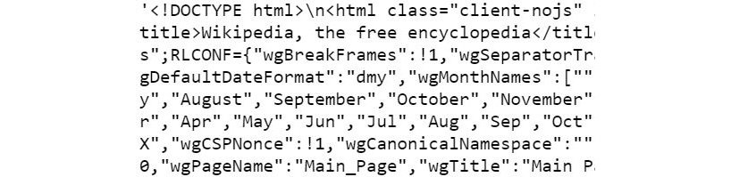
    


Obviously, this is a mixed blob of various HTML markup tags, text, and
element names/properties. We cannot hope to extract meaningful
information from this that could be used for efficient analysis without
using sophisticated functions or methods.


Fortunately, the `BeautifulSoup` library or `bs4`
library provides such methods, and we will see how to use them in the
following exercise.


Exercise 7.04: Extracting Readable Text from a BeautifulSoup Object
-------------------------------------------------------------------

In this exercise, we will create a utility function,
`decode_content`, to decode the response received after
initiating a request to the Wikipedia web page. We will use the
`BeautifulSoup` library on the `response` object to
further process it so that it becomes easier for us to extract any
meaningful information from it. `BeautifulSoup` has a
`text` method, which can be used to extract text. Let\'s
follow these steps:

1.  Open a new Jupyter Notebook and import the `requests`
    library:
    
    ```
    import requests
    ```

2.  Assign the home page URL to a variable, `wiki_home`:
    
    ```
    wiki_home = "https://en.wikipedia.org/wiki/Main_Page"
    ```

3.  Use the `get` method from the `requests` library
    to get a response from this page:
    
    ```
    response = requests.get(wiki_home)
    ```

4.  Write a utility function to decode the contents of the response:
    
    ```
    def encoding_check(r):
        return (r.encoding)
    def decode_content(r,encoding):
        return (r.content.decode(encoding))
    contents = decode_content(response,encoding_check(response))
    ```

5.  Import the package and then pass on the whole string (HTML content)
    to a method for parsing:
    
    ```
    from bs4 import BeautifulSoup
    soup = BeautifulSoup(contents, 'html.parser')
    ```

6.  Execute the following code in your notebook:
    
    ```
    txt_dump=soup.text
    ```

7.  Find the type of the `txt_dmp`:

    
    ```
    type(txt_dump)
    ```

    The output is as follows:

    
    ```
    str
    ```

8.  Find the length of the `txt_dmp`:

    
    ```
    len(txt_dump)
    ```

    The output is as follows:

    
    ```
    15326
    ```

    **Note:**

    This output is variable and is susceptible to change depending on
    the updates made to the Wikipedia web page.

    Now, the length of the text dump is much smaller than the raw HTML
    string\'s length. This is because the `bs4` library has
    parsed through the HTML and extracted only human-readable text for
    further processing.

9.  Print the initial portion of this text:

    
    ```
    print(txt_dump[10000:11000])
    ```

    You will see something similar to the following:

    
    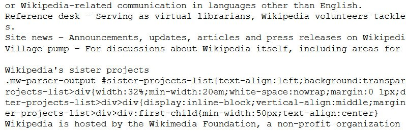
    

Extracting Text from a Section
------------------------------

Now, let\'s move on to more exciting data wrangling tasks. If you open
the Wikipedia home page,
[https://en.wikipedia.org/wiki/Main\_Page,](https://en.wikipedia.org/wiki/Main_Page)
you are likely to see a section called
`From today's featured article`. This is an excerpt from the
day\'s featured article, which is randomly selected and promoted on the
home page. This article can also change throughout the day:


You need to extract the text from this section. There are several ways
to accomplish this task. We will go through a simple and intuitive
method for doing so here.

First, we try to identify two indices -- the *start index* and *end
index* of the line string -- which demarcate the start and end of the
text we are interested in extracting or reading. In the next screenshot,
the indices are shown:


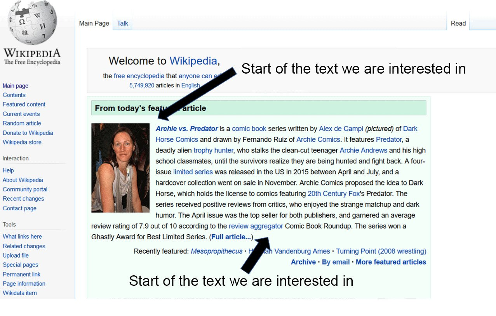


The following code accomplishes the extraction:

```
idx1=txt_dump.find("From today's featured article")
idx2=txt_dump.find("Recently featured")
print(txt_dump[idx1+len("From today's featured article"):idx2])
```


Note that we have to add the length of the
`From today's featured article` string to `idx1` and
then pass that as the starting index. This is because `idx1`
finds where the `From today's featured article` string starts.

It prints out something like this (this is a sample output):


**Note:**

The output you get will vary based on the current featured article.

As you can see, the `BeautifulSoup` library provides an
efficient technique to read data from a source. It will also be
interesting to know the events that occurred on a particular day.


Extracting Important Historical Events that Happened on Today\'s Date
---------------------------------------------------------------------

Next, we will try to extract the text corresponding to the important
historical events that happened on today\'s date. This can generally be
found in the bottom-right corner, as shown in the following screenshot:


So, can we apply the same technique as we did for
`From today's featured article`? Apparently not, because there
is text just below where we want our extraction to end, which is not
fixed, unlike in the previous case. Note that, in the previous section,
the fixed string `Recently featured` occurs at the exact place
where we want the extraction to stop, so we could use it in our code.
However, we cannot do that in this case, and the reason for this is
illustrated in the following screenshot:


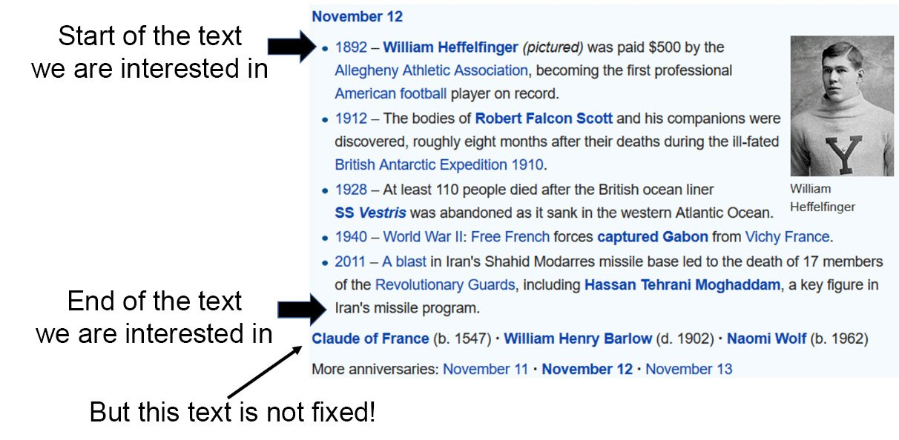


So, in this section, we just want to find out what the text looks like
around the main content we are interested in. For that, we must find out
the start of the `On this day` string and print out the next
1,000 characters using the following code:

```
idx3=txt_dump.find("On this day")
print(txt_dump[idx3+len("On this day"):idx3+len("On this day")\
               +1000])
```


The output looks as follows:


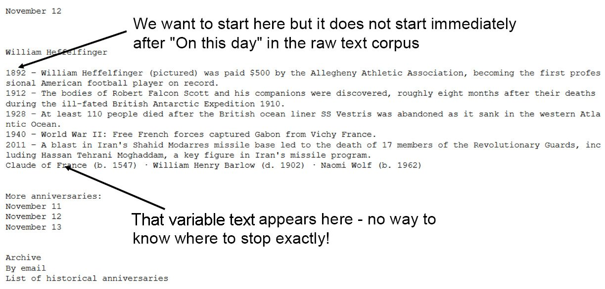


As we can see, there is a bit of unwanted data along with the relevant
information that we are really interested in reading (as shown by the
arrows). To address this issue, we need to think differently and use
some other methods apart from `BeautifulSoup` (and write
another utility function).

HTML pages are made of many markup tags, such as `<div>`,
which denotes a division of text/images, and `<ul>`, which
denotes lists. In the following exercise, we\'ll use advanced techniques
from the `BeautifulSoup` library to extract relevant
information from a web page.


Exercise 7.05: Using Advanced BS4 Techniques to Extract Relevant Text
---------------------------------------------------------------------

In this exercise, we\'ll take advantage of `BeautifulSoup`
library techniques and extract the element that contains the text we are
interested in. Let\'s perform the following steps:

1.  Open the Wikipedia page using this link:
    <https://en.wikipedia.org/wiki/Main_Page>.

2.  In the Mozilla Firefox browser, right-click and select the
    `Inspect Element` option (in Chrome, we do the same,
    except the menu option is called `Inspect`) as shown in
    the following screenshot:

    
    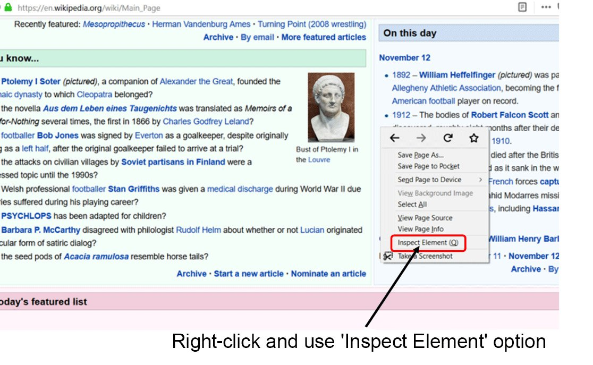
    


    As you hover over this with the mouse, you will see different
    portions of the page being highlighted. By doing this, it is easy to
    find out which precise block of markup text is responsible for the
    textual information we are interested in. Here, we can see that a
    certain `<ul>` block contains the text:

    
    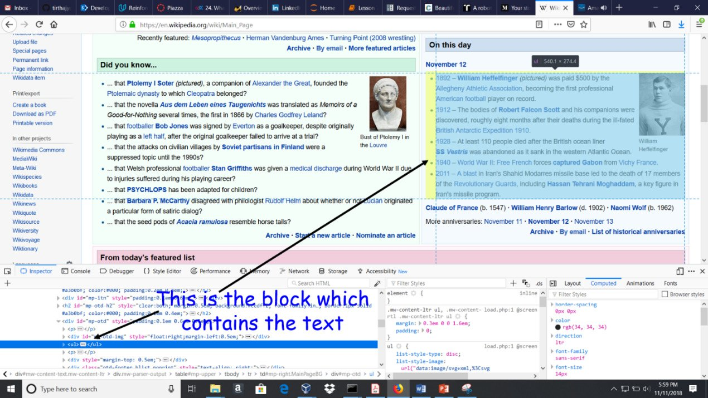
    
    Now, it is prudent to find the `<div>` tag that contains
    this `<ul>` block within it. By looking around the same
    screen as before, we can find the `<div>` and its
    `ID`:

    
    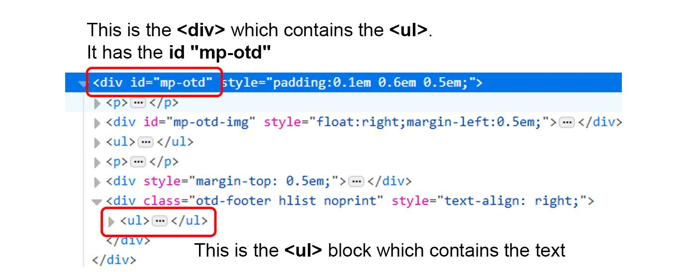
    

    We can do similar things using `bs4` functions.

3.  Start off by importing `requests` and
    `BeautifulSoup`. Also, retrieve the contents of the
    Wikipedia Main Page (highlighted).
    
    ```
    import requests 
    wiki_home = "https://en.wikipedia.org/wiki/Main_Page"
    response = requests.get(wiki_home) 
    def encoding_check(r): 
        return (r.encoding) 
    def decode_content(r,encoding):
        return (r.content.decode(encoding)) 
    contents = decode_content(response,encoding_check(response))
    from bs4 import BeautifulSoup 
    soup = BeautifulSoup(contents, 'html.parser')
    ```

4.  Use the `find_all` method from `BeautifulSoup`,
    which scans all the tags of the HTML page (and their sub-elements)
    to find and extract the text associated with this particular
    `<div>` element. Create an empty list and append the text
    from the `NavigableString` class to this list as we
    traverse the page:

    
    ```
    text_list=[] #Empty list
    for d in soup.find_all('div'):
        if (d.get('id')=='mp-otd'):
            for i in d.find_all('ul'):
                text_list.append(i.text)
    ```

    The `find_all` method returns a
    `NavigableString` class, which has a useful
    `text` method associated with it for extraction. **Note:** how
    we are utilizing the `mp-otd` ID of the `<div>`
    element to identify it among tens of other `<div>`
    elements. Now, if we examine the `text_list` list, we will
    see that it has three elements.

5.  Print the elements separated by a marker. We will see that the text
    we are interested in appears as the first element:

    
    ```
    for i in text_list:
        print(i)
        print('-'*100)
    ```

    The output is as follows:


As we can see, it is the first element of the list that we are
interested in. However, the exact position will depend on the web page.
In this exercise, we were introduced to some advanced uses of
`BeautifulSoup` and saw how we can extract meaningful
information using its APIs.


Next, we will create a compact function to encapsulate some of those.
Creating such functions helps us to increase the reusability of code.

As we discussed before, it is always good to try to functionalize
specific tasks, particularly in a web-scraping application. In the
following exercise, we are going to create a compact function.


Exercise 7.06: Creating a Compact Function to Extract the On this day Text from the Wikipedia Home Page
-------------------------------------------------------------------------------------------------------

In this exercise, we are going to create a function that will take the
Wikipedia URL (as a string), <https://en.wikipedia.org/wiki/Main_Page>,
and return the text corresponding to the `On this day`
section. The benefit of a functional approach is that you can call this
function from any Python script and use it anywhere in another program
as a standalone module. To do this, let\'s follow these steps:

1.  Create the compact `def` function. Extract the text from
    the `On this day` section of the Wikipedia home page,
    <https://en.wikipedia.org/wiki/Main_Page>. Accept the Wikipedia home
    page URL as a string. A default URL is provided:

    **Note:**

    It is recommended that you run *Steps 1,2, and 3* of this exercise
    in a single Jupyter Notebook cell.

    
    ```
    def wiki_on_this_day(url="https://en.wikipedia.org/"\
                             "wiki/Main_Page"):
        import requests
        from bs4 import BeautifulSoup
        wiki_home = str(url)
        response = requests.get(wiki_home)
    ```

2.  Create a function that will check the status of the response
    received from the web page:
    
    ```
        def status_check(r):
            if r.status_code==200:
                return 1
            else:
                return -1
        def encoding_check(r): 
            return (r.encoding)
        def decode_content(r,encoding): 
            return (r.content.decode(encoding))
        status = status_check(response)
        if status==1:
            contents = decode_content(response,\
                                      encoding_check(response))
        else:
            print("Sorry could not reach the web page!")
            return -1
    ```

3.  Create a `BeautifulSoup` object and read the contents of
    the web page:
    
    ```
    soup = BeautifulSoup(contents, 'html.parser')
    text_list=[]
    for d in soup.find_all('div'):
        if (d.get('id')=='mp-otd'):
            for i in d.find_all('ul'):
                text_list.append(i.text)
    return (text_list[0])
    ```

4.  Let\'s see the function in action.

    
    ```
    print(wiki_on_this_day())
    ```

    The output will be:

    
    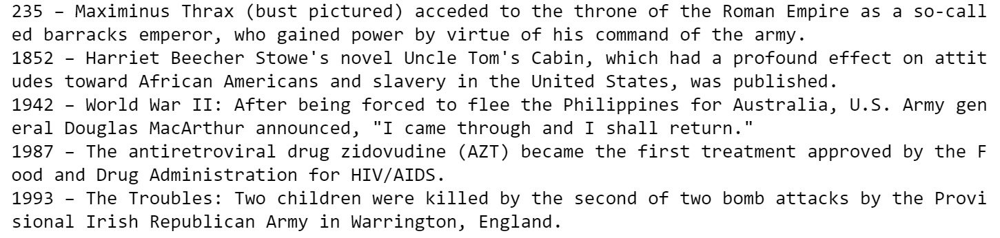
    


5.  **Note:** how this function utilizes the status check and prints out an
    error message if the request failed. When we test this function with
    an intentionally incorrect URL, it behaves as expected:

    
    ```
    print(wiki_on_this_day\
          ("https://en.wikipedia.org/wiki/Main_Page1"))
    ```

    The output is as follows:

    
    ```
    Sorry could not reach the web page!
    ```

In this exercise, we saw how to write a function to encapsulate a lot of
important things that we have learned about `BeautifulSoup`.


Reading Data from XML
=====================


Exercise 7.07: Creating an XML File and Reading XML Element Objects
-------------------------------------------------------------------

In this exercise, we\'ll create some random data and store it in XML
format. We\'ll then read from the XML file and examine the XML-formatted
data string. Let\'s follow these steps:

1.  Create an XML file using the following command:

    
    ```
    data = '''
    <person>
      <name>Dave</name>
      <surname>Piccardo</surname>
      <phone type="intl">
        +1 742 101 4456
      </phone>
      <email hide="yes">
        dave.p@gmail.com</email>
    </person>'''
    ```

    As we can see, the `phone` type is a triple-quoted string
    or multiline string. If you print this object, you will get the
    following output. This is an XML-formatted data string in a tree
    structure, as we will see when we parse the structure and break
    apart the individual parts.

2.  To process and wrangle with the data, we have to read it as an
    `Element` object using the Python XML parser engine:

    
    ```
    import xml.etree.ElementTree as ET
    tree = ET.fromstring(data)
    type (tree)
    ```

    The output is as follows:

    
    ```
    xml.etree.ElementTree.Element
    ```

In this exercise, we saw how to create an XML file, how to read an XML
file, and what kind of object we can expect when we read an XML file.


Exercise 7.08: Finding Various Elements of Data within a Tree (Element)
-----------------------------------------------------------------------

In this exercise, we will use the `find` method to search for
various pieces of useful data within an XML element object and print
them using the `text` method. We will also use the
`get` method to extract the specific attribute we want. To do
so, let\'s follow these steps:

1.  Create an XML file using the following code:
    
    ```
    data = '''
    <person>
      <name>Dave</name>
      <surname>Piccardo</surname>
      <phone type="intl">
        +1 742 101 4456
      </phone>
      <email hide="yes">
        dave.p@gmail.com
      </email>
      </person>'''
    ```

2.  To process and wrangle with the data, we have to read it as an
    `Element` object using the Python XML parser engine:
    
    ```
    import xml.etree.ElementTree as ET
    tree = ET.fromstring(data)
    ```

3.  Use the `find` method to find `Name`:

    
    ```
    print('Name:', tree.find('name').text)
    ```

    The output is as follows:

    
    ```
    Name: Dave
    ```

4.  Use the `find` method to find `Surname`:

    
    ```
    print('Surname:', tree.find('surname').text)
    ```

    The output is as follows:

    
    ```
    Surname: Piccardo
    ```

5.  Use the `find` method to find `Phone`. **Note:** the
    use of the `strip` method to strip away any trailing
    spaces/blanks:

    
    ```
    print('Phone:', tree.find('phone').text.strip())
    ```

    The output will be as follows:

    
    ```
    Phone: +1 742 101 4456
    ```

6.  Use the `find` method to find `email status` and
    `actual email`. **Note:** the use of the `get` method
    to extract the status:

    
    ```
    print('Email hidden:', tree.find('email').get('hide'))
    print('Email:', tree.find('email').text.strip())
    ```

    The output will be as follows:

    
    ```
    Email hidden: yes
    Email: dave.p@gmail.com
    ```

In this exercise, we saw how we can use the `find` method to
read the relevant information from an XML file. XML is a very diverse
format of expressing data. Apart from following some ground rules,
everything else is customizable in an XML document. In this exercise, we
saw how to access a custom XML element and extract data from it.


Reading from a Local XML File into an ElementTree Object
--------------------------------------------------------

We can also read from an XML file saved locally on disk. This is a
fairly common situation where a frontend web scraping module has already
downloaded a lot of XML files by reading a table of data on the web and
the data wrangler needs to parse through this XML file to extract
meaningful pieces of numerical and textual data.

We have a file associated with this lab called `xml1.xml`.
The file can be found here: <https://github.com/fenago/data-wrangling-python>.

Please make sure you have the file in the same directory that you are
running your Jupyter notebook from:

```
tree2=ET.parse('../datasets/xml1.xml')
type(tree2)
```


The output will be as follows:

```
xml.etree.ElementTree.ElementTree
```


**Note:** how we use the `parse` method to read this XML file. This
is slightly different than using the `fromstring` method used
in the previous exercise, where we were directly reading from a
`string` object. This produces an `ElementTree`
object instead of a simple `Element`.

The idea of building a tree-like object is the same as in the domains of
computer science and programming. Let\'s take a look at the following
diagram:


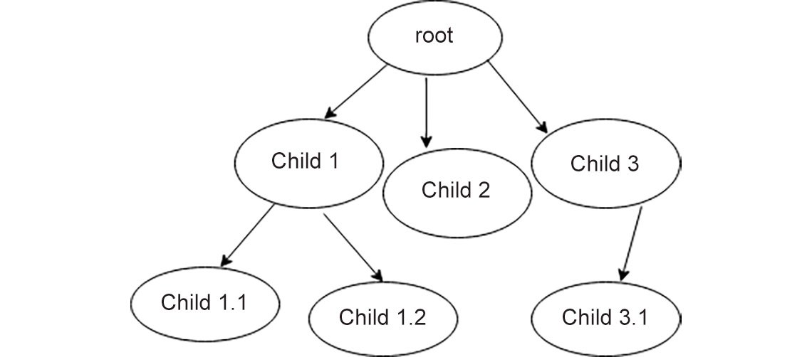


In the preceding diagram, we can see the following:

-   There is a root.
-   There are child objects attached to the root.
-   There could be multiple levels, that is, children of children,
    recursively going down.
-   All of the nodes of the tree (root and children alike) have
    attributes attached to them that contain data.

Tree traversal algorithms can be used to search for a particular
attribute. If provided, special methods can be used to probe a node more
deeply.

Every node in the XML tree has tags and attributes. The idea is as
follows:


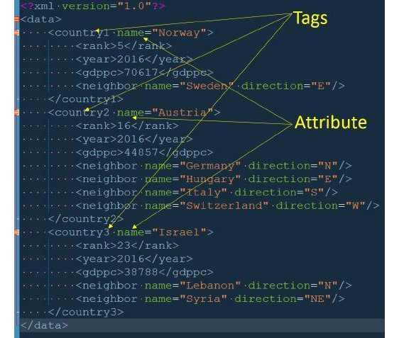


As the document is organized in a tree fashion, we can use a tree
traversal algorithm to go through it and visit all the children,
starting at the root.


Exercise 7.09: Traversing the Tree, Finding the Root, and Exploring All the Child Nodes and Their Tags and Attributes
---------------------------------------------------------------------------------------------------------------------

In this exercise, we will use the tree traversal algorithm to traverse a
tree, find the root, and explore all the child nodes. We will first
define a variable called `tree2`, which will contain the
contents of the `xml1.xml` file. Then, we will use a
`for` loop to traverse through this XML document tree.

The XML file can be found here: <https://github.com/fenago/data-wrangling-python>. Follow
these steps:

1.  Open a new Jupyter Notebook and define the tree:

    
    ```
    import xml.etree.ElementTree as ET
    tree2=ET.parse('../datasets/xml1.xml')
    type(tree2)
    ```

    **Note:**

    Depending on where it is saved on your system, don\'t forget to
    change the path of the XML file (highlighted).

    The output will be as follows:

    
    ```
    xml.etree.ElementTree.ElementTree
    ```

2.  Explore these tags and attributes using the following code:

    
    ```
    root=tree2.getroot()
    for child in root:
        print("Child:",child.tag, "| Child attribute:",\
              child.attrib)
    ```

    The output will be as follows:


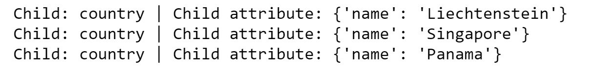


In this exercise, we saw how to traverse an XML document tree.


Remember that every XML data file could follow a different naming or
structural format, but using an element tree approach puts the data into
a somewhat structured flow that can be explored systematically. Still,
it is best to examine the raw XML file structure once and understand
(even if at a high level) the data format before attempting automatic
extractions.

In the following exercise, we will see how to extract relevant
information from a tree.


Exercise 7.10: Using the text Method to Extract Meaningful Data
---------------------------------------------------------------

In this exercise, we will be using the `text` method from the
`BeautifulSoup` library to extract different types of data
from a particular node of the XML document tree. We can almost think of
the XML tree as a **list of lists** and index it accordingly. Let\'s
follow these steps:

1.  Open a new Jupyter Notebook and define the tree:

    
    ```
    import xml.etree.ElementTree as ET
    tree2=ET.parse('../datasets/xml1.xml')
    type(tree2)
    ```

    **Note:**

    Depending on where it is saved on your system, don\'t forget to
    change the path of the XML file (highlighted).

    The output will be as follows:

    
    ```
    xml.etree.ElementTree.ElementTree
    ```

2.  Explore these tags and attributes using the following code:
    
    ```
    root=tree2.getroot()
    ```

3.  Access the `root[0][2]` element by using the following
    code:

    
    ```
    root[0][2]
    ```

    The output will be as follows:

    
    ```
    <Element 'gdppc' at 0x00000000051FF278>
    ```

    So, this points to the `gdppc` piece of data. Here,
    `gdppc` is the tag and the actual GDP/per capita data is
    attached to this tag.

4.  Use the `text` method to access the data:

    
    ```
    root[0][2].text
    ```

    The output will be as follows:

    
    ```
    '141100'
    ```

5.  Use the `tag` method to access `gdppc`:

    
    ```
    root[0][2].tag
    ```

    The output will be as follows:

    
    ```
    'gdppc'
    ```

6.  Check `root[0]`:

    
    ```
    root[0]
    ```

    The output will be as follows:

    
    ```
    <Element 'country1' at 0x00000000050298B8>
    ```

7.  Check the tag:

    
    ```
    root[0].tag
    ```

    The output will be as follows:

    
    ```
    'country'
    ```

8.  We can use the `attrib` method to access it:

    
    ```
    root[0].attrib
    ```

    The output will be as follows:

    
    ```
    {'name': ' Liechtenstein '}
    ```

    So, `root[0]` is again an element, but it has a different
    set of tags and attributes than `root[0][2]`. This is
    expected because they are all part of the tree as nodes, but each is
    associated with a different level of data.

In this exercise, we saw how to access a particular node in an XML
document and how to get the data, attributes, and other related things
from it. This knowledge is very valuable as a lot of data is still
presented and exchanged in XML format.


This last piece of code output is interesting because it returns a
dictionary object. Therefore, we can just index it by its keys. We will
do that in the next exercise.


Extracting and Printing the GDP/Per Capita Information Using a Loop
-------------------------------------------------------------------

Now that we know how to read the GDP/per capita data and how to get a
dictionary back from the tree, we can easily construct a simple dataset
by running a loop over the tree:

```
for c in root:
    country_name=c.attrib['name']
    gdppc = int(c[2].text)
    print("{}: {}".format(country_name,gdppc))
```


The output is as follows:

```
Liechtenstein: 141100
Singapore: 59900
Panama: 13600
```


We can put these in a DataFrame or a CSV file to be saved to a local
disk for further processing, such as a simple plot.


Finding All the Neighboring Countries for Each Country and Printing Them
------------------------------------------------------------------------

There are efficient search algorithms for tree structures, and one such
method for XML trees is `findall`. We can use this, for this
example, to find all the neighbors a country has and print them out.

Why do we need to use `findall` instead of `find`?
Well, because not all countries have an equal number of neighbors and
`findall` searches for all the data with that tag that is
associated with a particular node, and we want to traverse all of them:

```
for c in root:
# Find all the neighbors
    ne=c.findall('neighbor') 
    print("Neighbors\n"+"-"*25)
# Iterate over the neighbors and print their 'name' attribute
    for i in ne: 
        print(i.attrib['name'])
    print('\n')
```


The output looks something like this:


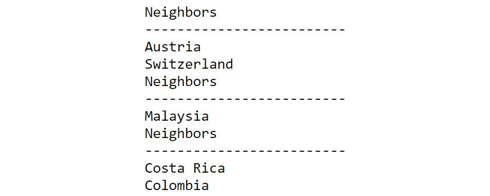


In this section, we have looked into how to use specific search
algorithms in the form of pre-defined functions to traverse through an
XML document and get interesting data from the nodes we visit.

In the previous topic of this lab, we learned about simple web
scraping using the `requests` library. So far, we have worked
with static XML data, that is, data from a local file or a string object
we\'ve scripted. Now, it is time to combine our learning and read XML
data directly over the internet (as you are expected to do almost all
the time).


Exercise 7.11: A Simple Demo of Using XML Data Obtained by Web Scraping
-----------------------------------------------------------------------

In this exercise, we will obtain XML data using web scraping. We will
read a cooking recipe from a website called
<http://www.recipepuppy.com/>, which contains aggregates links of
various other sites with the recipe. Next, we will use the
`find` method to extract the appropriate attribute from the
XML file and display the relevant content. Let\'s follow these steps:

1.  Import the necessary libraries:

    
    ```
    import requests, urllib.parse
    ```

    Read from the <http://www.recipepuppy.com/> website:

    
    ```
    serviceurl = 'http://www.recipepuppy.com/api/?'
    item = str(input('Enter the name of a food item '\
                     '(enter\'quit\' to quit): '))
    url = serviceurl + urllib.parse.urlencode({'q':item})\
          +'&p=1&format=xml'
    uh = requests.get(url)
    data = uh.text
    print('Retrieved', len(data), 'characters')
    ```

    This code will ask the user for input. You have to enter the name of
    a food item: \'`chicken tikka`\'.

    You will get the following output:

    
    ```
    Enter the name of a food item (enter 'quit' to quit): chicken tikka
    Retrieved 2611 characters
    ```

    If we print the last variable, `data`, we may see that it
    is a mix of a legitimate XML document and some junk HTML appended to
    it. We need to first check if that is the case.

2.  Use the `find` method from Python. As `data` is
    a string, we can simply do the following:

    
    ```
    data.find("<!DOCTYPE html PUBLIC") 
    ```

    This should return an integer if that string is found in
    `data`. Otherwise, it will return `–1`. If we
    get a positive integer, then we know -- thanks to Python\'s
    `find` method -- it is the start index of the string we
    are searching.

3.  Get only the XML part using a piece of code like the following:

    
    ```
    end_marker = data.find("<!DOCTYPE html PUBLIC")
    xml_text = data[:end_marker]
    ```

    However, if we do not get a positive integer, then we assume that
    the whole return text is valid XML and we simply set the
    `end_marker` as the total length of the string. Although,
    it is always good practice to print the raw data and check whether
    it is pure XML or some junk added with it.

4.  Write the code to get back data in XML format and read and decode it
    before creating an XML tree out of it:
    
    ```
    import xml.etree.ElementTree as ET
    end_marker = data.find("<!DOCTYPE html PUBLIC") \
                 if data.find("<!DOCTYPE html PUBLIC") != \
                 -1 else len(data)
    xml_text = data[:end_marker]
    tree3 = ET.fromstring(xml_text)
    ```

5.  Now, we can use another useful method, called `iter`,
    which basically iterates over the nodes under an element. If we
    traverse the tree and extract the text, we get the following output:

    
    ```
    for elem in tree3.iter():
        print(elem.text)
    ```

    The output (partially shown) is as follows:

    
    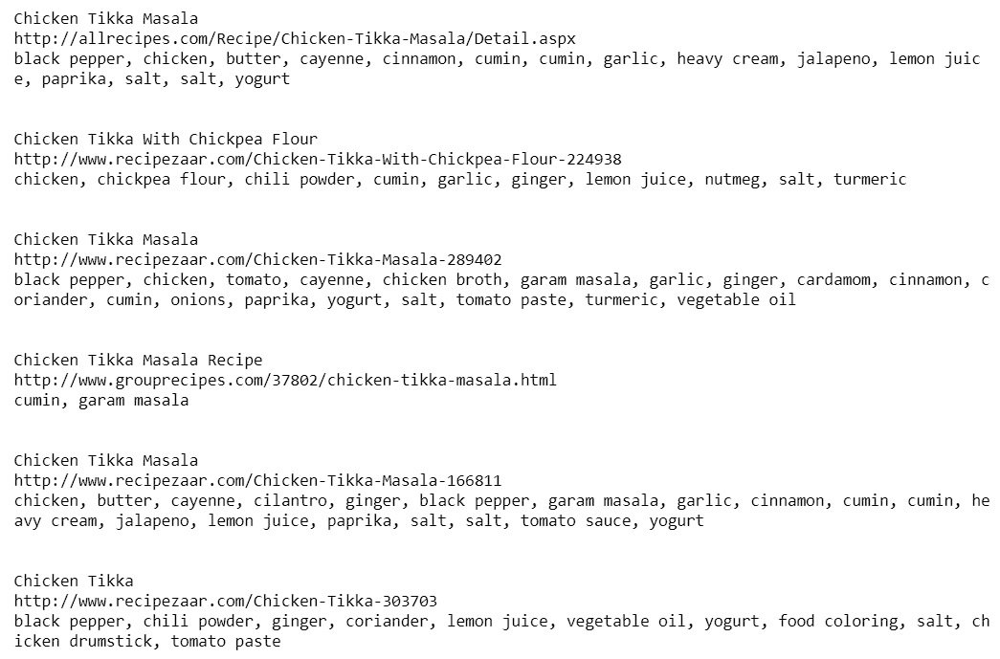
    


    We can use the `find` method to search for the appropriate
    attribute and extract its content. This is the reason it is
    important to scan through the XML data manually and check what
    attributes are used. Remember, this means scanning the raw string
    data, not the tree structure.

6.  Print the raw string data:

    
    ```
    print(data)
    ```

    The output (partially shown) is as follows:

    
    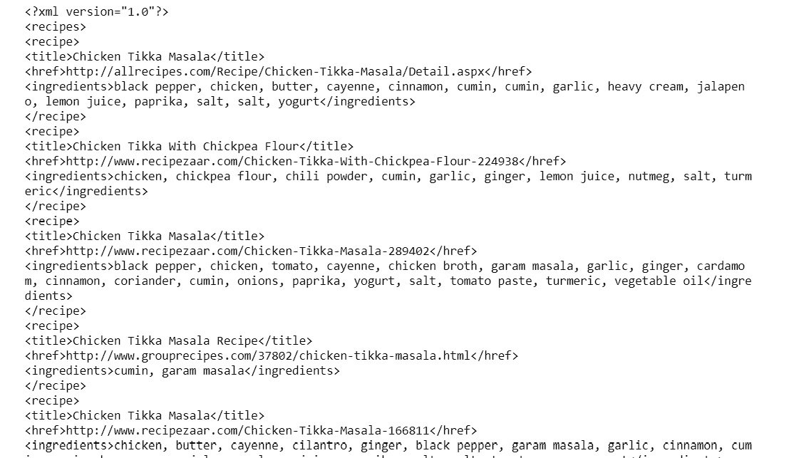
    


    Let\'s examine the XML data that we received, and let\'s locate the
    `<title>` and `<href>` tags:

    
    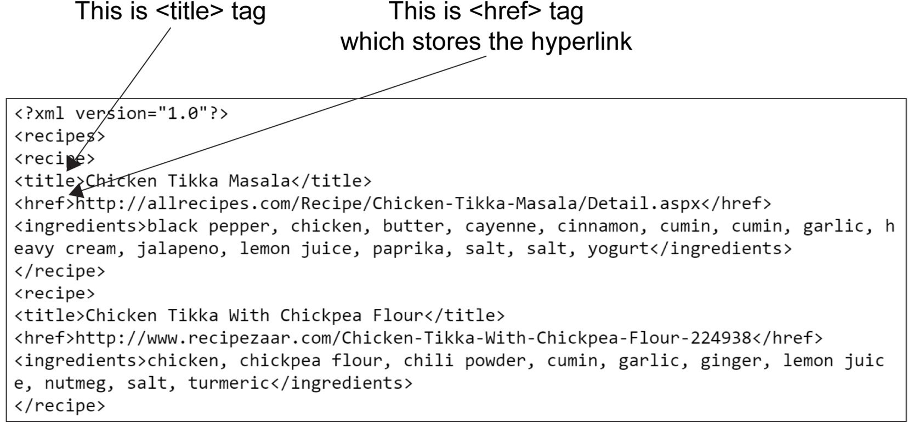
    


    Now we know what tags to search for.

7.  Print the `<title>` and `<href>` hyperlinks in
    the XML data:

    
    ```
    for e in tree3.iter():
        h=e.find('href')
        t=e.find('title')
        if h!=None and t!=None:
            print("Receipe Link for:",t.text)
            print(h.text)
            print("-"*100)
    ```

    The final output (partially shown) is as follows:

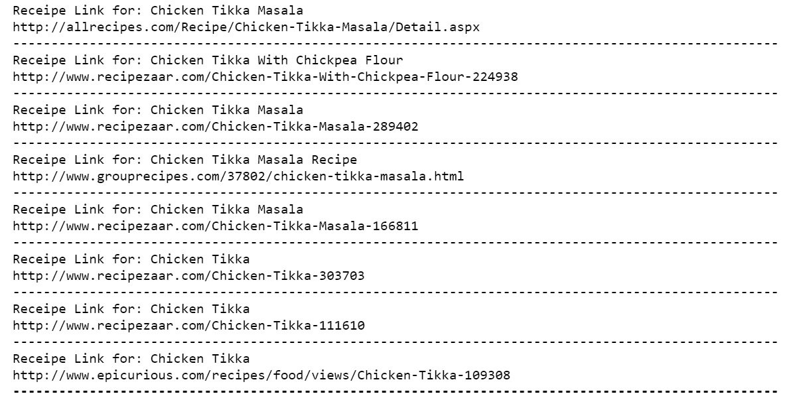


RegEx in the Context of Web Scraping
------------------------------------


`RegEx` is like a mini-programming language in itself and
common ideas are used not only in Python, but in all widely used web app
languages, such as JavaScript, PHP, and Perl. The `regex`
module is built into Python, and you can import it by using the
following code:

```
import re
```


In the next exercise, we are going to use the `match` method
to check whether a pattern matches a string or sequence.


Exercise 7.14: Using the match Method to Check Whether a Pattern Matches a String/Sequence
------------------------------------------------------------------------------------------

In this exercise, we will use one of the most common regex methods,
`match`, to check for an exact or partial match at the
beginning of a string. Let\'s follow these steps:

1.  Import the `regex` module:
    
    ```
    import re
    ```

2.  Define a string and a pattern:
    
    ```
    string1 = 'Python'
    pattern = r"Python"
    ```

3.  Write a conditional expression to check for a match:

    
    ```
    if re.match(pattern,string1):
        print("Matches!")
    else:
        print("Doesn't match.")
    ```

    The output should be as follows:

    
    ```
    Matches!
    ```

4.  Test this with a string that only differs in the first letter by
    making it lowercase:

    
    ```
    string2 = 'python'
    if re.match(pattern,string2):
           print("Matches!")
    else:
          print("Doesn't match.")
    ```

    The output is as follows:

    
    ```
    Doesn't match.
    ```


In this exercise, we just saw how to do the most basic regex operations.
In itself, it may not look very impressive, but we will be building
further complex logic on top of this basic idea in the forthcoming
exercises.


Using the compile Method to Create a RegEx Program
--------------------------------------------------

In a program or module, if we are making heavy use of a particular
pattern, then it is better to use the `compile` method and
create a regex program and then call methods on this program.

Here is how you compile a regex program:

```
prog = re.compile(pattern)
prog.match(string1)
```


The output is as follows:

```
<re.SRE_Match object; span=(0, 6), match='Python'>
```


This code produced an `SRE.Match` object that has a
`span` of (`0,6`) and the matched string of
`Python`. The span here simply denotes the start and end
indices of the pattern that was matched. These indices may come in handy
in a text mining program where the subsequent code uses the indices for
further search or decision-making purposes.

Compiled objects act like functions in that they return `None`
if the pattern does not match. This concept will come in handy later
when we write a small utility function to check for the type of the
returned object from regex-compiled programs and act accordingly. We
cannot be sure whether a pattern will match a given string or whether it
will appear in a corpus of text (if we are searching for the pattern
anywhere within the text). Depending on the situation, we may encounter
`Match` objects or `None` as the returned value, and
we have to handle this gracefully. Let\'s practice this in the following
exercise.


Exercise 7.15: Compiling Programs to Match Objects
--------------------------------------------------

In this exercise, we will define two strings and a pattern. We will use
the `compile` method to compile a regex program. Next, we will
write a small conditional to test whether the compiled object matches
the defined pattern. Let\'s follow these steps:

1.  Use the `compile` function from the `regex`
    module:
    
    ```
    import re
    def print_match(s):
        if prog.search(s)==None:
            print("No match")
        else:
            print(prog.search(s).group()) 
    string1 = 'Python'
    string2 = 'python'
    pattern = r"Python"
    prog = re.compile(pattern)
    ```

2.  Match it with the first string:

    
    ```
    if prog.match(string1)!=None:
        print("Matches!")
    else:
        print("Doesn't match.")
    ```

    The output is as follows:

    
    ```
    Matches!
    ```

3.  Match it with the second string:

    
    ```
    if prog.match(string2)!=None:
        print("Matches!")
    else:
        print("Doesn't match.")
    ```

    The output is as follows:

    
    ```
    Doesn't match.
    ```

So, the `compile` method returns special objects, such as
`match` objects. But if they don\'t match, it will return
`None`, so we can still run our conditional loop.


Exercise 7.16: Using Additional Parameters in the match Method to Check for Positional Matching
-----------------------------------------------------------------------------------------------

In this exercise, we will use the `match` method to check
whether there\'s a match at a specific location in the string. Let\'s
follow these steps:

1.  Match `y` in the second position:

    
    ```
    import re
    def print_match(s):
        if prog.search(s)==None:
            print("No match")
        else:
            print(prog.search(s).group()) 
    prog = re.compile(r'y')
    prog.match('Python',pos=1)
    ```

    The output is as follows:

    
    ```
    <re.Match object; span=(1, 2), match='y'>
    ```

    This is the `match` object that we talked about before.

2.  Check for a pattern called `thon` starting from
    `pos=2`, that is, the third character:

    
    ```
    prog = re.compile(r'thon')
    prog.match('Python',pos=2)
    ```

    The output is as follows:

    
    ```
    <_re.SRE_Match object; span=(2, 6), match='thon'>
    ```

3.  Find a match in a different string by using the following command:

    
    ```
    prog.match('Marathon',pos=4)
    ```

    The output is as follows:

    
    ```
    <_re.SRE_Match object; span=(4, 8), match='thon'>
    ```

So, we have seen how can we use regex, and use it in various use cases.


Finding the Number of Words in a List That End with \"ing\"
-----------------------------------------------------------

Suppose we want to find out whether a given string has the last three
letters `ing`. This kind of query may come up in a text
analytics/text mining program where somebody is interested in finding
instances of present continuous tense words, which are highly likely to
end with `ing`. However, nouns may also end with
`ing` (as we will see in this example):

```
prog = re.compile(r'ing')
words = ['Spring','Cycling','Ringtone']
```


Create a `for` loop to find words ending with `ing`:

```
for w in words:
    if prog.match(w,pos=len(w)-3)!=None:
        print("{} has last three letters 'ing'".format(w))
    else:
        print("{} does not have last three letter as 'ing'"\
              .format(w))
```


The output is as follows:

```
Spring has last three letters 'ing'
Cycling has last three letters 'ing'
Ringtone does not have last three letter as 'ing'
```


The search Method in RegEx
--------------------------

It looks plain and simple, and you may well wonder what the purpose of
using a special regex module for this is. A simple string method should
have been sufficient. Yes, it would have been OK for this particular
example, but the whole point of using regex is to be able to use very
complex string patterns that are not at all obvious when it comes to how
they are written using simple string methods. We will see the real power
of regex compared to string methods shortly. But before that, let\'s
explore another of the most commonly used methods, called
`search`.

`search` and `match` are related concepts, and they
both return the same `match` object. The real difference
between them is that **match works for only the first match** (either at
the beginning of the string or at a specified position, as we saw in the
previous exercises), whereas **search looks for the pattern anywhere in
the string** and returns the position if it finds a match.


Exercise 7.17: The search Method in RegEx
-----------------------------------------

In this exercise, we will use the `search` method to find the
`ing` pattern in a regex structure. Let\'s follow these steps:

1.  Use the `compile` method to find matching strings:

    
    ```
    import re
    def print_match(s):
        if prog.search(s)==None:
            print("No match")
        else:
            print(prog.search(s).group())
    prog = re.compile('ing')
    if prog.match('Spring')==None:
        print("None")
    ```

    The output is as follows:

    
    ```
    None
    ```

2.  Search the string by using the following command:

    
    ```
    prog.search('Spring')
    ```

    The output is as follows:

    
    ```
    <_sre.SRE_Match object; span=(3, 6), match='ing'>
    ```

3.  Let\'s use `Ringtone` as the search parameter:

    
    ```
    prog.search('Ringtone')
    ```

    The output is as follows:

    
    ```
    <re.Match object; span=(1, 4), match='ing'>
    ```

As you can see, the `match` method returns `None`
for the input `Spring`, and we had to write code to print that
out explicitly (because in a Jupyter notebook, nothing will show up for
a `None` object). But `search` returns a
`match` object with `span=(3,6)` as it finds the
`ing` pattern spanning those positions.

Similarly, for the `Ringtone` string, it finds the correct
position of the match and returns `span=(1,4)`.


Exercise 7.18: Using the span Method of the Match Object to Locate the Position of the Matched Pattern
------------------------------------------------------------------------------------------------------

In this exercise, we will use the `span` contained in the
`Match` object to locating the exact position of the pattern
as it appears in the string. Let\'s follow these steps:

1.  Initialize `prog` with the `ing` pattern:
    
    ```
    import re
    def print_match(s):
        if prog.search(s)==None:
            print("No match")
        else:
            print(prog.search(s).group()) 
    prog = re.compile(r'ing')
    words = ['Spring','Cycling','Ringtone']
    ```

2.  Create a function to return a tuple of the start and end positions
    of the match:
    
    ```
    for w in words:
        mt = prog.search(w)
    # Span returns a tuple of start and end positions of the match
    # Starting position of the match
    start_pos = mt.span()[0]
    # Ending position of the match 
    end_pos = mt.span()[1] 
    ```

3.  Print the word ending with `ing` and its start and end
    position:

    
    ```
    print("The word '{}' contains 'ing' in the position {}-{}"\
          .format(w,start_pos,end_pos))
    ```

    The output is as follows:

    
    ```
    The word 'Ringtone' contains 'ing' in the position 1-4
    ```


Now, we will start getting into the real usage of regex with examples of
various useful pattern matching. In the following exercise, we will
explore single-character matching.


Exercise 7.19: Examples of Single-Character Pattern Matching with search
------------------------------------------------------------------------

In this exercise, we will use the `group` method, which will
return the matched pattern in a string format so that we can print and
process it easily. Let\'s follow these steps:

1.  Pass a regex expression with a dot (`.`) inside the
    `compile` method. It matches any single character except a
    newline character:

    
    ```
    import re
    prog = re.compile(r'py.')
    print(prog.search('pygmy').group())
    print(prog.search('Jupyter').group())
    ```

    The output is as follows:

    
    ```
    pyg
    pyt
    ```

2.  Pass a regex expression with `\w` (lowercase w) inside the
    `compile` method. It matches any single letter, digit, or
    underscore:

    
    ```
    prog = re.compile(r'c\wm')
    print(prog.search('comedy').group())
    print(prog.search('camera').group())
    print(prog.search('pac_man').group())
    print(prog.search('pac2man').group())
    ```

    The output is as follows:

    
    ```
    com
    cam
    c_m
    c2m
    ```

3.  Pass a regex expression with `\W` (uppercase W) inside the
    `compile` method. It matches anything not covered by
    `\w`:

    
    ```
    prog = re.compile(r'4\W1')
    print(prog.search('4/1 was a wonderful day!').group())
    print(prog.search('4-1 was a wonderful day!').group())
    print(prog.search('4.1 was a wonderful day!').group())
    print(prog.search('Remember the wonderful day 04/1?').group())
    ```

    The output is as follows:

    
    ```
    4/1
    4-1
    4.1
    4/1
    ```

4.  Pass a regex expression with `\s` (lowercase s) inside the
    `compile` method. It matches a single whitespace
    character, such as a space, newline, tab, or return:

    
    ```
    prog = re.compile(r'Data\swrangling')
    print(prog.search("Data wrangling is cool").group())
    print("-"*80)
    print("Data\twrangling is the full string")
    print(prog.search("Data\twrangling is the full string").group())
    print("-"*80)
    print("Data\nwrangling is the full string")
    print(prog.search("Data\nwrangling").group())
    ```

    The output is as follows:

    
    ```
    Data wrangling
    --------------------------------------------------------------
    Data    wrangling is the full string
    Data    wrangling
    --------------------------------------------------------------
    Data
    wrangling is the full string
    Data
    wrangling
    ```

5.  Pass a regex expression with `\d` inside the
    `compile` method. It matches numerical digits 0-9:

    
    ```
    prog = re.compile(r"score was \d\d")
    print(prog.search("My score was 67").group())
    print(prog.search("Your score was 73").group())
    ```

    The output is as follows:

    
    ```
    score was 67
    score was 73
    ```

As we can see, we can use the `group` function to return a
group of matched characters.


In the following exercise, we will manipulate the start or end of a
string using pattern matching.


Exercise 7.20: Handling Pattern Matching at the Start or End of a String
------------------------------------------------------------------------

In this exercise, we will match patterns with strings using the
`^` (caret) operator. The focus is to find out whether the
pattern is present at the start or the end of the string. Let\'s follow
these steps:

1.  Write a function to handle cases where a match is not found, that
    is, to handle `None` objects that are returned:
    
    ```
    import re
    def print_match(s):
        if prog.search(s)==None:
            print("No match")
        else:
            print(prog.search(s).group())
    ```

2.  Use `^` (caret) to match a pattern at the start of the
    string:

    
    ```
    prog = re.compile(r'^India')
    print_match("Russia implemented this law")
    print_match("India implemented that law")
    print_match("This law was implemented by India")
    ```

    The output is as follows:

    
    ```
    No match
    India
    No match
    ```

3.  Use `$` (dollar sign) to match a pattern at the end of the
    string:

    
    ```
    prog = re.compile(r'Apple$')
    print_match("Patent no 123456 belongs to Apple")
    print_match("Patent no 345672 belongs to Samsung")
    print_match("Patent no 987654 belongs to Apple")
    ```

    The output is as follows:

    
    ```
    Apple
    No match
    Apple
    ```


    For these examples and exercises, also try to think about how you
    would implement them without regex, that is, by using simple string
    methods and any other logic that you can think of. Then, compare
    that solution to the ones implemented with regex for brevity and
    efficiency.


Exercise 7.21: Pattern Matching with Multiple Characters
--------------------------------------------------------

In this exercise, we will use the `match` method for matching
multiple characters. Let\'s perform the following steps:

1.  Use `*` to match `0` or more repetitions of the
    preceding regular expression:

    
    ```
    import re
    def print_match(s):
        if prog.search(s)==None:
            print("No match")
        else:
            print(prog.search(s).group())
    prog = re.compile(r'ab*')
    print_match("a")
    print_match("ab")
    print_match("abbb")
    print_match("b")
    print_match("bbab")
    print_match("something_abb_something")
    ```

    The output is as follows:

    
    ```
    a
    ab
    abbb
    No match
    ab
    abb
    ```

2.  Using `+` causes the resulting `RE` to match
    `1` or more repetitions of the preceding regular
    expression:

    
    ```
    prog = re.compile(r'ab+')
    print_match("a")
    print_match("ab")
    print_match("abbb")
    print_match("b")
    print_match("bbab")
    print_match("something_abb_something")
    ```

    The output is as follows:

    
    ```
    No match
    ab
    abbb
    No match
    ab
    abb
    ```

3.  ? causes the resulting `re` string to match precisely 0 or
    1 repetitions of the preceding regular expression:

    
    ```
    prog = re.compile(r'ab?')
    print_match("a")
    print_match("ab")
    print_match("abbb")
    print_match("b")
    print_match("bbab")
    print_match("something_abb_something")
    ```

    The output is as follows:

    
    ```
    a
    ab
    ab
    No match
    ab
    ab
    ```

Here, we saw how we can use regex to search for and match a set of
characters in the same order as they occur in the search pattern.


The standard (default) mode of pattern matching in regex is **greedy**,
that is, the program tries to match as much as it can. Sometimes, this
behavior is natural, but in some cases, you may want to match minimally.
This is called **non-greedy** matching.


Exercise 7.22: Greedy versus Non-Greedy Matching
------------------------------------------------

In this exercise, we will perform greedy and non-greedy pattern
matching. Let\'s go through the following steps:

1.  Write the code to check the greedy way of matching a string, as
    follows:

    
    ```
    import re
    def print_match(s):
        if prog.search(s)==None:
            print("No match")
        else:
            print(prog.search(s).group())
    prog = re.compile(r'<.*>')
    print_match('<a> b <c>')
    ```

    The output is as follows:

    
    ```
     <a> b <c>
    ```

    So, the preceding regex found both tags with the `<>`
    pattern, but what if we wanted to match the first tag only and stop
    there.

2.  Use `?` by inserting it after any regex expression to make
    it non-greedy:

    
    ```
    prog = re.compile(r'<.*?>')
    print_match('<a> b <c>')
    ```

    The output is as follows:

    
    ```
    <a>
    ```

In the following exercise, we will be handling repetitions using
`match`.


Exercise 7.23: Controlling Repetitions to Match in a Text
---------------------------------------------------------

In this exercise, we will check the number of repetitions of the pattern
we want to match in a text. Let\'s go through the following steps:

1.  `{m}` specifies exactly `m` copies of
    `RE` to match. Fewer matches cause a non-match and return
    `None`:

    
    ```
    import re
    def print_match(s):
        if prog.search(s)==None:
            print("No match")
        else:
            print(prog.search(s).group())
    prog = re.compile(r'A{3}')
    print_match("ccAAAdd")
    print_match("ccAAAAdd")
    print_match("ccAAdd")
    ```

    The output is as follows:

    
    ```
    AAA
    AAA
    No match
    ```

2.  `{m,n}` specifies exactly `m` to `n`
    copies of `RE` to match:

    
    ```
    prog = re.compile(r'A{2,4}B')
    print_match("ccAAABdd")
    print_match("ccABdd")
    print_match("ccAABBBdd")
    print_match("ccAAAAAAABdd")
    ```

    The output is as follows:

    
    ```
    AAAB
    No match
    AAB
    AAAAB
    ```

3.  Omitting `m` specifies a lower bound of zero:

    
    ```
    prog = re.compile(r'A{,3}B')
    print_match("ccAAABdd")
    print_match("ccABdd")
    print_match("ccAABBBdd")
    print_match("ccAAAAAAABdd")
    ```

    The output is as follows:

    
    ```
    AAAB
    AB
    AAB
    AAAB
    ```

4.  Omitting `n` specifies an infinite upper bound:

    
    ```
    prog = re.compile(r'A{3,}B')
    print_match("ccAAABdd")
    print_match("ccABdd")
    print_match("ccAABBBdd")
    print_match("ccAAAAAAABdd")
    ```

    The output is as follows:

    
    ```
    AAAB
    No match
    No match
    AAAAAAAB
    ```

5.  `{m,n}?` specifies `m` to `n` copies
    of `RE` to match in a non-greedy fashion:

    
    ```
    prog = re.compile(r'A{2,4}')
    print_match("AAAAAAA")
    prog = re.compile(r'A{2,4}?')
    print_match("AAAAAAA")
    ```

    The output is as follows:

    
    ```
    AAAA
    AA
    ```


Let\'s go over to the next section.


Sets of Matching Characters
---------------------------

To match an arbitrarily complex pattern, we need to be able to include a
logical combination of characters together as a bunch. Regex gives us
that kind of capability.

The following examples demonstrate such uses of regex.
`[x,y,z]` matches `x`, `y`, or
`z`:

```
prog = re.compile(r'[A,B]')
print_match("ccAd")
print_match("ccABd")
print_match("ccXdB")
print_match("ccXdZ")
```


The output will be as follows:

```
A
A
B
No match
```


A range of characters can be matched inside the set using `-`.
This is one of the most widely used regex techniques.


Exercise 7.24: Sets of Matching Characters
------------------------------------------

In this exercise, we will find the sets of matching characters from a
defined string. We will look for an email address pattern,
`<some name>@<some domain name>.<some domain identifier>`,
from a string. Let\'s go through the following steps:

1.  Suppose we want to pick out an email address from some text:

    
    ```
    import re
    def print_match(s):
        if prog.search(s)==None:
            print("No match")
        else:
            print(prog.search(s).group())
    prog = re.compile(r'[a-zA-Z]+@+[a-zA-Z]+\.com')
    print_match("My email is coolguy@xyz.com")
    print_match("My email is coolguy12@xyz.com")
    ```

    The output is as follows:

    
    ```
    coolguy@xyz.com
    No match
    ```

    Look at the regex pattern inside \[` … `\]. It is
    `a-zA-Z`. This covers all letters, including lowercase and
    uppercase. With this one simple regex, you are able to match any
    (pure) alphabetical string for that part of the email. Now, the next
    pattern is `@`, which is added to the previous regex by
    the `+` character. This is the way to build up a complex
    regex: by adding/stacking up individual regex patterns. We also use
    the same `[a-zA-Z]` for the email domain name and add a
    `.com` at the end to complete the pattern as a valid email
    address. Why `\.`? Because, by itself, a dot
    (`.`) is used as a special modifier in regex but here we
    want to use a dot (`.`) just as a dot (`.`), not
    as a modifier. So, we need to precede it with `\`.

    So, with this regex, we could extract the first email address
    perfectly but got `No match` with the second one. What
    happened with the second email ID?

    The regex could not capture it because it had the number
    `12` in the name. That pattern is not captured by the
    expression \[`a-zA-Z`\].

2.  Let\'s change that and add the digits as well:

    
    ```
    prog = re.compile(r'[a-zA-Z0-9]+@+[a-zA-Z]+\.com')
    print_match("My email is coolguy12@xyz.com")
    print_match("My email is coolguy12@xyz.org")
    ```

    The output is as follows:

    
    ```
    coolguy12@xyz.com
    No match
    ```

    We caught the first email ID perfectly. But what\'s going on with
    the second one? Again, we got a mismatch. The reason is that we
    changed the `.com` to `.org` in that email, and
    in our regex expression, that portion was hardcoded as
    `.com`, so it did not find a match.

3.  Let\'s try to address this in the following regex:

    
    ```
    prog = re.compile(r'[a-zA-Z0-9]+@+[a-zA-Z]+\.+[a-zA-Z]{2,3}')
    print_match("My email is coolguy12@xyz.org")
    print_match("My email is coolguy12[AT]xyz[DOT]org")
    ```

    The output is as follows:

    
    ```
    coolguy12@xyz.org
    No match
    ```

In this regex, we used the fact that most domain identifiers have two or
three characters, so we used `[a-zA-Z]{2,3}` to capture that.

What happened with the second email ID? This is an example of the small
tweaks that you can make to stay ahead of telemarketers who want to
scrape online forums or any other corpus of text and extract your email
ID. If you do not want your email to be found, you can change
`@` to `[AT]` and `.` to
`[DOT]`, and hopefully, that should beat some regex techniques
(but not all of them).


Exercise 7.25: The Use of OR in RegEx Using the OR Operator
-----------------------------------------------------------

In this exercise, we will use the `OR` operator in a Regex
expression. We will try to extract patterns of 10-digit numbers that
could be phone numbers. We can do that by using the `|`
operator. Let\'s go through the following steps:

1.  Let\'s start with the `OR` operator:

    
    ```
    import re
    def print_match(s):
        if prog.search(s)==None:
             print("No match")
        else:
             print(prog.search(s).group())
    prog = re.compile(r'[0-9]{10}')
    print_match("3124567897")
    print_match("312-456-7897")
    ```

    The output is as follows:

    
    ```
    3124567897
    No match
    ```

    **Note:** the use of `{10}` to denote exactly
    `10`-digit numbers in the pattern. But the second number
    could not be matched for obvious reasons -- it had `-`
    symbols inserted in between groups of numbers.

2.  Use multiple smaller regexes and logically combine them by using the
    following command:

    
    ```
    prog = re.compile(r'[0-9]{10}|[0-9]{3}-[0-9]{3}-[0-9]{4}')
    print_match("3124567897")
    print_match("312-456-7897")
    ```

    The output is as follows:

    
    ```
    3124567897
    312-456-7897
    ```

    Phone numbers are written in a myriad of ways and if you search on
    the web, you will see examples of very complex regexes (written not
    only in Python but in other widely used languages for web apps such
    as JavaScript, C++, PHP, and Perl) for capturing phone numbers.

3.  Create four strings and execute `print_match` on them:

    
    ```
    p1= r'[0-9]{10}'
    p2=r'[0-9]{3}-[0-9]{3}-[0-9]{4}'
    p3 = r'\([0-9]{3}\)[0-9]{3}-[0-9]{4}'
    p4 = r'[0-9]{3}\.[0-9]{3}\.[0-9]{4}'
    pattern= p1+'|'+p2+'|'+p3+'|'+p4
    prog = re.compile(pattern)
    print_match("3124567897")
    print_match("312-456-7897")
    print_match("(312)456-7897")
    print_match("312.456.7897")
    ```

    The output is as follows:

    
    ```
    3124567897
    312-456-7897
    (312)456-7897
    312.456.7897
    ```

So, as you can see, thanks to all the different patterns we have added
together using the `OR` operator, we are able to detect phone
numbers even if they are written in very different ways.


The findall Method
------------------

The last regex method that we will cover in this lab is
`findall`. Essentially, it is a **search-and-aggregate**
method, that is, it puts together all the instances that match the regex
pattern in a given text and returns them in a list. This is extremely
useful, as we can just count the length of the returned list to count
the number of occurrences or pick and use the returned pattern-matched
words one by one as we see fit.

Note that although we are giving short examples of single sentences in
this lab, you will often deal with a large corpus of text when using
a regex.

In those cases, you are likely to get many matches from a single regex
pattern search. For all of those cases, the `findall` method
is going to be the most useful:

```
ph_numbers = """Here are some phone numbers.
Pick out the numbers with 312 area code: 
312-423-3456, 456-334-6721, 312-5478-9999, 
312-Not-a-Number,777.345.2317, 312.331.6789"""
print(ph_numbers)
re.findall('312+[-\.][0-9-\.]+',ph_numbers)
```


The output is as follows:

```
 Here are some phone numbers.
Pick out the numbers with 312 area code: 
312-423-3456, 456-334-6721, 312-5478-9999, 
312-Not-a-Number,777.345.2317, 312.331.6789
 ['312-423-3456', '312-5478-9999', '312.331.6789']
```


With all this knowledge gained from the lab, let\'s get started with
solving the following activities.


Activity 7.01: Extracting the Top 100 e-books from Gutenberg
------------------------------------------------------------

Project Gutenberg encourages the creation and distribution of eBooks by
encouraging volunteer efforts to digitize and archive cultural works.
This activity aims to scrape the URL of Project Gutenberg\'s Top 100
eBooks to identify the eBooks\' links. It uses `BeautifulSoup`
to parse the HTML and regular expression code to identify the Top 100
eBook file numbers. You can use these numbers to download the book into
your local drive if you want.

These are the steps that will help you complete this activity:

1.  Import the necessary libraries, including `regex` and
    `BeautifulSoup`.
2.  Read the HTML from the URL.
3.  Write a small function to check the status of the web request.
4.  Decode the response and pass this on to `BeautifulSoup`
    for HTML parsing.
5.  Find all the `href` tags and store them in the list of
    links. Check what the list looks like -- print the first 30
    elements.
6.  Use a regular expression to find the numeric digits in these links.
    These are the file numbers for the top 100 eBooks.
7.  Initialize the empty list to hold the file numbers over an
    appropriate range and use `regex` to find the numeric
    digits in the link `href` string. **Hint:** Use the
    `findall` method.
8.  What does the `soup` object\'s text look like? Use the
    `.text` method and print only the first 2,000 characters
    (do not print the whole thing, as it is too long).
9.  Search in the extracted text (using a regular expression) from the
    `soup` object to find the names of the top 100 eBooks
    (yesterday\'s ranking).
10. Create a starting index. It should point at the text *Top 100 Ebooks
    yesterday*. Use the `splitlines` method of
    `soup.text`. It splits the lines of text of the
    `soup` object.
11. Run the `for` loop `1-100` to add the strings of
    the next `100` lines to this temporary list. **Hint:** use
    the `splitlines` method.
12. Use a regular expression to extract only text from the name strings
    and append it to an empty list. Use `match` and
    `span` to find the indices and use them.
13. Print the list of titles.

The output (shown partially) should look like this:

```
Pride and Prejudice by Jane Austen 
Frankenstein
A Modest Proposal by Jonathan Swift 
A Christmas Carol in Prose
Heart of Darkness by Joseph Conrad 
Et dukkehjem
A Tale of Two Cities by Charles Dickens 
Dracula by Bram Stoker 
Moby Dick
The Importance of Being Earnest
Alice
Metamorphosis by Franz Kafka 
The Strange Case of Dr
Beowulf
…
The Russian Army and the Japanese War
Calculus Made Easy by Silvanus P
Beyond Good and Evil by Friedrich Wilhelm Nietzsche 
An Occurrence at Owl Creek Bridge by Ambrose Bierce 
Don Quixote by Miguel de Cervantes Saavedra 
Blue Jackets by Edward Greey 
The Life and Adventures of Robinson Crusoe by Daniel Defoe 
The Waterloo Campaign 
The War of the Worlds by H
Democracy in America 
Songs of Innocence
The Confessions of St
Modern French Masters by Marie Van Vorst 
Persuasion by Jane Austen 
The Works of Edgar Allan Poe 
The Fall of the House of Usher by Edgar Allan Poe 
The Masque of the Red Death by Edgar Allan Poe 
The Lady with the Dog and Other Stories by Anton Pavlovich Chekhov
```


Activity 7.02: Building Your Own Movie Database by Reading an API
-----------------------------------------------------------------

In this activity, you will build a complete movie database by
communicating and interfacing with a free API from the OMDb portal
<http://www.omdbapi.com/?>.You will obtain a unique user key from the
OMDb website that must be used when your program tries to access the
API. Then, you will need to store this key value in a `.json`
file.

The aims of this activity are as follows:

-   To retrieve and print basic data about a movie (the title is entered
    by the user) from the web (the OMDb database).
-   If a poster of the movie can be found, download the file and save it
    in a user-specified location.

These are the steps that will help you complete this activity:

1.  Import `urllib.request`, `urllib.parse`,
    `urllib.error`, and `json`.

2.  Load the secret API key (you have to get one from the OMDb website
    and use that; it has a daily limit of 1,000 API keys) from a JSON
    file, stored in the same folder, in a variable.

    **Hint:** Use `json.loads()`.

    Students/users will need to obtain a key and store it in a JSON
    file.

3.  Obtain a key and store it in a JSON file as
    `APIkeys.json`.

4.  Open the `APIkeys.json` file.

5.  Assign the OMDb portal (<http://www.omdbapi.com/?>) as a string to a
    variable.

6.  Create a variable called `apikey` with the last portion of
    the URL (`&apikey=secretapikey`), where
    `secretapikey` is your own API key.

7.  Write a utility function called `print_json` to print the
    movie data from a JSON file (which we will get from the portal).

8.  Write a utility function to download a poster of the movie based on
    the information from the JSON dataset and save it in your local
    folder. Use the `os` module. The poster data is stored in
    a JSON key called `Poster`. Use the `open`
    Python command to open a file and write the poster data. Close the
    file after you\'re done. This function will save the poster data as
    an image file.

9.  Write a utility function called `search_movie` to search
    for a movie by its name, print the downloaded `JSON` data,
    and save the movie poster in the local folder. Use a
    `try-except` loop for this. Use the previously created
    `serviceurl` and `apikey` variables. You have to
    pass on a dictionary with a key, `t`, and the movie name
    as the corresponding value to the
    `urllib.parse.urlencode()` function and then add the
    `serviceurl` and `apikey` variables to the
    output of the function to construct the full URL. This URL will be
    used to access the data. The `JSON` data has a key called
    `Response`. If it is `True`, that means the read
    was successful. Check this before processing the data. If it\'s not
    successful, then print the `JSON` key `Error`,
    which will contain the appropriate error message returned by the
    movie database.

10. Test the `search_movie` function by entering
    `Titanic`. The output should look like this:
    
    ```
    http://www.omdbapi.com/?t=Titanic&apikey=<your API key>
    --------------------------------------------------
    Title: Titanic
    Year: 1997
    Rated: PG-13
    Released: 19 Dec 1997
    Runtime: 194 min
    Genre: Drama, Romance
    Director: James Cameron
    Writer: James Cameron
    Actors: Leonardo DiCaprio, Kate Winslet, Billy Zane, Kathy Bates
    Plot: A seventeen-year-old aristocrat falls in love with a kind but poor artist aboard the luxurious, ill-fated R.M.S. Titanic.
    Language: English, Swedish
    Country: USA
    Awards: Won 11 Oscars. Another 111 wins & 77 nominations.
    Ratings: [{'Source': 'Internet Movie Database', 'Value': '7.8/10'}, {'Source': 'Rotten Tomatoes', 'Value': '89%'}, {'Source': 'Metacritic', 'Value': '75/100'}]
    Metascore: 75
    imdbRating: 7.8
    imdbVotes: 913,780
    imdbID: tt0120338
    --------------------------------------------------
    ```

11. Test the `search_movie` function by entering
    `Random_error` and retrieve the data for
    `Random_error` (obviously, this will not be found, and you
    should be able to check whether your error-catching code is working
    properly). The expected output is as follows:

    
    ```
    http://www.omdbapi.com/?t=Random_error&apikey=<your api key>
    Error encountered:  Movie not found!
    ```

Look for a folder called `Posters` in the same directory you
are working in. It should contain a file called `Titanic.jpg`.
Check the file.


Summary
=======


In this lab, we went through several important concepts and learning
modules related to advanced data gathering and web scraping. We started
by reading data from web pages using two of the most popular Python
libraries -- `requests` and `BeautifulSoup`. In this
task, we utilized the knowledge we gained in the previous lab about
the general structure of HTML pages and their interaction with Python
code. We extracted meaningful data from the Wikipedia home page during
this process.

Then, we learned how to read data from XML and JSON files.
At the end of this lab, we went through a detailed exercise using
regex techniques in tricky string-matching problems to scrape useful
information.

In the next lab, we will learn about databases with Python.
