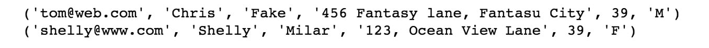
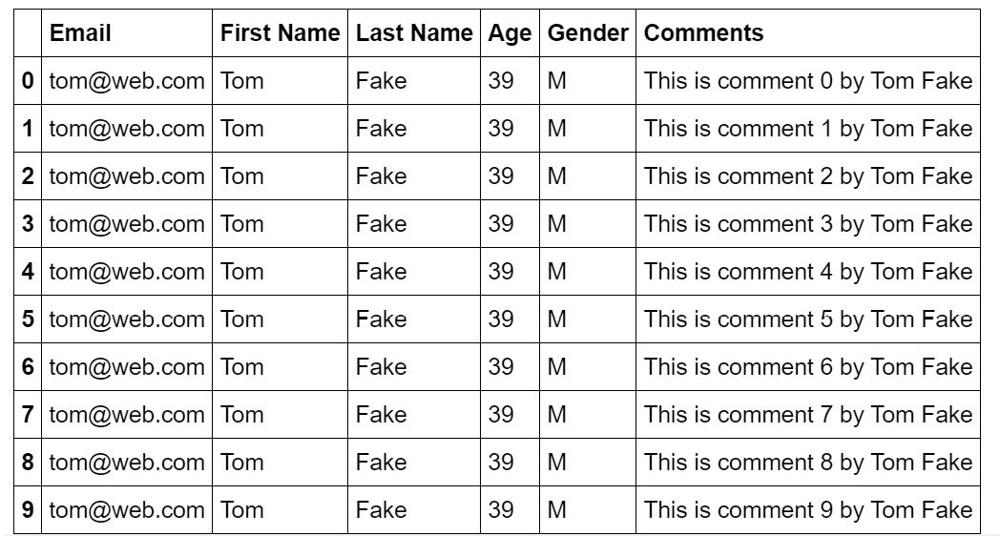
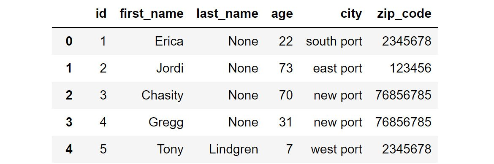
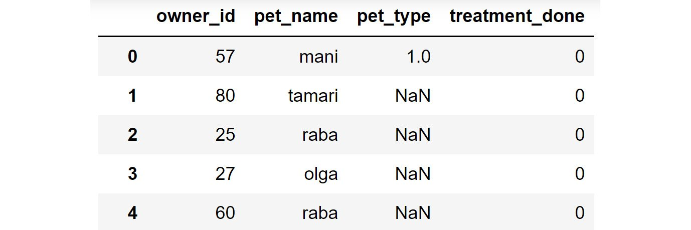
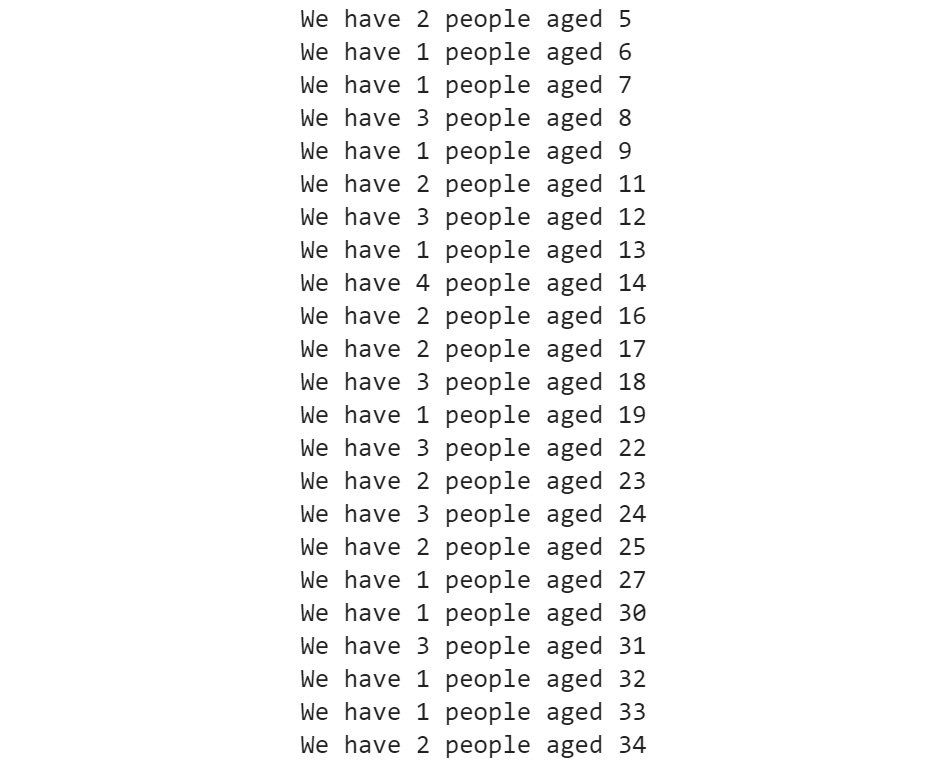

Lab 8: RDBMS and SQL
====================


#### Pre-reqs:
- Google Chrome (Recommended)

#### Lab Environment
Notebooks are ready to run. All packages have been installed. There is no requirement for any setup.

All notebooks are present in `~/work/data-wrangling-python/lab08` folder.


Exercise 8.01: Connecting to a Database in SQLite
-------------------------------------------------

In this exercise, we will look into the first step toward using an RDBMS
in Python code. We are going to connect to a database,
`lesson.db`. We will then close the connection safely. Let\'s
perform the following steps:

1.  Import the `sqlite3` library from Python by using the
    following command:
    
    ```
    import sqlite3
    ```

2.  Use the `connect` function to connect to a database:
    
    ```
    conn = sqlite3.connect("../lesson.db")
    ```

3.  Close the connection, as follows:

    
    ```
    conn.close()
    ```

    This `conn` object is the main connection object, and we
    will need it to get a second type of object in the future once we
    want to interact with the database. We need to be careful about
    closing any open connection to our database.

4.  Use the same `with` statement from Python, just like we
    did for files, and connect to the database, as follows:
    
    ```
    with sqlite3.connect("../lesson.db") as conn:
        pass
    ```

In this exercise, we have connected to a database using Python.

**Note:**

To access the source code for this specific section, please refer to
<https://github.com/fenago/data-wrangling-python>.


In the next exercise, we will see the best way to create a table and put
data into it using Python.


Exercise 8.02: Using DDL and DML Commands in SQLite
---------------------------------------------------

In this exercise, we will connect with the `lesson.db`
database and then create a `user` table. Then, we will insert
data into the table using the DDL and DML commands. Let\'s perform the
following steps:

1.  Use SQLite\'s `connect` function to connect to the
    `lesson.db` database. Create a `cursor` object
    by calling `conn.cursor()`. The `cursor` object
    acts as a medium by which to communicate with the database:
    
    ```
    import sqlite3
    with sqlite3.connect("../lesson.db") as conn:
        cursor = conn.cursor()
    ```
2.  Create a table in Python, as follows:
    
    ```
    cursor.execute("CREATE TABLE IF NOT EXISTS \
                    user (email text, first_name  text, \
                          last_name text, address text, age integer, \
                          PRIMARY KEY (email))")
    ```
3.  Insert rows into the database that you created, as follows:
    
    ```
    cursor.execute("INSERT INTO user VALUES \
                   ('bob@example.com', 'Bob', 'Codd', \
                    '123  Fantasy lane, Fantasy City', 31)") 
    cursor.execute("INSERT INTO user VALUES \
                   ('tom@web.com', 'Tom', 'Fake', \
                    '456 Fantasy lane, Fantasy City', 39)")
    ```
4.  Commit to the database:
    
    ```
    conn.commit()
    ```

This will create the table and write two rows to it with data.

You must execute the entire Notebook in order to get the desired result.

In the next section, we will read back the data that we just stored.


Reading Data from a Database in SQLite
--------------------------------------

In the preceding exercise, we created a table and stored data in it.
Now, we will learn how to read the data that\'s stored in this database.

You can use the `SELECT` clause in SQL to retrieve data, as follows:

```
import sqlite3
with sqlite3.connect("../lesson.db") as conn:
    cursor = conn.cursor()
    rows = cursor.execute('SELECT * FROM user')
    for row in rows:
        print(row)
```


The output is as follows:

```
('bob@example.com', 'Bob', 'Codd', '123 Fantasy lane, Fantasy City', 31)
('tom@web.com', 'Tom', 'Fake', '456 Fantasy lane, Fantasy City', 39)
```


The syntax to use the `SELECT` clause with `LIMIT`
is as follows:

```
SELECT * FROM <table_name> LIMIT 50;
```


**Note:**

This syntax is sample code and will not work on Jupyter Notebooks.

This will select all the columns, but only the first `50` rows
from the table.

Now that we have seen how to connect, write, and read basic data to a
database, we will be venturing into more advanced operations in the
coming exercises, with the sorting of data being the next one.


Exercise 8.03: Sorting Values That Are Present in the Database
--------------------------------------------------------------

In this exercise, we will use the `ORDER BY` clause to sort
the rows of the `user` table with respect to the
`age` column in both descending and ascending order. Let\'s
perform the following steps:

1.  Connect to the `lesson.db` database and sort
    `lesson.db` by age in descending order, as follows:

    
    ```
    import sqlite3
    with sqlite3.connect("../lesson.db") as conn:
        cursor = conn.cursor()
        rows = cursor.execute('SELECT * FROM user ORDER BY age DESC')
        for row in rows:
            print(row)
    ```

    The output is as follows:

    
    ```
    ('tom@web.com', 'Tom', 'Fake', '456 Fantasy lane, Fantasy City', 39)
    ('bob@example.com', 'Bob', 'Codd', '123 Fantasy lane, Fantasy City', 31)
    ```

2.  Sort the `lesson.db` database by age in ascending order,
    as follows:

    
    ```
    with sqlite3.connect("../lesson.db") as conn:
        cursor = conn.cursor()
        rows = cursor.execute('SELECT * FROM user ORDER BY age')
        for row in rows:
            print(row)
    ```

    The output is as follows:

    
    ```
    ('bob@example.com', 'Bob', 'Codd', '123 Fantasy lane, Fantasy City', 31)
    ('tom@web.com', 'Tom', 'Fake', '456 Fantasy lane, Fantasy City', 39)
    ```

Notice that we don\'t need to specify the order as `ASC` in
order to sort it in ascending order.

In this exercise, we have seen how to sort data. Sorting is one of the
most important operations you will often need to do.

You must execute the entire Notebook in order to get the desired result.

In the coming exercise, we will see how to update the structure of an
already defined table.


The ALTER Command
-----------------

`ALTER` is a command that is used by a RDBMS to add a new
column to an already existing table, or to change the data type of a
column, whereas the `UPDATE` command is used to update the
value of one or more columns in one or several rows of a database. We
will examine them in the following section to check out their use.


Exercise 8.04: Altering the Structure of a Table and Updating the New Fields
----------------------------------------------------------------------------

In this exercise, we are going to add a column, `gender`,
using the `ALTER` command in the `user` table. Then,
by using the `UPDATE` command, we will set the value of the
`gender` column. Let\'s perform the following steps:

1.  Establish a connection with the database by using the following
    command:
    
    ```
    import sqlite3
    with sqlite3.connect("../lesson.db") as conn:
        cursor = conn.cursor()
    ```

2.  Add another column in the `user` table and fill it with
    null values by using the following command:
    
    ```
    cursor.execute("ALTER TABLE user ADD COLUMN gender text")
    conn.commit()
    ```

3.  Update all of the values of gender so that they are `M` by
    using the following command:
    
    ```
    cursor.execute("UPDATE user SET gender='M'")
    conn.commit()
    ```

4.  To check the altered table, execute the following command:

    
    ```
    with sqlite3.connect("../lesson.db") as conn:
        cursor = conn.cursor()
        rows = cursor.execute('SELECT * FROM user ORDER BY age')
        for row in rows:
            print(row)
    ```

    The output is as follows:

    
    ```
    ('bob@example.com', 'Bob', 'Codd', '123 Fantasy lane, Fantasy City', 
     31, 'M')
    ('tom@web.com', 'Tom', 'Fake', '456 Fantasy lane, Fantasy City', 
     39, 'M')
    ```

We have to be cautious when using `UPDATE`, because using
`UPDATE` without selective clauses (such as `WHERE`)
affects the entire table.

You must execute the entire Notebook in order to get the desired result.


The GROUP BY clause
-------------------

In the preceding diagram, we can see that the `col3` column
has only two unique values across all rows, `A` and
`B`. The command that\'s used to check the total number of
rows belonging to each group is as follows:

```
SELECT count(*), col3 FROM <tablename> GROUP BY col3
```


Let\'s go through the following exercise to practice the
`GroupBy` clause.


Exercise 8.05: Grouping Values in Tables
----------------------------------------

In this exercise, we will use the `GROUP BY` clause to select
the columns grouped by `gender`. We\'ll add users whose
genders are male and female to the table and group them based on gender.
Let\'s perform the following steps to do so:

1.  Establish the connection with the database by using the following
    command:
    
    ```
    import sqlite3
    with sqlite3.connect("../lesson.db") as conn:
        cursor = conn.cursor()
    ```

2.  Add a female user to the table:

    
    ```
    cursor.execute("INSERT INTO user VALUES ('shelly@www.com', 'Shelly',\
                                             'Milar',\
                                             '123, Ocean View Lane',\
                                             39, 'F')")
    conn.commit()
    cursor = conn.cursor()
    rows = cursor.execute('SELECT * FROM user ORDER BY age DESC')
    for row in rows:
        print(row)
    ```

    **Note:**

    The aforementioned code block must be run in a single cell in
    Jupyter Notebook.

    The output is as follows:

    
    ```
    ('tom@web.com', 'Tom', 'Fake', '456 Fantasy lane, Fantasy City', 
      39, 'M')
    ('shelly@www.com', 'Shelly', 'Milar', '123, Ocean View Lane', 
      39, 'F')
    ('bob@example.com', 'Bob', 'Codd', '123 Fantasy lane, Fantasy City', 
      31, 'M')
    ```

3.  Run the following code to see the count by each `gender`:

    
    ```
    rows = cursor.execute("SELECT COUNT(*), "\
                          "gender FROM user GROUP BY gender")
    for row in rows:
        print(row)
    ```

    The output is as follows:

    
    ```
    (1, 'F')
    (2, 'M')
    ```


Relation Mapping in Databases
=============================

In a non-RDBMS situation, this situation can quickly become difficult
and messy to manage and maintain. However, with an RDBMS, all we have to
tell the database engine, in very precise ways, is what to do when a
situation like this occurs. The database engine will do the rest for us.
We use `ON DELETE` to tell the engine what we do with all the
rows of a table when the parent row gets deleted. The following code
illustrates these concepts:

```
import sqlite3
with sqlite3.connect("../lesson.db") as conn:
    cursor = conn.cursor()
    cursor.execute("PRAGMA foreign_keys = 1")
    sql = """
    CREATE TABLE comments ( \
         user_id text, \
         comments text, \
         FOREIGN KEY (user_id) REFERENCES user (email) \
         ON DELETE CASCADE ON UPDATE NO ACTION \
    )
    """
    cursor.execute(sql)
    conn.commit()
```


The `ON DELETE` `CASCADE` line informs the database
engine that we want to delete all the children rows when the parent gets
deleted. We will cover deleting values in detail in a later exercise. We
can also define actions for `UPDATE`. In this case, there is
nothing to do on `UPDATE`.

The `FOREIGN KEY` modifier modifies a column definition
(`user_id`, in this case) and marks it as a foreign key, which
is related to the primary key (email, in this case) of another table. A
foreign key is a link between two tables. We define a primary key in one
table and then define the same values as foreign keys to another table,
thereby creating a link between them.

You may notice the strange looking
`cursor.execute("PRAGMA foreign_keys = 1")` line in the code.
It is there just because SQLite does not use the normal foreign key
features by default. It is this line that enables that feature. It is
typical to SQLite and we won\'t need it for any other databases.

Hence, we have covered the idea of relations between two tables. One
table can be related to any number of tables. And there are different
types of relationships such as `1:1`, `1:n`, and
`n:n`. Readers are encouraged to look into these in detail.

In the next section, we will insert rows in the newly created table.


Adding Rows in the comments Table
---------------------------------

We have created a table called `comments`. In this section, we
will dynamically generate an `INSERT` query, as follows:

```
import sqlite3
with sqlite3.connect("../lesson.db") as conn:
    cursor = conn.cursor()
    cursor.execute("PRAGMA foreign_keys = 1")
    sql = "INSERT INTO comments VALUES ('{}', '{}')"
    rows = cursor.execute('SELECT * FROM user ORDER BY age')
    for row in rows:
        email = row[0]
        print("Going to create rows for {}".format(email))
        name = row[1] + " " + row[2]
        for i in range(10):
            comment = "This is comment {} by {}".format(i, name)
            conn.cursor().execute(sql.format(email, comment))
            conn.commit()
```

Pay attention to how we dynamically generate the insert query so that we
can insert 10 comments for each user.


Joins
=====


In our case, our first table, user, has three entries, with the primary
key being email. We can make use of this in our query to get comments
just from Bob:

```
import sqlite3
with sqlite3.connect("../lesson.db") as conn:
    cursor = conn.cursor()
    cursor.execute("PRAGMA foreign_keys = 1")
    sql = """
    SELECT * FROM comments \
    JOIN user ON comments.user_id = user.email \
    WHERE user.email='bob@example.com' \
    """
    rows = cursor.execute(sql)
    for row in rows:
        print(row)
```


The output is as follows:

```
('bob@example.com', 'This is comment 0 by Bob Codd', 'bob@example.com', 'Bob', 'Codd', '123 Fantasy lane, Fantasy City', 31, 'M')
('bob@example.com', 'This is comment 1 by Bob Codd', 'bob@example.com', 'Bob', 'Codd', '123 Fantasy lane, Fantasy City', 31, 'M')
('bob@example.com', 'This is comment 2 by Bob Codd', 'bob@example.com', 'Bob', 'Codd', '123 Fantasy lane, Fantasy City', 31, 'M')
('bob@example.com', 'This is comment 3 by Bob Codd', 'bob@example.com', 'Bob', 'Codd', '123 Fantasy lane, Fantasy City', 31, 'M')
('bob@example.com', 'This is comment 4 by Bob Codd', 'bob@example.com', 'Bob', 'Codd', '123 Fantasy lane, Fantasy City', 31, 'M')
('bob@example.com', 'This is comment 5 by Bob Codd', 'bob@example.com', 'Bob', 'Codd', '123 Fantasy lane, Fantasy City', 31, 'M')
('bob@example.com', 'This is comment 6 by Bob Codd', 'bob@example.com', 'Bob', 'Codd', '123 Fantasy lane, Fantasy City', 31, 'M')
('bob@example.com', 'This is comment 7 by Bob Codd', 'bob@example.com', 'Bob', 'Codd', '123 Fantasy lane, Fantasy City', 31, 'M')
('bob@example.com', 'This is comment 8 by Bob Codd', 'bob@example.com', 'Bob', 'Codd', '123 Fantasy lane, Fantasy City', 31, 'M')
('bob@example.com', 'This is comment 9 by Bob Codd', 'bob@example.com', 'Bob', 'Codd', '123 Fantasy lane, Fantasy City', 31, 'M')
```


The preceding output of the `JOIN` query, showing that we have
jointly read data from two tables at the same time, is restricting our
query scope to a particular email.

We have just looked into one of the most important operations of all,
joins. We will cover some other aspects of the same in the coming
section.


Retrieving Specific Columns from a JOIN Query
=============================================


In the previous exercise, we saw that we can use a `JOIN` to
fetch the related rows from two tables. However, if we look at the
results, we will see that it returned all the columns, thus combining
both tables. This is not very concise. What about if we only want to see
the emails and the related comments, and not all the data?

There is some nice shorthand code that lets us do this:

```
import sqlite3
with sqlite3.connect("../lesson.db") as conn:
    cursor = conn.cursor()
    cursor.execute("PRAGMA foreign_keys = 1")
    sql = """
    SELECT comments.* FROM comments \
    JOIN user ON comments.user_id = user.email \
    WHERE user.email='bob@example.com' \
    """
    rows = cursor.execute(sql)
    for row in rows:
        print(row)
```


Just by changing the `SELECT` statement, we made our final
result appear as follows, where only columns from the
`comments` table are present:

```
('bob@example.com', 'This is comment 0 by Bob Codd')
('bob@example.com', 'This is comment 1 by Bob Codd')
('bob@example.com', 'This is comment 2 by Bob Codd')
('bob@example.com', 'This is comment 3 by Bob Codd')
('bob@example.com', 'This is comment 4 by Bob Codd')
('bob@example.com', 'This is comment 5 by Bob Codd')
('bob@example.com', 'This is comment 6 by Bob Codd')
('bob@example.com', 'This is comment 7 by Bob Codd')
('bob@example.com', 'This is comment 8 by Bob Codd')
('bob@example.com', 'This is comment 9 by Bob Codd')
```


We have now looked at joins. They are very useful, and you will end up
using them often while dealing with databases in real life. Up next is a
detailed look into deleting rows.


Deleting Rows from Tables
-------------------------

This will be done by using the `DELETE` command. As the name
suggests, this command helps to delete rows from a table. It is an
irreversible process, meaning once deleted, we cannot restore those
rows. So be very careful when running this command as it can have a
destructive effect on the data. Please keep in mind that it has to
almost always be run accompanied by a `WHERE` clause so that
we delete just a part of the data and not everything.


Exercise 8.06: Deleting Rows from Tables
----------------------------------------

In this exercise, we will be working with two tables, `user`
and `comments`, which are a part of the `lesson.db`
database.

**Note:**

The GitHub version of this exercise begins with the previous 4 examples
that we just saw, starting off with creation of the `comments`
table. You may ignore those steps if you have executed them already.

We will delete a row from the `user` table and observe the
effects it will have on the comments table. Include all the steps
mentioned previously. Let\'s perform the following steps:

1.  To delete a row from a table, we use the `DELETE` clause
    in SQL. To run delete on the user table, we are going to use the
    following code:
    
    ```
    with sqlite3.connect("../lesson.db") as conn:
        cursor = conn.cursor()
        cursor.execute("PRAGMA foreign_keys = 1")
        cursor.execute("DELETE FROM user "\
                       "WHERE email='bob@example.com'")
        conn.commit()
    ```

2.  Perform the `SELECT` operation on the user table:

    
    ```
    with sqlite3.connect("../lesson.db") as conn:
        cursor = conn.cursor()
        cursor.execute("PRAGMA foreign_keys = 1")
        rows = cursor.execute("SELECT * FROM user")
        for row in rows:
            print(row)
    ```

    The output is as follows:

    
    ```
    ('tom@web.com', 'Tom', 'Fake', '456 Fantasy lane, Fantasy City', 
      39, 'M')
    ('shelly@www.com', 'Shelly', 'Milar', '123, Ocean View Lane', 
      39, 'F')
    ```

    Observe that the user `Bob` has been deleted.

    Now, moving on to the `comments` table, we have to
    remember that we had mentioned `ON DELETE`
    `CASCADE` while creating the table. The database engine
    knows that if a row is deleted from the parent table
    (`user`), all the related rows from the child tables
    (`comments`) will have to be deleted.

3.  Perform a `SELECT` operation on the `comments`
    table by using the following command:

    
    ```
    with sqlite3.connect("../lesson.db") as conn:
        cursor = conn.cursor()
        cursor.execute("PRAGMA foreign_keys = 1")
        rows = cursor.execute("SELECT * FROM comments")
        for row in rows:
            print(row)
    ```

    The output (partially shown) is as follows:

    
    ```
    ('tom@web.com', 'This is comment 0 by Tom Fake')
    ('tom@web.com', 'This is comment 1 by Tom Fake')
    ('tom@web.com', 'This is comment 2 by Tom Fake')
    ('tom@web.com', 'This is comment 3 by Tom Fake')
    ('tom@web.com', 'This is comment 4 by Tom Fake')
    ('tom@web.com', 'This is comment 5 by Tom Fake')
    ('tom@web.com', 'This is comment 6 by Tom Fake')
    ('tom@web.com', 'This is comment 7 by Tom Fake')
    ('tom@web.com', 'This is comment 8 by Tom Fake')
    ('tom@web.com', 'This is comment 9 by Tom Fake')
    ```

We can see that all of the rows related to `Bob` are deleted
from the `comments` table.

We have observed the `DELETE` command and also learned how to
use it safely.


You must execute the entire Notebook in order to get the desired result.

In the following section, we will see how to update a specific value in
a table.


Updating Specific Values in a Table
-----------------------------------

In this example, we will see how we can update rows in a table. Without
`WHERE`, updating is often a bad idea. The reason is that we
may end up updating rows that we did not intend to.

We can combine `UPDATE` with `WHERE` to selectively
update the first name of the user with the email address tom\@web.com,
as shown in the following code:

```
with sqlite3.connect("../lesson.db") as conn:
    cursor = conn.cursor()
    cursor.execute("PRAGMA foreign_keys = 1")
    cursor.execute("UPDATE user set first_name='Chris' "\
                   "where email='tom@web.com'")
    conn.commit()
    rows = cursor.execute("SELECT * FROM user")
    for row in rows:
        print(row)
```


The output is as follows:





So far, we have covered a lot of concepts related to databases. We have
learned a set of skills that are important for dealing with
database-level operations. In the next section, we will combine two
worlds; the world of databases and the world of pandas.

We have looked into many fundamental aspects of storing and querying
data from a database, but as a data wrangling expert, we need our data
to be packed and presented as a DataFrame so that we can perform quick
and convenient operations on them.


Exercise 8.07: RDBMS and DataFrames
-----------------------------------

In this exercise, we will connect to the `lesson.db` database
and join the two tables, `user` and `comments`. We
will create an empty `data` list and then add the rows of this
joined table in `data`. Next, we will store the content of
`data` in a `pandas` DataFrame. To complete this
exercise, let\'s perform the following steps:

1.  Import pandas using the following code:
    
    ```
    import pandas as pd
    ```

2.  Create a columns list with email, first name, last name, age,
    gender, and comments as column names. Also, create an empty
    `data` list:
    
    ```
    columns = ["Email", "First Name", "Last Name", \
               "Age", "Gender", "Comments"]
    data = []
    ```

3.  Connect to `lesson.db` using SQLite and obtain a cursor,
    as follows:
    
    ```
    import sqlite3
    with sqlite3.connect("../lesson.db") as conn:
        cursor = conn.cursor()
    ```

4.  Use the `execute` method from the cursor to set
    `PRAGMA foreign_keys = 1`:
    
    ```
    cursor.execute("PRAGMA foreign_keys = 1")
    ```

5.  Create a `sql` variable that will contain the
    `SELECT` command and use the join command to join the
    databases:
    
    ```
    sql = """
        SELECT user.email, user.first_name, user.last_name, \
        user.age, user.gender, comments.comments FROM comments \
        JOIN user ON comments.user_id = user.email \
        WHERE user.email = 'tom@web.com' \
         """
    ```

6.  Use the execute method of `cursor` to execute the
    `sql` command:
    
    ```
    rows = cursor.execute(sql)
    ```

7.  Append the rows to the data list:
    
    ```
    for row in rows:
        data.append(row)
    ```

8.  Create a DataFrame using the data list and print out the result:

    
    ```
    df = pd.DataFrame(data, columns=columns)
    df
    ```

    The output will be:

    
    
    


**Note:**

To access the source code for this specific section, please refer to
<https://github.com/fenago/data-wrangling-python>.


You must execute the entire Notebook in order to get the desired result.

This ends our journey into the world of databases. It was a basic
introduction. Nonetheless, we managed to cover a wide range of essential
topics. DBMS and related fields are a mature stream in computer science
and are still under active development and research. We strongly
encourage the reader to read more about it.


Activity 8.01: Retrieving Data Accurately from Databases
--------------------------------------------------------

The goal of this activity is to fetch data and retrieve information from
two tables, `persons` and `pets`, which are a part
of the `petsdb` database.

**Note:**

You can find the `petsdb` database at
<https://github.com/fenago/data-wrangling-python>.

The `persons` table is defined as follows:





The `persons` table has the following columns:

-   `first_name`: The first name of the person
-   `last_name`: The last name of the person (can be
    `null`)
-   `age`: The age of the person
-   `city`: The city where they are from
-   `zip_code`: The zip code of the city

As we can see, the `id` column in the `persons`
table (which is an integer) serves as the primary key for that table and
as a foreign key for the `pets` table, which is linked via the
`owner_id` column.

The `pets` table is defined as follows:





The pets table has the following columns:

-   `pet_name`: The name of the pet.
-   `pet_type`: What type of pet it is, for example,
    `cat` or `dog`. Due to a lack of further
    information, we do not know which number represents what, but it is
    an integer and can be `null`.
-   `treatment_done`: This is also an integer column, and
    `0` here represents `No`, whereas `1`
    represents `Yes`.

In this activity, you will first connect to the `petsdb`
database and check whether the connection has been successful. You will
then create and execute a few SQL commands to answer the following
questions:

1.  What is the count of people belonging to different age groups in the
    `persons` table?
2.  Which age group has the maximum number of people?
3.  How many people do not have a last name?
4.  How many people have more than one pet?
5.  How many pets have received treatment?
6.  How many pets have received treatment, and the type of pet is known?
7.  How many pets are from the city called east port?
8.  How many pets are from the city called east port, and who received
    treatment?

The output should be as follows:

Answer to question 1 (the following is partial output):




Answer to question 2:

```
Highest number of people is 5 and came from 73 age group
```


Answer to question 3:

```
(60,)
```


Answer to question 4:

```
43 people has more than one pet
```


Answer to question 5:

```
(36,)
```


Answer to question 6:

```
(16,)
```


Answer to question 7:

```
(49,)
```


Answer to question 8:

```
(11,)
```


In this activity, we have applied all the skills we learned in this
lab concerning databases.


Summary
=======


We have come to the end of the database lab. We have learned how to
connect to SQLite using Python. We have brushed up on the basics of
relational databases and how to open and close a database. We then
learned how to export this relational database into Python DataFrames.

In the next lab, we will be performing data wrangling on datasets
that are used in business use cases. We will use different types of
datasets and then clean and process the data in a meaningful way.