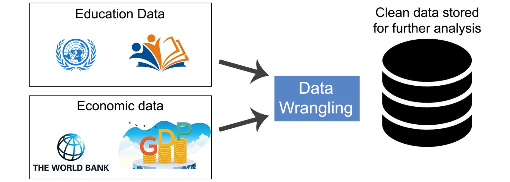
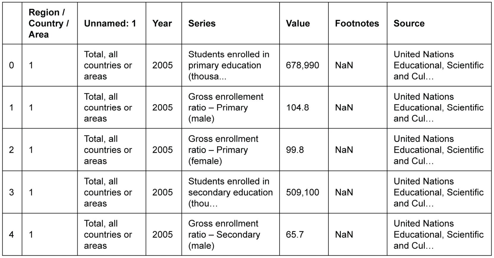
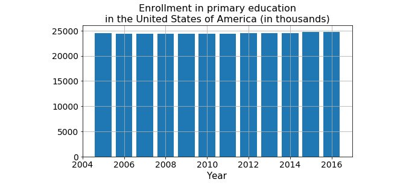
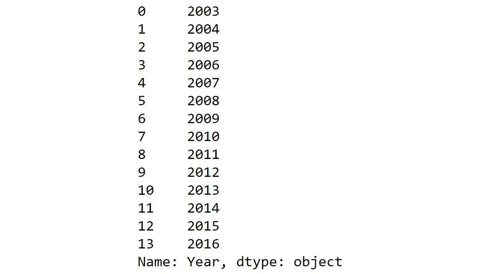
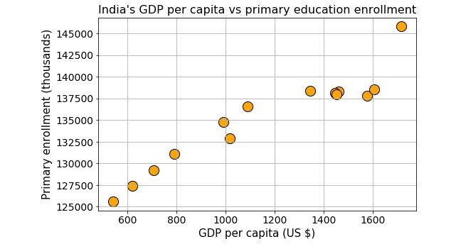

Applications in Business Use Cases and Conclusion of the Course
==================================================================

Applying Your Knowledge to a Data Wrangling Task
================================================

Suppose you are asked the following question:

*In India, did the enrollment in primary/secondary/tertiary education
increase with the improvement of per capita GDP in the past 15 years? To
provide an accurate and analyzed result, machine learning and data
visualization techniques will be used by an expert data scientist*. The
actual modeling and analysis will be done by a senior data scientist,
who will use machine learning and data visualization for analysis. As a
data wrangling expert, *your job will be to acquire and provide a clean
dataset that contains educational enrollment and GDP data side by side*.

Suppose you have a link for a dataset from the United Nations and you
can download the dataset of education (for all the nations around the
world). But this dataset has some missing values and, moreover, it does
not have any **Gross Domestic Product** (**GDP**) information. Someone
has also given you another separate CSV file (downloaded from the World
Bank site) that contains GDP data but in a messy format.

In the following activity, we will examine how to handle these two
separate sources and clean the data to prepare a simple final dataset
with the required data and save it to the local drive as a SQL database
file:

You are encouraged to follow along with the code and results in the
notebook and try to understand and internalize the nature of the data
wrangling flow. You are also encouraged to try extracting various data
from these files and answer your own questions about a nation\'s
socio-economic factors and their inter-relationships.

**Note:**

Coming up with interesting questions about social, economic,
technological, and geo-political topics and then answering them using
freely available data and a little bit of programming knowledge is one
of the most fun ways to learn about any data science topic. You will get
a taste of that process in this lab.

Let\'s take a look at the following table, which shows information from
a dataset of education from the UN data:

From the preceding table, we can observe that we are missing some data.
Let\'s say we decide to impute these data points by performing simple
linear interpolation between the available data points. We can take a
calculator and compute those values and manually create a dataset. But
being a data wrangler, we will, of course, take advantage of Python
programming, and use `pandas` imputation methods for this
task.

But to do that, we need to create a DataFrame with missing values in it;
that is, we need to append another DataFrame with missing values to the
current DataFrame.

Activity 9.01: Data Wrangling Task -- Fixing UN Data
----------------------------------------------------

The goal of this activity is to perform data analysis on the UN data to
find out whether the enrollment in primary, secondary, or tertiary
education has increased with the improvement of per capita GDP in the
past 15 years. For this task, we will need to clean or wrangle the two
datasets, that is, the education enrollment and GDP data.

The UN data is available at <https://github.com/fenago/data-wrangling-python>.

**Note:**

If you download the CSV file and open it using Excel, then you will see
that the `Footnotes` column sometimes contains useful notes.
We may not want to drop it in the beginning. If we are interested in a
particular country\'s data (like we are in this task), then it may well
turn out that `Footnotes` will be `NaN`, that is,
blank. In that case, we can drop it at the end. But for some countries
or regions, it may contain information.

These steps will guide you through this activity:

1.  Download the dataset from the UN data from GitHub from the following
    link: <https://github.com/fenago/data-wrangling-python>.

    The UN data contains missing values. Clean the data to prepare a
    simple final dataset with the required data and save it to your
    local drive as a SQL database file.

2.  Use the `pd.read_csv` method of `pandas` to
    create a DataFrame.

3.  Since the first row does not contain useful information, skip it
    using the `skiprows` parameter.

4.  Drop the column region/country/area and source.

5.  Assign the following names as columns of the DataFrame:
    Region/County/Area, Year, Data, Value, and Footnotes.

6.  Check how many unique values are present in the
    `Footnotes` column.

7.  Check the type of the `value` column.

8.  Create a function to convert the value column into floating-point
    numbers.

9.  Use the `apply` method to apply this function to a value.

10. Print the unique values in the data column.

The final output should be as follows:

With this, we\'ve reached the end of this activity.
Here, we have looked into how to examine a particular real-life dataset
to see what kind of data is missing. We also used the interpolate method
from our DataFrame to fill in certain missing values.

Activity 9.02: Data Wrangling Task -- Cleaning GDP Data
-------------------------------------------------------

The GDP data is available at <https://data.worldbank.org/> and is
available on GitHub at <https://github.com/fenago/data-wrangling-python>.

In this activity, we will clean the GDP data. Follow these steps to
complete this activity:

1.  Create three DataFrames from the original DataFrame using filtering.
    Create the `df_primary`, `df_secondary`, and
    `df_tertiary` DataFrames for students enrolled in primary
    education, secondary education, and tertiary education in thousands,
    respectively.
2.  Plot bar charts of the enrollment of primary students in a
    low-income country such as India and a higher-income country such as
    the USA.
3.  Since there is missing data, use `pandas` imputation
    methods to impute these data points by simple linear interpolation
    between data points. To do that, create a DataFrame with missing
    values inserted and append a new DataFrame with missing values to
    the current DataFrame.
4.  (For India) Append the rows corresponding to the missing years:
    `2004 – 2009`, `2011 – 2013`.
5.  Create a dictionary of values with `np.nan`. Note that
    there are `9` missing data points, so we need to create a
    list with identical values repeated `9` times.
6.  Create a DataFrame of missing values (from the preceding dictionary)
    that we can append.
7.  Append the DataFrames together.
8.  Sort by year and reset the indices using `reset_index`.
    Use `inplace=True` to execute the changes on the DataFrame
    itself.
9.  Use the interpolate method for linear interpolation. It fills all
    the `NaN` values with linearly interpolated values. See
    the following link for more details about this method:
    <http://pandas.pydata.org/pandas-docs/version/0.17/generated/pandas.DataFrame.interpolate.html>.
10. Repeat the same steps for USA (or other countries).
11. If there are values that are unfilled, use the `limit` and
    `limit_direction` parameters with the interpolate method
    to fill them in.
12. Plot the final graph using the new data.
13. Read the GDP data using the `pandas` `read_csv`
    method. It will generally throw an error.
14. To avoid errors, try using the `error_bad_lines = False`
    option.
15. Since there is no delimiter in the file, add the `\t`
    delimiter.
16. Use the `skiprows` function to remove rows that are not
    useful.
17. Examine the dataset. Filter the dataset with information that states
    that it is similar to the previous education dataset.
18. Reset the index for this new dataset.
19. Drop the rows that aren\'t useful and re-index the dataset.
20. Rename the columns properly. This is necessary for merging the two
    datasets.
21. We will concentrate only on the data from `2003` to
    `2016`. Eliminate the remaining data.
22. Create a new DataFrame called `df_gdp` with rows
    `43` to `56`.

The final output should be as follows:

Now that we\'ve seen how to clean and format the datasets, in the
following activity, we\'ll learn how to merge these two datasets.

Activity 9.03: Data Wrangling Task -- Merging UN Data and GDP Data
------------------------------------------------------------------

The aim of this activity is to merge the two datasets: UN data and GDP
data.

The steps to merge these two databases is as follows:

1.  Reset the indexes for merging.
2.  Merge the two DataFrames, `primary_enrollment_india` and
    `df_gdp`, on the `Year` column.
3.  Drop the data, footnotes, and region/county/area.
4.  Rearrange the columns for proper viewing and presentation.

The output should be as follows:

In this activity, we saw how to merge two DataFrames to create a unified
view and how to examine that view a little bit. In the next activity, we
will learn how to store some of that data in a database.

Activity 9.04: Data Wrangling Task -- Connecting the New Data to the Database
-----------------------------------------------------------------------------

The steps to connect the data to the database is as follows:

1.  Import the `sqlite3` module of Python and use the
    `connect` function to connect to the database. The main
    database engine is embedded. But for a different database such as
    `Postgresql` or `MySQL`, we will need to connect
    to them using those credentials. We designate `Year` as
    the `PRIMARY KEY` of this table.
2.  Then, run a loop with the dataset rows one by one to insert them
    into the table.

The output: If we look at the current folder, we should see a file
called `Education_GDP.db`, and if we examine that using a
database viewer program, we will see the data transferred being there.

If we look at the current folder, we should see a
file called `Education_GDP.db`, and if we can examine that
using a database viewer program, we will see that the data has been
transferred there.

In these activities, we have examined a complete data wrangling flow,
including reading data from the web and a local drive and filtering,
cleaning, quick visualization, imputation, indexing, merging, and
writing back to a database table. We also wrote custom functions to
transform some of the data and saw how to handle situations where we may
get errors upon reading the file.

Summary
=======

Data is everywhere and it is all around us. In these nine chapters, we
have learned how data from different types and sources can be cleaned,
corrected, and combined. Hopefully, this lab must have tested your
skills enough to shore up the concepts you\'ve learned so far. If you
want, you can revisit some of the prior chapters to practice your data
wrangling skills a bit more. Using the power of Python and the knowledge
of data wrangling and applying the tricks and tips that you have studied
in this course, you are ready to be a data wrangler.
